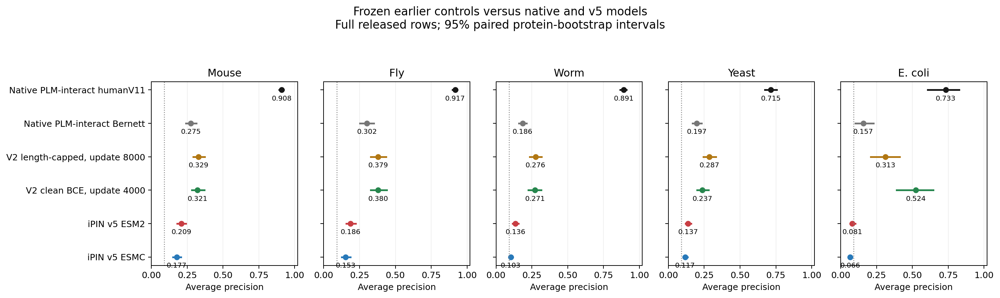
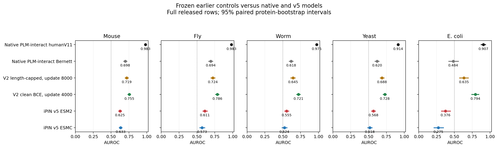

# Earlier native-like models on the five-species benchmark

Completed 2026-10-05T14:37:07.895417+00:00. Two frozen v2 checkpoints, each scored on all 242,000 released observations. Native humanV11, native Bernett and both v5 predictions were reused from the ongoing nonhuman benchmark. No retraining.

The user requested both meanings of closest: **v2 length-capped, update 8,000** is the available control most similar to the native Bernett architecture/objective/length policy; **v2 clean BCE, update 4,000** is closest in the earlier Bernett AP/AUROC comparison. Both retain their existing DEV-selected weights. Historical Bernett performance informed the requested choice of model family, not checkpoint reselection on nonhuman data.

## Average precision

| Model | Mouse | Fly | Worm | Yeast | E. coli |
|---|---:|---:|---:|---:|---:|
| Native PLM-interact humanV11 | 0.9084 | 0.9168 | 0.8909 | 0.7147 | 0.7329 |
| Native PLM-interact Bernett | 0.2751 | 0.3017 | 0.1856 | 0.1974 | 0.1572 |
| V2 length-capped, update 8000 | 0.3286 | 0.3795 | 0.2759 | 0.2866 | 0.3130 |
| V2 clean BCE, update 4000 | 0.3212 | 0.3798 | 0.2712 | 0.2365 | 0.5241 |
| iPIN v5 ESM2 | 0.2091 | 0.1864 | 0.1359 | 0.1366 | 0.0807 |
| iPIN v5 ESMC | 0.1768 | 0.1531 | 0.1028 | 0.1165 | 0.0663 |

## AUROC

| Model | Mouse | Fly | Worm | Yeast | E. coli |
|---|---:|---:|---:|---:|---:|
| Native PLM-interact humanV11 | 0.9830 | 0.9834 | 0.9753 | 0.9144 | 0.9066 |
| Native PLM-interact Bernett | 0.6983 | 0.6940 | 0.6176 | 0.6196 | 0.4839 |
| V2 length-capped, update 8000 | 0.7193 | 0.7237 | 0.6449 | 0.6881 | 0.6347 |
| V2 clean BCE, update 4000 | 0.7550 | 0.7861 | 0.7207 | 0.7279 | 0.7937 |
| iPIN v5 ESM2 | 0.6254 | 0.6114 | 0.5553 | 0.5680 | 0.3757 |
| iPIN v5 ESMC | 0.6331 | 0.5726 | 0.5239 | 0.5180 | 0.2749 |

## Comparison

V2 length-capped, update 8000 has higher AP than Native PLM-interact humanV11 in 0/5 species. V2 length-capped, update 8000 has higher AP than Native PLM-interact Bernett in 5/5 species. V2 length-capped, update 8000 has higher AP than iPIN v5 ESM2 in 5/5 species. V2 length-capped, update 8000 has higher AP than iPIN v5 ESMC in 5/5 species. V2 clean BCE, update 4000 has higher AP than Native PLM-interact humanV11 in 0/5 species. V2 clean BCE, update 4000 has higher AP than Native PLM-interact Bernett in 5/5 species. V2 clean BCE, update 4000 has higher AP than iPIN v5 ESM2 in 5/5 species. V2 clean BCE, update 4000 has higher AP than iPIN v5 ESMC in 5/5 species.

These are fixed-checkpoint transfer results. HumanV11 uses different human interaction evidence from the native Bernett and v2 models. The v2 models share the native ESM2-650M, standard attention and ReLU(CLS)-linear prediction head. Capped retains masked-input BCE plus MLM and restricts training to combined length 2,193; clean BCE removes training masking and MLM and uses all retained training lengths. Neither is an exact recreation of the authors’ unreported training trajectory. Differences do not isolate negative sampling, architecture or any single training choice.

Every primary score pools AB/BA raw logits. Native humanV11 uses its qualified FP32 computation; both v2 models, native Bernett and v5 use FP32 weights with qualified BF16 autocast and TF32 disabled. The released strings are preserved, all are at most 800 residues, and the v2 training cap causes no test exclusion. The separate original-order metrics remain in [orientation-metrics.csv](results/orientation-metrics.csv); the earlier Figure 2 convention is documented in [the parent audit](../FIGURE2-AUDIT.md).

## Uncertainty and exposure

The figures use 1,000 paired protein-endpoint bootstrap replicates, seed 20261005. Non-self pairs receive the product of endpoint multiplicities; self-pairs receive one multiplicity. Each model uses the same resamples within a species. [Paired differences](results/paired-differences.csv) compare both v2 models with each native and v5 model. Intervals are descriptive, conditional on these trained checkpoints and historical datasets, without training-seed uncertainty or multiple-comparison adjustment.

The conservative human-source exposure mask includes the original Bernett TRAIN/DEV files, a superset of the cleaned/capped v2 training and validation evidence. Its Bernett source component alone contains 94 exact shared test sequences and 18 mouse positive pairs. The shared mask also excludes the known human sources of v5, humanV11, TUnA, D-SCRIPT and SPRINT, so every displayed model uses identical remaining rows. It does not establish absence of homologs or PLM pretraining exposure.

| Model | Mouse | Fly | Worm | Yeast | E. coli |
|---|---:|---:|---:|---:|---:|
| Native PLM-interact humanV11 | 0.8879 | 0.9169 | 0.8909 | 0.7147 | 0.7329 |
| Native PLM-interact Bernett | 0.2738 | 0.3019 | 0.1856 | 0.1974 | 0.1572 |
| V2 length-capped, update 8000 | 0.3144 | 0.3798 | 0.2759 | 0.2866 | 0.3130 |
| V2 clean BCE, update 4000 | 0.3047 | 0.3800 | 0.2712 | 0.2365 | 0.5241 |
| iPIN v5 ESM2 | 0.1908 | 0.1864 | 0.1359 | 0.1366 | 0.0807 |
| iPIN v5 ESMC | 0.1608 | 0.1531 | 0.1028 | 0.1165 | 0.0663 |

This mask retains 52,065 mouse pairs (3,944 positives), 54,858 fly pairs (4,997 positives), and all worm, yeast and E. coli rows. Subset metrics are descriptive point estimates; their changed prevalence prevents direct AP comparisons with the full tests. [Subsets](results/subsets.csv) also report one observation per unordered sequence pair after removing conflicting labels.

## Validation and files

Each checkpoint was hash-verified, loaded strictly and checked against the saved selected DEV predictions on short, middle and long batches. Fresh raw-string tokenization and unpatched original ESM2 forwards were independently checked on fixed examples from all five species, including each longest pair. All four GPU shards and their atomic chunks were verified, complete coverage restored, and all source strings and labels independently checked against the released CSVs. No production test score was used to choose a checkpoint, threshold, score direction or averaging rule.

[Frozen selection](provenance/selection.json) · [Metrics](results/metrics.csv) · [Intervals](results/confidence-intervals.csv) · [Paired differences](results/paired-differences.csv) · [Summary and provenance](results/summary.json). Per-row scores are in `results/{species}-predictions.csv.gz`. PNG/PDF/SVG figures are saved alongside their data.
