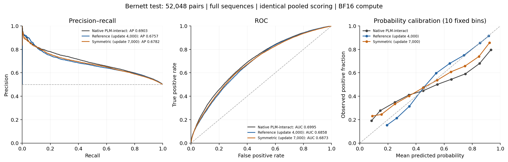
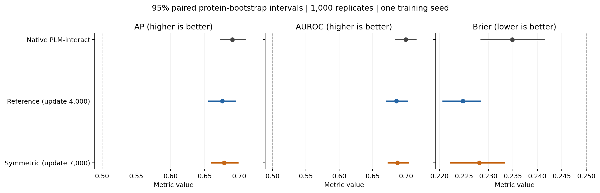

**Benchmark-v1: interim Bernett test comparison**

Both retrained snapshots have lower pooled test AP than the released native Bernett checkpoint. This benchmark does not demonstrate an AP improvement from retrain-v1 at the selected interim checkpoints.

The model selection was frozen at **2026-09-29T09:11:58.854736+00:00**, before benchmark inference. Reference update 4,000 corresponds to approximately 1.57 epochs; symmetric update 7,000 to approximately 2.75 epochs. Both were selected by their existing validation rules. The authors' exact selected Bernett epoch/update remains unreported. Checkpoint hashes, source revisions and selection rules are recorded in [selection.json](provenance/selection.json).

All **52,048 test pairs** were evaluated, with **26,024 positives** and no test exclusions or sequence truncation. Both sequences and labels were checked against the original release. Every model receives the same full-length inputs, BF16 computation and pooling of A–B/B–A logits. AP means average precision, as in the authors' code. All intervals below are approximate 95% intervals from the paired protein bootstrap.

| Model | AP [95% interval] ↑ | AUROC [95% interval] ↑ | Brier ↓ |
| --- | ---: | ---: | ---: |
| Native PLM-interact (Bernett) | 0.690319 [0.672442, 0.709015] | 0.699467 [0.684204, 0.714535] | 0.234875 |
| Reference, update 4,000 | 0.675669 [0.655738, 0.694638] | 0.685761 [0.670704, 0.702085] | 0.224792 |
| Symmetric, update 7,000 | 0.678164 [0.659910, 0.698043] | 0.687280 [0.673179, 0.703465] | 0.228095 |

The native checkpoint has higher AP and AUROC, while both retrained snapshots have lower Brier scores. Lower Brier means smaller mean squared probability error against these benchmark labels; it does not establish improved ranking. The symmetric model's small AP advantage over the reference is inconclusive under the paired interval below.

The paired AP differences are:

- reference-seed2 minus native-bernett: **-0.014650**, interval **[-0.024693, -0.005176]**.
- symmetric-seed2 minus native-bernett: **-0.012155**, interval **[-0.018579, -0.005150]**.
- symmetric-seed2 minus reference-seed2: **+0.002495**, interval **[-0.006472, +0.011209]**.

The bootstrap uses 1,000 identical protein resamples across models, covering 3,022 unique test protein sequences. Pair weights are products of their distinct endpoint multiplicities; self-pairs use one multiplicity. Intervals are conditional on this observed interaction graph and do not capture training-seed variability, all homology dependence, or model-selection uncertainty. The weighted AP/AUROC implementation was verified against scikit-learn, including ties and zero weights. See [paired differences](results/paired-differences.csv) and [all intervals](results/confidence-intervals.csv).

The common pooled validation AP endpoints are native 0.642142, reference 0.650275, and symmetric 0.647411. Both retrained snapshots score higher on this validation set despite lower test AP. The native endpoint is a fresh evaluation under this protocol, not an author-provided historical training record. See [validation metrics](results/validation-metrics.csv).

Operating points are compared using both probability 0.5 and thresholds selected to maximize F1 on the same 59,258 validation pairs. Exact F1 ties use the highest threshold. No test labels were used to choose thresholds. Retrained models reuse their saved selected-checkpoint validation predictions; native validation predictions were generated freshly.

| Model | F1 at 0.5 | Validation-selected probability threshold | Test precision | Test recall | Test F1 | Test MCC |
| --- | ---: | ---: | ---: | ---: | ---: | ---: |
| Native PLM-interact (Bernett) | 0.664593 | 0.132515 | 0.534707 | 0.952544 | 0.684930 | 0.198168 |
| Reference, update 4,000 | 0.607581 | 0.315103 | 0.532950 | 0.953735 | 0.683794 | 0.192162 |
| Symmetric, update 7,000 | 0.637554 | 0.156362 | 0.520885 | 0.968414 | 0.677409 | 0.151769 |

The sequence-length analysis uses the paper's 2,193-residue combined training cutoff, equivalent to 2,196 input tokens including special tokens. All models use complete sequences in both strata. Prevalence is shown because AP values across different prevalences are not directly comparable.

| Combined residues | Pairs | Positive fraction | Native AP | Reference AP | Symmetric AP |
| --- | ---: | ---: | ---: | ---: | ---: |
| ≤ 2,193 | 48,656 | 0.500185 | 0.693226 | 0.680836 | 0.681184 |
| > 2,193 | 3,392 | 0.497347 | 0.644194 | 0.620470 | 0.641743 |

For long pairs, symmetric-minus-native AP is -0.002451, with interval [-0.038174, +0.034643]. This interval spans zero; these snapshots do not demonstrate a long-pair AP gain.

Length-specific AUROC, Brier, threshold metrics and paired uncertainty are retained in the result CSVs. The full-length training policy is shared by both retrained arms; their comparison does not isolate the benefit of removing the native training cutoff.

The paper's native scores require a separate comparison because they use original-order inference. The common pooled results above are the main matched comparison.

| Native evaluation | AP | AUROC |
| --- | ---: | ---: |
| Paper, rounded | 0.69 | 0.70 |
| Deposited predictions | 0.686620 | 0.697756 |
| Earlier FP32 reproduction, full sequences, original order | 0.686576 | 0.697632 |
| Fresh BF16, full sequences, original order | 0.686295 | 0.697652 |
| Fresh BF16, full sequences, pooled | 0.690319 | 0.699467 |

For completeness, the reference's prespecified original-order test view has AP 0.670670 and AUROC 0.682071. It uses the same update-4,000 weights as its pooled view. Pooling makes all three final predictors order-invariant, so that property is not unique to symmetric retraining. [Orientation diagnostics](results/orientation-diagnostics.csv) describe the underlying unpooled predictions.

Across all native original-order test predictions, changing from the earlier eager FP32 evaluation to the common BF16 evaluation changed AP by -0.000281 and AUROC by +0.000020. The mean absolute probability difference is 0.002476, the maximum is 0.110910, and 197 decisions differ at 0.5. These are numerical sensitivity results, not identical predictions.

A post-hoc numerical check reran the five largest native BF16-versus-FP32 probability discrepancies, selected without labels. Efficient FP32 predictions agreed with the earlier eager FP32 predictions to a maximum logit difference of 0.00002296. This supports reduced-precision sensitivity as the source of those outliers. Primary benchmark predictions and model selection were left unchanged. See [the outlier audit](provenance/precision-outlier-audit.json).

The earlier reproduction found deposited Bernett predictions consistent with a 3,570-token inference cap. That diagnostic cap was not used here; all three current models see complete sequences. See the [native reproduction report](../plm-interact-reproducability/REPORT.md) and the [paper materials](../literature/plm-interact/READING_NOTES.md).

Coverage checks passed for every model and split: complete unique row IDs, exact labels, finite logits and verified chunk hashes. A separate [input audit](provenance/input-audit.json) checked every sequence against the original CSVs. [Qualification](provenance/qualification.json) verified strict loading, tokenizer agreement, efficient versus eager attention in FP32, BF16 sensitivity, consistency with saved retraining validation predictions, and the longest validation input of 39,391 tokens. The supplied SIF's SHA-256 was independently verified.

This comparison concerns the Bernett PPI task corresponding to Figure 4. Both retrained models start from pretrained ESM-2 and share full-length coverage, small homology exclusions and trainer corrections; the reference is a newly trained control. Differences against native PLM-interact cannot be attributed solely to the symmetric objective. The reference-versus-symmetric comparison isolates that objective within the shared corrected training regime. Negative labels remain sampled unreported interactions, and the historical test set has already been examined during the previous reproduction.

Both original training jobs were left unchanged. These fixed best-so-far snapshots do not establish the outcome of the complete five-epoch runs. No checkpoint was selected or training parameter changed using this benchmark.

[Exact summary and provenance](results/benchmark-summary.json) · [All metrics](results/metrics.csv) · [Validation thresholds](results/validation-thresholds.csv) · [Protocol](PROTOCOL.md) · [Reproduction commands](README.md)
