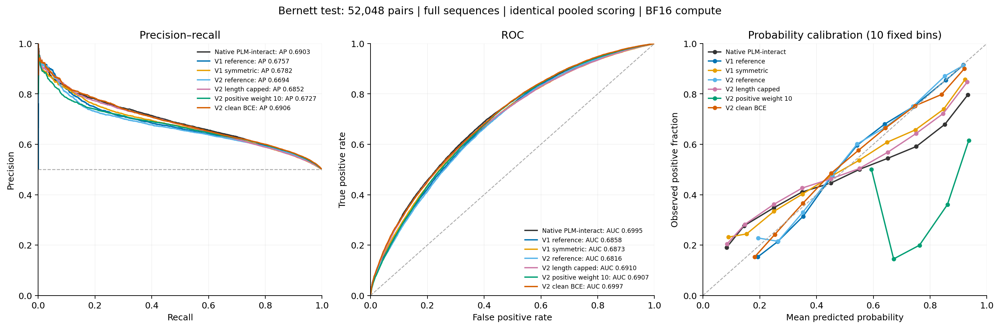
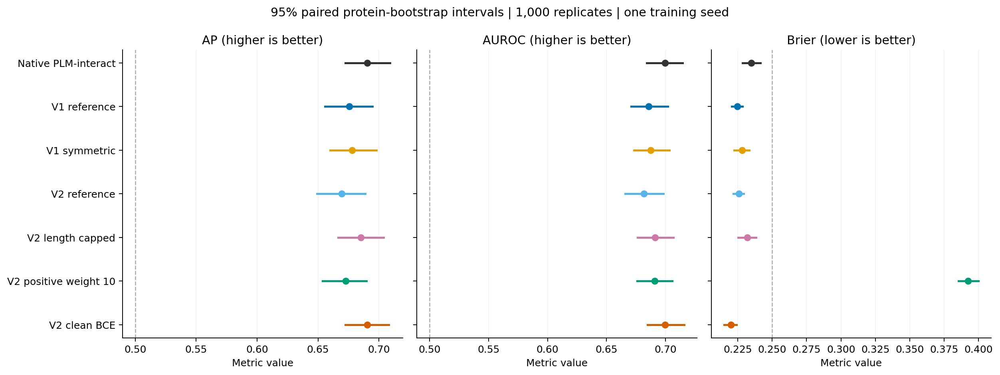

**Benchmark v2 completed Bernett test comparison**

V2 clean BCE has the highest v2 test AP (0.690596), compared with native PLM-interact's 0.690319. Its AP difference from native is +0.000277, with conditional 95% interval [-0.007765, +0.008157]. This does not demonstrate AP superiority over native.

This compares the existing validation-selected checkpoint from every completed initial v2 run with native PLM-interact and both v1 models. All seven results are retained. This historically reused test set provides an exploratory comparison, not independent confirmation of improved generalization.

V2 checkpoint identities were frozen at **2026-09-30T08:44:17.585014+00:00**, before new test inference. Reference, Positive10 and Clean BCE use update 4,000; the length-capped model uses update 8,000. Native and v1 predictions were reused after integrity and compatibility checks; their selected weights are unchanged.

All **52,048 test pairs** were evaluated, with **26,024 positives**. Every model receives complete sequences, BF16 computation with FP32 parameters, efficient attention, disabled TF32 and mean A–B/B–A logits. AP means average precision; AP and AUROC use raw logits. Brier is squared probability error and is lower when better.

| Model | Selected update | AP [95% interval] ↑ | AUROC ↑ | Brier ↓ |
| --- | ---: | --- | ---: | ---: |
| Native PLM-interact | Unreported | 0.690319 [0.672442, 0.709015] | 0.699467 | 0.234875 |
| V1 reference | 4,000 | 0.675669 [0.655738, 0.694638] | 0.685761 | 0.224792 |
| V1 symmetric | 7,000 | 0.678164 [0.659910, 0.698043] | 0.687280 | 0.228095 |
| V2 reference | 4,000 | 0.669386 [0.649064, 0.688809] | 0.681621 | 0.225789 |
| V2 length capped | 8,000 | 0.685180 [0.666691, 0.703768] | 0.691005 | 0.231953 |
| V2 positive weight 10 | 4,000 | 0.672726 [0.653597, 0.689674] | 0.690719 | 0.392505 |
| V2 clean BCE | 4,000 | 0.690596 [0.672353, 0.708224] | 0.699727 | 0.219897 |

**V2 differences from native**

| V2 model minus native | AP difference | Conditional 95% interval | AUROC difference | Brier difference ↓ |
| --- | ---: | --- | ---: | ---: |
| V2 reference | -0.020933 | [-0.033323, -0.008566] | -0.017846 | -0.009086 |
| V2 length capped | -0.005139 | [-0.013443, +0.002337] | -0.008462 | -0.002922 |
| V2 positive weight 10 | -0.017593 | [-0.027768, -0.007440] | -0.008748 | +0.157629 |
| V2 clean BCE | +0.000277 | [-0.007765, +0.008157] | +0.000260 | -0.014978 |

**V2 differences from v1**

| V2 model | AP difference from V1 reference [95% interval] | AP difference from V1 symmetric [95% interval] |
| --- | --- | --- |
| V2 reference | -0.006283 [-0.012934, +0.000666] | -0.008778 [-0.020148, +0.002302] |
| V2 length capped | +0.009511 [+0.001162, +0.017783] | +0.007016 [-0.000227, +0.013909] |
| V2 positive weight 10 | -0.002943 [-0.011041, +0.004062] | -0.005438 [-0.015494, +0.004020] |
| V2 clean BCE | +0.014926 [+0.007152, +0.022780] | +0.012431 [+0.004342, +0.019653] |

**Interventions against the v2 reference**

| Intervention minus v2 reference | AP difference | Conditional 95% interval |
| --- | ---: | --- |
| V2 length capped | +0.015794 | [+0.006659, +0.024670] |
| V2 positive weight 10 | +0.003340 | [-0.003897, +0.009671] |
| V2 clean BCE | +0.021209 | [+0.010962, +0.031347] |

The v2 reference is the matched control for the v2 interventions. V1 and v2 differ in their training stream and checkpoint-selection details, so differences between versions cannot be attributed to a single model modification. The capped arm changes training coverage; its test inference includes every long pair. Clean BCE removes masking and MLM together. Positive10 changes the class-weighted objective, which can shift raw probabilities without the same change in ranking.

Intervals use 1,000 paired protein bootstrap resamples with seed 20260929. Every model receives the same endpoint multiplicities; self-pairs receive one multiplicity. They condition on this interaction graph and the selected checkpoints, excluding training-seed, remote-homology and selection uncertainty. Comparisons are descriptive and not multiplicity-adjusted. Full AP, AUROC and Brier intervals and all 21 pairwise model comparisons are in [the result CSVs](results/paired-differences.csv).

**Validation and test separation**

| Model | Pooled validation AP | Pooled test AP |
| --- | ---: | ---: |
| Native PLM-interact | 0.642142 | 0.690319 |
| V1 reference | 0.650275 | 0.675669 |
| V1 symmetric | 0.647411 | 0.678164 |
| V2 reference | 0.653895 | 0.669386 |
| V2 length capped | 0.651579 | 0.685180 |
| V2 positive weight 10 | 0.654795 | 0.672726 |
| V2 clean BCE | 0.652156 | 0.690596 |

The test ordering differs from the validation ordering: Positive10 had the highest v2 validation AP, while Clean BCE and the capped model score better on test. The earlier observation that clean BCE deteriorated late in training concerns its final weights; this benchmark uses its prespecified update-4,000 selection.

Clean BCE improves on both v1 models in this historical comparison: AP differences are +0.014926 and +0.012431, respectively, with conditional intervals above zero. Its Brier improvement over native is -0.014978, interval [-0.019017, -0.011291]. This supports lower probability error against these benchmark labels, while the AP/AUROC differences from native remain inconclusive.

Checkpoint selection used validation only. These v2 selections follow completion of the full 12,745-update horizon; the v1 selections remain the best available checkpoints after their earlier shutdown. The authors’ exact selected native training update is unreported. The historical test already informed earlier research decisions, so favorable results here would still require independent holdout evaluation and seed replication before a generalization claim.

**Operating thresholds and probability accuracy**

Each threshold below maximizes F1 on the same 59,258 validation pairs, choosing the highest threshold on an exact tie. Pooled thresholds were fixed before new test inference. Test labels did not choose thresholds or fit calibration.

| Model | F1 at probability 0.5 | Validation-selected probability threshold | Test precision | Test recall | Test F1 | Test MCC |
| --- | ---: | ---: | ---: | ---: | ---: | ---: |
| Native PLM-interact | 0.664593 | 0.132515 | 0.534707 | 0.952544 | 0.684930 | 0.198168 |
| V1 reference | 0.607581 | 0.315103 | 0.532950 | 0.953735 | 0.683794 | 0.192162 |
| V1 symmetric | 0.637554 | 0.156362 | 0.520885 | 0.968414 | 0.677409 | 0.151769 |
| V2 reference | 0.604137 | 0.301568 | 0.529404 | 0.959576 | 0.682351 | 0.182874 |
| V2 length capped | 0.643295 | 0.113187 | 0.519970 | 0.971526 | 0.677393 | 0.150507 |
| V2 positive weight 10 | 0.666667 | 0.818737 | 0.537106 | 0.951967 | 0.686745 | 0.207094 |
| V2 clean BCE | 0.620698 | 0.253861 | 0.532709 | 0.963764 | 0.686154 | 0.201428 |

AP/AUROC assess ranking. Brier and the thresholded metrics assess different properties; a lower Brier score does not establish better ranking. In particular, positive class weighting changes the meaning of raw sigmoid scores, so the common 0.5 threshold can be inappropriate. No probability recalibration was fitted for this benchmark.

At probability 0.5, Positive10 predicts every test pair positive (recall 1, precision 0.5, MCC 0). Its F1 of 0.666667 at that threshold is the all-positive baseline on this balanced test set. Its validation-selected threshold gives a more useful operating point, as shown above.

**Sequence length strata**

| Model | AP for combined residues ≤2,193 | AP for combined residues >2,193 |
| --- | ---: | ---: |
| Native PLM-interact | 0.693226 | 0.644194 |
| V1 reference | 0.680836 | 0.620470 |
| V1 symmetric | 0.681184 | 0.641743 |
| V2 reference | 0.674183 | 0.623986 |
| V2 length capped | 0.688219 | 0.638810 |
| V2 positive weight 10 | 0.677388 | 0.628799 |
| V2 clean BCE | 0.694529 | 0.633929 |

The shorter stratum contains 48,656 pairs (positive fraction 0.500185); the longer stratum contains 3,392 pairs (positive fraction 0.497347). Special tokens add three to combined residue length. All strata use the globally validation-selected checkpoint; no subset-specific reselection was performed. Length-stratified AUROC, Brier and paired intervals are also retained.

**Inference reuse and verification**

Native PLM-interact, v1 reference and v1 symmetric test predictions were reused from benchmark-v1. All four v2 test predictions were generated freshly. Reuse checks verified the original checkpoint identities, SIF, full input arrays, model/data forward implementation, precision, pooling and batching. They checked 428 source prediction chunks across three prior test tasks and native validation, and required their merged arrays to equal the cached predictions exactly. Recomputed baseline metrics and complete bootstrap replicates reproduce benchmark-v1 within 1e-12.

Each new checkpoint loaded strictly and reproduced all 160 checked validation-pair logits exactly. The shared inference implementation also matched the frozen v2 implementation exactly on the checked BF16 and FP32 forwards. Tokenization was checked, all 3,710 validation sequences matched the v2 prepared data, and the longest 39,391-token validation input passed. Existing native eager/efficient FP32 and BF16 sensitivity evidence is retained from benchmark-v1.

Final merging checked every test row exactly once, labels, finite logits, chunk hashes and four distinct worker GPUs for each fresh model. Checkpoint identities and selection stayed fixed throughout evaluation. Negative labels are sampled unreported interactions rather than experimentally established noninteractions. This comparison concerns the Bernett human PPI task, not the paper’s separate cross-species task.

The paper’s rounded AP/AUROC (0.69/0.70) used original-order inference. The primary comparison here gives all seven models the same full-length pooled scoring. Original-order metrics remain available as a secondary view. The [previous benchmark](../benchmark-v1/REPORT.md) documents published-score, sequence-cap and numerical-precision context.

[Exact results and provenance](results/benchmark-summary.json) · [All metrics](results/metrics.csv) · [Paired differences](results/paired-differences.csv) · [Frozen selection](provenance/selection.json) · [Reuse verification](provenance/reuse-verification.json) · [Qualification](provenance/qualification.json) · [Protocol](PROTOCOL.md)
