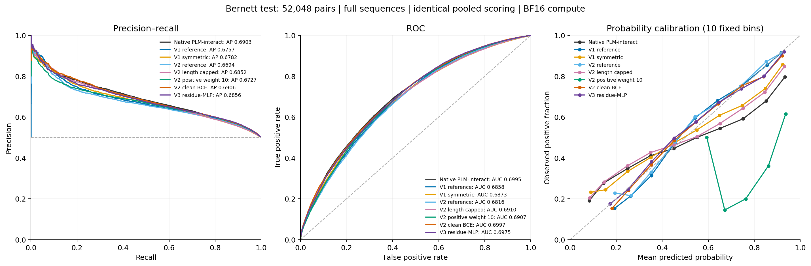
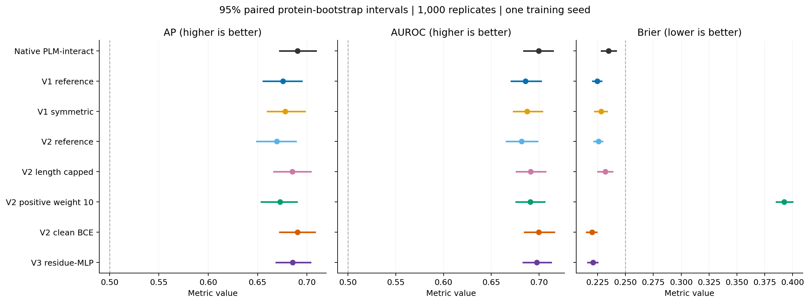

# Final v3 benchmark

V3 does not outperform native in primary test AP.

Selected residue-MLP checkpoint: update **4,000**, official validation AP **0.657140**.

This ends v3. No further v3 model, learning-rate, data or seed search is scheduled.

| Model | Selected update | Test AP | Test AUROC | Brier (lower is better) |
| --- | ---: | ---: | ---: | ---: |
| native-bernett | Unreported | 0.690319 | 0.699467 | 0.234875 |
| v1-reference | 4,000 | 0.675669 | 0.685761 | 0.224792 |
| v1-symmetric | 7,000 | 0.678164 | 0.687280 | 0.228095 |
| v2-reference | 4,000 | 0.669386 | 0.681621 | 0.225789 |
| v2-capped | 8,000 | 0.685180 | 0.691005 | 0.231953 |
| v2-positive10 | 4,000 | 0.672726 | 0.690719 | 0.392505 |
| v2-clean-bce | 4,000 | 0.690596 | 0.699727 | 0.219897 |
| v3-residue-mlp | 4,000 | 0.685553 | 0.697471 | 0.220824 |

Paired protein-resampling AP differences (v3 minus comparator):

| Comparator | AP difference | Descriptive 95% interval |
| --- | ---: | --- |
| native-bernett | -0.004766 | [-0.012982, +0.003517] |
| v1-reference | +0.009883 | [+0.001268, +0.018493] |
| v1-symmetric | +0.007388 | [-0.000957, +0.015208] |
| v2-reference | +0.016166 | [+0.006160, +0.025843] |
| v2-capped | +0.000373 | [-0.007797, +0.008741] |
| v2-positive10 | +0.012826 | [+0.005400, +0.021201] |
| v2-clean-bce | -0.005043 | [-0.011594, +0.001509] |

## Scope and interpretation

One ESM2-initialized residue-MLP model, seed 2, initial LR 2e-5, clean BCE, full backbone fine-tuning. The 163,085 official training pairs and 59,258 validation pairs were unchanged; no length cap. The learning-rate schedule retained its original 12,745-update horizon and 2,000-update warmup. Maximum pooled validation AP selects the checkpoint; exact ties choose the earlier update. Both orientations contribute to training and inference.

Training stopped safely at update 8,446 of 12,745, after 8 complete official validations. The user authorized stopping after four successive validation AP declines. Selection used every completed validation; the final resumable checkpoint is separate from the selected checkpoint. The full training horizon was not completed, so this is not an equal-training-budget comparison with v2. V1 was also stopped early; v2 completed its full horizon. See the [early-stop amendment](provenance/early-stop-amendment.json).

All eight models cover the same 52,048 official test pairs. The seven native/v1/v2 prediction sets were reused after checksum and row/label checks. Scores average AB/BA logits, with FP32 parameters, BF16 autocast, efficient attention, TF32 disabled and no test truncation. Thresholds were fixed from validation before new test inference. Baseline metrics and paired bootstrap replicates reproduce v2 to 1e-12.

V3 inference ran the original four independent shards sequentially on the available interactive GH200 GPU. Row assignment, length sorting, batching, scoring and precision were unchanged from the prepared four-GPU implementation. Shard timing records verify nonoverlapping execution; every test row occurs exactly once. This avoids the several-hour estimated queue for another node.

This is an exploratory historical-test comparison, not independent confirmation. The test informed earlier research, only one full-data v3 seed was trained, and descriptive protein-level bootstrap intervals do not account for all prior model-selection or homology dependence. Residue-MLP improved internal mean AP by 0.003886 but did not pass the original +0.005 advancement gate. The user explicitly authorized this single final experiment despite that gate; the failed-gate record is preserved. No superiority guarantee was made.

The model/data/checkpoint core is unchanged from the qualified v3 residue stage. V3 disables DDP gradient bucket views to preserve exact resume; this engineering difference from v2 is documented in the training protocol. The final comparison cannot isolate every numerical or seed effect.

## Artifacts

- [Machine-readable results](results/benchmark-summary.json)
- [All paired differences](results/paired-differences.csv)
- [Validation-only checkpoint selection](provenance/selection.json)
- [Checkpoint forward verification](provenance/qualification.json)
- [Frozen training protocol](../retrain-v3/FINAL_PROTOCOL.md)
- [Original development decision](../retrain-v3/decisions/readout-window5000.json)
