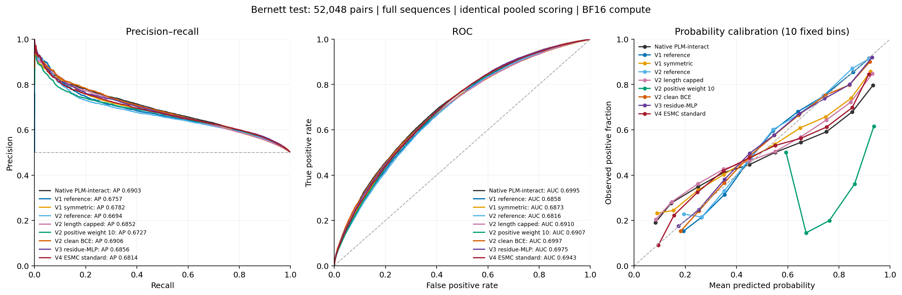
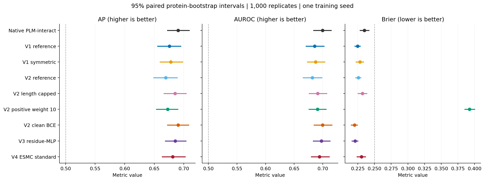

# V4 ESMC test benchmark

ESMC standard attention does not outperform native in pooled test AP.

ESMC 600M standard attention (C0), seed 2: selected update **7,000**, validation AP **0.657630**. The complete 12,745-update training horizon and all 13 validations finished before selection. The final update was not selected.

All nine models are compared on the same **52,048 Bernett human PPI test pairs**, including **26,024 positives**. Only C0 received new test inference. Native, both v1 models, all four v2 models and v3 reuse their verified predictions.

| Model | Selected update | Test AP | Test AUROC | Brier (lower is better) |
| --- | ---: | ---: | ---: | ---: |
| Native PLM-interact | Unreported | 0.690319 | 0.699467 | 0.234875 |
| V1 reference | 4,000 | 0.675669 | 0.685761 | 0.224792 |
| V1 symmetric | 7,000 | 0.678164 | 0.687280 | 0.228095 |
| V2 reference | 4,000 | 0.669386 | 0.681621 | 0.225789 |
| V2 length capped | 8,000 | 0.685180 | 0.691005 | 0.231953 |
| V2 positive weight 10 | 4,000 | 0.672726 | 0.690719 | 0.392505 |
| V2 clean BCE | 4,000 | 0.690596 | 0.699727 | 0.219897 |
| V3 residue-MLP | 4,000 | 0.685553 | 0.697471 | 0.220824 |
| V4 ESMC standard | 7,000 | 0.681420 | 0.694261 | 0.230444 |

## Paired AP differences

C0 minus each comparator. Intervals use the same 1,000 protein-resampling replicates (seed 20260929) as the previous benchmarks.

| Comparator | AP difference | Descriptive 95% interval |
| --- | ---: | --- |
| Native PLM-interact | -0.008899 | [-0.017948, +0.001604] |
| V1 reference | +0.005751 | [-0.006033, +0.017623] |
| V1 symmetric | +0.003256 | [-0.004961, +0.011941] |
| V2 reference | +0.012034 | [-0.001759, +0.027160] |
| V2 length capped | -0.003760 | [-0.013906, +0.007880] |
| V2 positive weight 10 | +0.008694 | [-0.002876, +0.020747] |
| V2 clean BCE | -0.009176 | [-0.018328, -0.000168] |
| V3 residue-MLP | -0.004133 | [-0.013958, +0.005798] |

## Validation and length diagnostics

Validation scores below use pooled logits from each already selected checkpoint. All test strata retain those global selections.

| Model | Validation AP | Test AP, residues ≤2,193 | Test AP, residues >2,193 | Protein-macro AP |
| --- | ---: | ---: | ---: | ---: |
| Native PLM-interact | 0.642142 | 0.693226 | 0.644194 | 0.718928 |
| V1 reference | 0.650275 | 0.680836 | 0.620470 | 0.697259 |
| V1 symmetric | 0.647411 | 0.681184 | 0.641743 | 0.708876 |
| V2 reference | 0.653895 | 0.674183 | 0.623986 | 0.696529 |
| V2 length capped | 0.651579 | 0.688219 | 0.638810 | 0.709444 |
| V2 positive weight 10 | 0.654795 | 0.677388 | 0.628799 | 0.702123 |
| V2 clean BCE | 0.652156 | 0.694529 | 0.633929 | 0.711667 |
| V3 residue-MLP | 0.657140 | 0.689930 | 0.656925 | 0.714466 |
| V4 ESMC standard | 0.657630 | 0.684127 | 0.653000 | 0.711667 |

The shorter and longer strata contain 48,656 and 3,392 pairs, respectively. Special tokens add three to residue length. Protein-macro AP gives equal weight to 2,795 test proteins with both positive and negative incident pairs; 227 single-class proteins are excluded. Self-pairs count once for their protein. This descriptive diagnostic is not used for model selection or the pooled-AP success criterion.

## Validation-selected operating thresholds

Each model uses the highest logit threshold attaining maximum validation F1. Thresholds were frozen before C0 test inference; no calibration was fitted.

| Model | Probability threshold | Test precision | Test recall | Test F1 | Test MCC |
| --- | ---: | ---: | ---: | ---: | ---: |
| Native PLM-interact | 0.132515 | 0.534707 | 0.952544 | 0.684930 | 0.198168 |
| V1 reference | 0.315103 | 0.532950 | 0.953735 | 0.683794 | 0.192162 |
| V1 symmetric | 0.156362 | 0.520885 | 0.968414 | 0.677409 | 0.151769 |
| V2 reference | 0.301568 | 0.529404 | 0.959576 | 0.682351 | 0.182874 |
| V2 length capped | 0.113187 | 0.519970 | 0.971526 | 0.677393 | 0.150507 |
| V2 positive weight 10 | 0.818737 | 0.537106 | 0.951967 | 0.686745 | 0.207094 |
| V2 clean BCE | 0.253861 | 0.532709 | 0.963764 | 0.686154 | 0.201428 |
| V3 residue-MLP | 0.250179 | 0.535556 | 0.959038 | 0.687302 | 0.208023 |
| V4 ESMC standard | 0.204342 | 0.545481 | 0.935790 | 0.689213 | 0.223379 |

## Scope and stopped experiments

This is the user-requested test comparison of C0, an originally planned standard-attention backbone control. The original v4 proposal nominated C1 (ESMC chain-aware) as its primary native-model comparison. C1 was stopped for the diagnosed attention failure; C0 is not retrospectively relabeled as that primary arm, and the incomplete factorial experiment cannot support an attention interaction claim.

| Stopped v4 arm | Stopped update | Best validation AP | Test inference here |
| --- | ---: | ---: | --- |
| S1: ESM2 chain-aware | 3,070 | 0.530384 | Not performed; user stopped this arm |
| C1: ESMC chain-aware | 3,015 | 0.519057 | Not performed; user stopped this arm |

The proposal's numerical practical-gain criterion (+0.010 absolute AP over native and a paired interval above zero) is not met by C0 descriptively. The original C1 primary comparison remains uncompleted.

The train/validation partitions remain 163,085/59,258 pairs. C0 uses full sequences, ESMC pretrained initialization, the v3 residue-MLP design, clean BCE, initial LR 2e-5 and 2,000-update warmup. C0 is selected at update 7,000 after 13 validation opportunities. V3/S0 was stopped at update 8,446 and selected update 4,000 from eight validations. V2 completed the full horizon; v1 was stopped early. These different selection histories and training exposures limit causal attribution to the backbone alone.

Scores average AB/BA raw logits for every model. ESMC inference uses the same SIF, frozen forward implementation and token IDs as its training: FP32 parameters, BF16 autocast, efficient attention, TF32 disabled, and no sequence truncation. The four fixed shards retain the previous benchmarks' row assignment, sorting and microbatches. Atomic chunks support restart. Final merging checks unique full row coverage, labels, finite scores and worker identity.

Reused prediction hashes and row identities are verified against benchmark-v3. All eight baseline AP/AUROC/Brier values and every protein-bootstrap replicate reproduce benchmark-v3 within 1e-12. Strict checkpoint loading and selected-validation forward checks precede new test inference. Original-order scores, pooled scores, fixed-0.5 metrics and full paired AP/AUROC/Brier comparisons remain in the CSV outputs.

This remains an exploratory historical-test comparison with one seed per training condition. The test informed earlier research decisions. Protein-bootstrap intervals condition on the current graph and chosen checkpoints, omit training-seed and some homology/selection uncertainty, and are not adjusted for multiple comparisons. Negative labels are sampled unreported interactions, not experimentally verified noninteractions. Lower Brier indicates lower probability error on these benchmark labels and does not by itself establish better AP.

## Artifacts

- [Machine-readable comparison](results/benchmark-summary.json)
- [All paired differences](results/paired-differences.csv)
- [All metrics and length strata](results/metrics.csv)
- [Protein-macro definition and results](results/protein-macro-summary.json)
- [Frozen checkpoint selection](provenance/selection.json)
- [Checkpoint forward verification](provenance/qualification.json)
- [Prediction reuse verification](provenance/reuse-verification.json)
- [Benchmark protocol](PROTOCOL.md)
