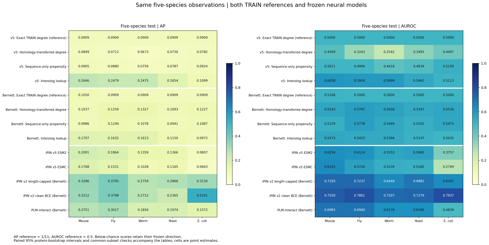
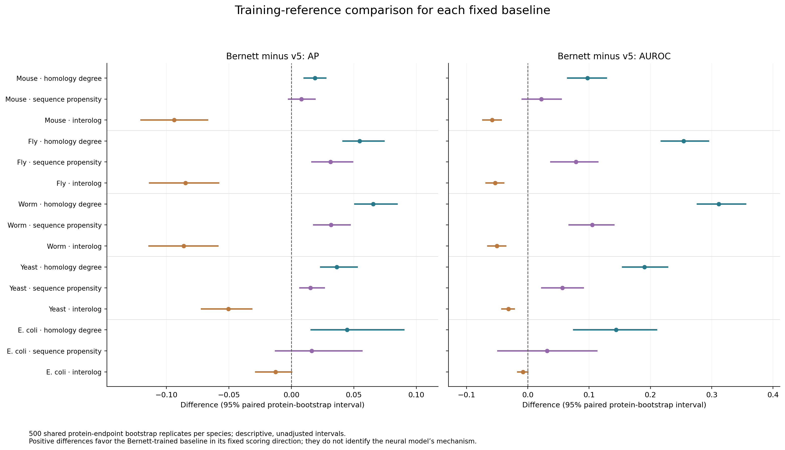
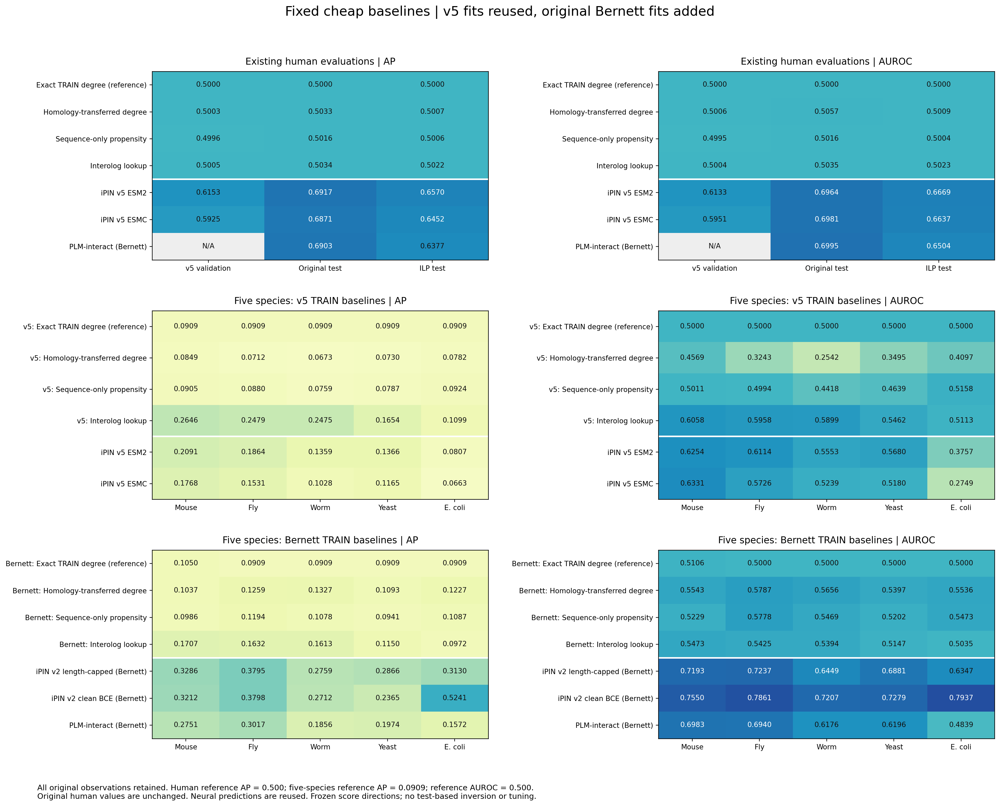

# Fixed cheap baselines: v5 and Bernett TRAIN, human and five-species tests

Updated 2026-10-07. The existing v5 model/propensities/positive graph were reused unchanged. Corresponding original-Bernett baselines were fitted with the identical fixed configuration. All 242,000 nonhuman source observations were evaluated. Earlier human results remain unchanged.

## Findings

**These three Bernett-trained baselines recover modest cross-species signal, but do not reproduce the much stronger Bernett-trained v2 performance. The result does not establish the hypothesized shortcut as the explanation of the neural gap.**

- Bernett mean AUROC: homology-transferred degree **0.5584**, sequence-only propensity **0.5430**, interolog **0.5295**. Each is below both v2 controls in AP and AUROC on every species; all 60 corresponding paired baseline-minus-v2 intervals lie below zero under the declared descriptive bootstrap. This does not rule out other shortcuts or prove what the neural models learned.
- **The reused v5 interolog baseline exceeds both v5 neural models in AP on all five species.** Its mean AP is **0.2071**, versus **0.1497** for v5 ESM2 and **0.1231** for v5 ESMC. It also exceeds the Bernett interolog baseline in AP and AUROC on every species. This is evidence of conserved-positive-graph signal available to this simple lookup; conservation is not automatically an illegitimate shortcut.
- v5 homology-degree AUROC is **0.4569, 0.3243, 0.2542, 0.3495, 0.4097**. **Below chance is inverse association, not absence of signal.** Its TRAIN target is almost constant: 99.82% of proteins have equal positive/negative degrees. The fixed no-hit fallback is slightly positive (0.000101364), whereas many matched proteins contribute zero. Between 96.72% and 99.89% of pairs within each species/class have exactly this zero-for-hit plus fallback-for-no-hit score. Test positives tend to have more matches, so this inherited convention tends to rank them lower. The score direction and fallback were not changed after seeing results.
- v5 sequence-propensity mean AUROC is **0.4844**; its fixed degree-ratio target is not a general test of all sequence-only classifiers.
- The v5 interolog AP advantage over both v5 neural models persists descriptively after excluding exact endpoints from either TRAIN, and after deduplication/removal of conflicting-label pairs. These secondary subsets have different prevalence and are not directly comparable to the full AP values.
- The previous V11 study recovered much stronger endpoint-transfer signal (mean homology-degree AUROC 0.8591), but those V11-trained results are not Bernett-trained evidence. See [that separate study](../literature/string-v11-baselines/REPORT.md).

## Five-species average precision

| Model / TRAIN reference | Mouse | Fly | Worm | Yeast | E. coli | Mean¹ |
|---|---:|---:|---:|---:|---:|---:|
| v5: Exact TRAIN degree (reference) | 0.0909 | 0.0909 | 0.0909 | 0.0909 | 0.0909 | 0.0909 |
| v5: Homology-transferred degree | 0.0849 | 0.0712 | 0.0673 | 0.0730 | 0.0782 | 0.0749 |
| v5: Sequence-only propensity | 0.0905 | 0.0880 | 0.0759 | 0.0787 | 0.0924 | 0.0851 |
| v5: Interolog lookup | 0.2646 | 0.2479 | 0.2475 | 0.1654 | 0.1099 | 0.2071 |
| Bernett: Exact TRAIN degree (reference) | 0.1050 | 0.0909 | 0.0909 | 0.0909 | 0.0909 | 0.0937 |
| Bernett: Homology-transferred degree | 0.1037 | 0.1259 | 0.1327 | 0.1093 | 0.1227 | 0.1189 |
| Bernett: Sequence-only propensity | 0.0986 | 0.1194 | 0.1078 | 0.0941 | 0.1087 | 0.1057 |
| Bernett: Interolog lookup | 0.1707 | 0.1632 | 0.1613 | 0.1150 | 0.0972 | 0.1415 |
| iPIN v5 ESM2 | 0.2091 | 0.1864 | 0.1359 | 0.1366 | 0.0807 | 0.1497 |
| iPIN v5 ESMC | 0.1768 | 0.1531 | 0.1028 | 0.1165 | 0.0663 | 0.1231 |
| iPIN v2 length-capped (Bernett) | 0.3286 | 0.3795 | 0.2759 | 0.2866 | 0.3130 | 0.3167 |
| iPIN v2 clean BCE (Bernett) | 0.3212 | 0.3798 | 0.2712 | 0.2365 | 0.5241 | 0.3466 |
| PLM-interact (Bernett) | 0.2751 | 0.3017 | 0.1856 | 0.1974 | 0.1572 | 0.2234 |

## Five-species AUROC

| Model / TRAIN reference | Mouse | Fly | Worm | Yeast | E. coli | Mean¹ |
|---|---:|---:|---:|---:|---:|---:|
| v5: Exact TRAIN degree (reference) | 0.5000 | 0.5000 | 0.5000 | 0.5000 | 0.5000 | 0.5000 |
| v5: Homology-transferred degree | 0.4569 | 0.3243 | 0.2542 | 0.3495 | 0.4097 | 0.3590 |
| v5: Sequence-only propensity | 0.5011 | 0.4994 | 0.4418 | 0.4639 | 0.5158 | 0.4844 |
| v5: Interolog lookup | 0.6058 | 0.5958 | 0.5899 | 0.5462 | 0.5113 | 0.5698 |
| Bernett: Exact TRAIN degree (reference) | 0.5106 | 0.5000 | 0.5000 | 0.5000 | 0.5000 | 0.5021 |
| Bernett: Homology-transferred degree | 0.5543 | 0.5787 | 0.5656 | 0.5397 | 0.5536 | 0.5584 |
| Bernett: Sequence-only propensity | 0.5229 | 0.5778 | 0.5469 | 0.5202 | 0.5473 | 0.5430 |
| Bernett: Interolog lookup | 0.5473 | 0.5425 | 0.5394 | 0.5147 | 0.5035 | 0.5295 |
| iPIN v5 ESM2 | 0.6254 | 0.6114 | 0.5553 | 0.5680 | 0.3757 | 0.5471 |
| iPIN v5 ESMC | 0.6331 | 0.5726 | 0.5239 | 0.5180 | 0.2749 | 0.5045 |
| iPIN v2 length-capped (Bernett) | 0.7193 | 0.7237 | 0.6449 | 0.6881 | 0.6347 | 0.6821 |
| iPIN v2 clean BCE (Bernett) | 0.7550 | 0.7861 | 0.7207 | 0.7279 | 0.7937 | 0.7567 |
| PLM-interact (Bernett) | 0.6983 | 0.6940 | 0.6176 | 0.6196 | 0.4839 | 0.6227 |

¹ Mean is the unweighted mean of five separate species metrics, not a pooled test or selected ensemble. Reference AP = 1/11 = 0.0909; reference AUROC = 0.5. Exact-degree lookup is the inherited control, not a fourth proposed method.





## Original human evaluations — unchanged

All three v5-trained baselines remain near chance on v5 validation and both human tests. There was no v5 refitting, rescoring of those human rows, or replacement of their intervals. The original report/figures/metrics and completion manifest are retained in `archive/before-nonhuman/`.

### Average precision

| Method | V5 validation | Original Bernett test | V5 ILP test |
|---|---:|---:|---:|
| Exact TRAIN degree (reference) | 0.5000 | 0.5000 | 0.5000 |
| Homology-transferred degree | 0.5003 | 0.5033 | 0.5007 |
| Sequence-only propensity | 0.4996 | 0.5016 | 0.5006 |
| Interolog lookup | 0.5005 | 0.5034 | 0.5022 |
| iPIN v5 ESM2 | 0.6153 | 0.6917 | 0.6570 |
| iPIN v5 ESMC | 0.5925 | 0.6871 | 0.6452 |
| PLM-interact (Bernett) | — | 0.6903 | 0.6377 |

### AUROC

| Method | V5 validation | Original Bernett test | V5 ILP test |
|---|---:|---:|---:|
| Exact TRAIN degree (reference) | 0.5000 | 0.5000 | 0.5000 |
| Homology-transferred degree | 0.5006 | 0.5057 | 0.5009 |
| Sequence-only propensity | 0.4995 | 0.5016 | 0.5004 |
| Interolog lookup | 0.5004 | 0.5035 | 0.5023 |
| iPIN v5 ESM2 | 0.6133 | 0.6964 | 0.6669 |
| iPIN v5 ESMC | 0.5951 | 0.6981 | 0.6637 |
| PLM-interact (Bernett) | — | 0.6995 | 0.6504 |

Human prevalence is 1/2. The two human tests share all positives. Validation neural scores were used for checkpoint selection. Native Bernett has no v5-validation predictions; its own validation was not substituted.



## Class-specific homology/interolog coverage

Each cell shows **positive percentage / negative percentage**. This is label association in the fixed evaluation data, not a predictor fitted to those labels. An exact match counts as a homolog. All missing-hit pairs remain in the denominator.

| Species | TRAIN | Both endpoints have a retained match (%) | Positive-graph interolog support (%) |
|---|---|---:|---:|
| Mouse | v5 | 41.16 / 32.75 | 21.88 / 0.80 |
| Mouse | bernett | 20.30 / 9.31 | 9.74 / 0.29 |
| Fly | v5 | 33.54 / 10.30 | 19.60 / 0.47 |
| Fly | bernett | 16.26 / 3.98 | 8.64 / 0.15 |
| Worm | v5 | 33.02 / 4.42 | 18.18 / 0.23 |
| Worm | bernett | 15.56 / 1.55 | 7.96 / 0.09 |
| Yeast | v5 | 18.50 / 4.01 | 9.50 / 0.26 |
| Yeast | bernett | 6.20 / 1.39 | 3.02 / 0.07 |
| E. coli | v5 | 5.20 / 0.70 | 2.30 / 0.04 |
| E. coli | bernett | 1.15 / 0.17 | 0.70 / 0.01 |

These class-conditional differences are information that FADI’s distinct-protein separation score does not quantify. Neither a total overlap count nor a training-size comparison can determine the mechanism responsible for a neural performance difference.

## Common-row sensitivity analyses

| Species | Subset | Rows | Positives | Negatives |
|---|---|---:|---:|---:|
| Mouse | common_train_endpoint_unexposed | 53,312 | 4,348 | 48,964 |
| Mouse | unique_nonconflicting_pairs | 54,965 | 4,997 | 49,968 |
| Fly | common_train_endpoint_unexposed | 54,858 | 4,997 | 49,861 |
| Fly | unique_nonconflicting_pairs | 54,923 | 4,998 | 49,925 |
| Worm | common_train_endpoint_unexposed | 55,000 | 5,000 | 50,000 |
| Worm | unique_nonconflicting_pairs | 54,960 | 4,992 | 49,968 |
| Yeast | common_train_endpoint_unexposed | 55,000 | 5,000 | 50,000 |
| Yeast | unique_nonconflicting_pairs | 54,940 | 4,980 | 49,960 |
| E. coli | common_train_endpoint_unexposed | 22,000 | 2,000 | 20,000 |
| E. coli | unique_nonconflicting_pairs | 18,228 | 1,999 | 16,229 |

Both masks apply identically to all 13 predictors. The exact-exposure mask concerns these two TRAIN references only; it is not the broader all-competitor exposure mask in the neural benchmark. The primary results preserve duplicates/conflicts. Subset metrics are point estimates in [nonhuman-subsets.csv](results/nonhuman-subsets.csv).

## Methods, uncertainty and limits

- [Original frozen protocol](PROTOCOL.md) and [five-species addendum](NONHUMAN-ADDENDUM.md). New numerical baseline results were unknown when the addendum was frozen; historical neural results and FADI/TRIQ were already known.
- v5 TRAIN: 700,764 rows, 350,382 positives, 13,110 distinct sequences. Original Bernett TRAIN: 163,192 rows, 81,596 positives, 4,286 distinct sequences. No validation examples enter counts, graph construction or fitting. Bernett is the full source release; the historical neural models used their recorded cleaned/capped variants and different training trajectories.
- Fixed log((positive occurrences + 1)/(negative occurrences + 1)); self-pairs count once. The same 422 features and 300-iteration histogram gradient boosting regressor are used. Graph lookup uses up to five matches per endpoint and maximizes the product of their weights over positive TRAIN edges.
- CPU MMseqs2 uses the original 25%-identity/50%-bilateral-coverage search settings, E≤1e-5, sensitivity 7.5 and 1,000 candidates. Searches are against each TRAIN separately. The inherited reported-identity/coverage weights and tie-breaking are unchanged. FADI’s different search was not substituted.
- 500 paired protein-endpoint bootstrap replicates per species, seed 20261006, shared across all 13 predictors. Intervals are descriptive and unadjusted for multiple comparisons; they omit training-seed, family/phylogenetic and data-construction uncertainty. No scores were inverted, recalibrated or selected using the test labels.
- Three fixed probes cannot exhaust every shortcut. Protein-propensity models do not learn partner-specific compatibility; interolog lookup may exploit legitimate conserved biology. Baseline performance does not identify a neural model’s causal mechanism.

## Verification and computational audit

- **40 independent checks passed**, including all 242,000 exported rows with 13 scores per row. Point metrics, shared bootstrap samples, intervals, sources and neural score mappings were verified.
- Original human study: 83 artifact hashes verified before extension and archived. The v5 regressor, degree targets, graph and original prediction arrays remain unchanged. The new homolog parser reproduces every original v5 index/weight exactly; reloaded model predictions reproduce saved values exactly.
- An auxiliary export issue was diagnosed: MMseqs `nident` was unavailable without backtraces. Backtrace searches reproduced all nine baseline-relevant fields for every alignment, so **no score changed**. The raw initial integer diagnostics in `predictions-frozen.json` are superseded by `alignment-precision-{v5,bernett}.json`. One apparent boundary discrepancy in the integer export was checked by counting aligned residues directly: 211/841 = 25.0892%, which passes the requested identity cutoff. See [identity-boundary-check.json](provenance/nonhuman/identity-boundary-check.json).
- [Fallback diagnostic](results/nonhuman-v5-fallback-diagnostic.csv) was added after seeing below-chance v5 homology-degree results. It measures agreement with the existing fallback convention; no alternative predictor or flipped score was evaluated.
- CPU only on the existing Arrhenius allocation; two 16-thread searches run concurrently. Initial search times: v5 125.34 s, Bernett 87.03 s. Auxiliary backtrace checks add 126.38 s and 87.44 s. The new Bernett regressor fit took about 1.04 s; v5 fit time is zero. These exclude preparation, qualification, export and plotting and are machine-specific timings.

## Artifacts and reproduction

- [Combined metrics](results/metrics.csv), [intervals](results/confidence-intervals.csv), [paired differences](results/paired-differences.csv), and [summary](results/summary.json).
- `results/nonhuman-*` contains extension-only tables, coverage, subset analyses, mean metrics and verification. `results/{species}-predictions.csv.gz` preserves all row-level scores, labels, sequence hashes and support counts.
- All three figure groups are exported as PNG/PDF/SVG. `models/nonhuman/` stores the Bernett fit and both references’ mapped protein values/graphs/hits. `provenance/nonhuman/` stores frozen settings, source mappings, checksums, reuse proofs and corrections.
- Existing heavy inputs, models and predictions remain local; lightweight reports, tables, figures and code are versionable.

```bash
bash benchmark-v5-baselines/scripts/run.sh
```

The runner verifies and reuses completed stages. It never refits the saved v5 model. Final completion is recorded in `results/COMPLETE.json` after the combined outputs pass integrity checks.
