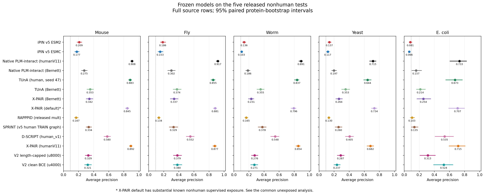
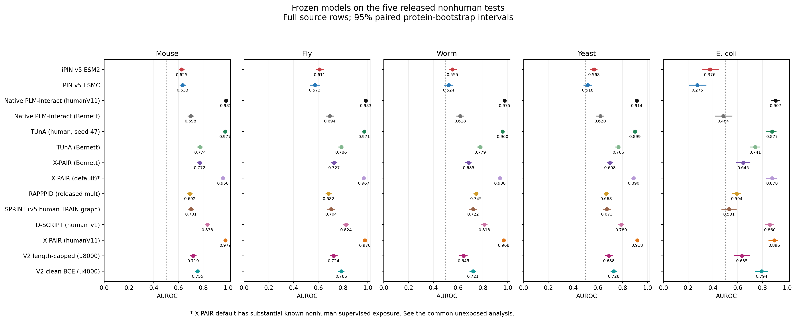
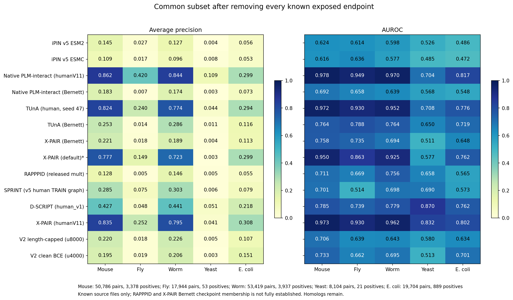
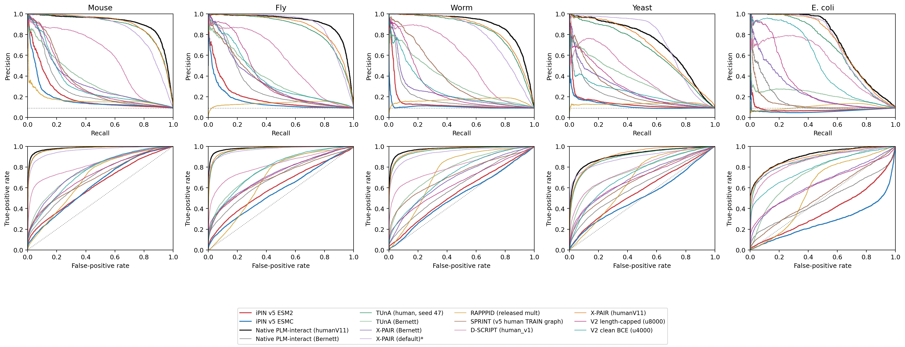

# Frozen v5 iPIN transfer to five nonhuman species

Completed analysis: 2026-10-06T20:56:29.203801+00:00. All 14 displayed frozen predictors cover the same 242,000 released rows across five species.

The frozen v5 iPIN models do not demonstrate a cross-species advantage on these datasets. iPIN v5 ESM2 exceeds native humanV11 on AP in 0/5 species and native Bernett in 0/5; iPIN v5 ESMC exceeds native humanV11 on AP in 0/5 species and native Bernett in 0/5. This is a transfer limitation of these particular human ILP-trained checkpoints. It does not reverse their earlier human test results, and it does not isolate architecture from training-data effects.

## Average precision

| Model | Mouse | Fly | Worm | Yeast | E. coli |
|---|---:|---:|---:|---:|---:|
| iPIN v5 ESM2 | 0.2091 | 0.1864 | 0.1359 | 0.1366 | 0.0807 |
| iPIN v5 ESMC | 0.1768 | 0.1531 | 0.1028 | 0.1165 | 0.0663 |
| Native PLM-interact (humanV11) | 0.9084 | 0.9168 | 0.8909 | 0.7147 | 0.7329 |
| Native PLM-interact (Bernett) | 0.2751 | 0.3017 | 0.1856 | 0.1974 | 0.1572 |
| TUnA (human, seed 47) | 0.8832 | 0.8550 | 0.8368 | 0.6441 | 0.6730 |
| TUnA (Bernett) | 0.3528 | 0.3740 | 0.3551 | 0.3527 | 0.2139 |
| X-PAIR (Bernett) | 0.3423 | 0.3366 | 0.2310 | 0.2644 | 0.2542 |
| X-PAIR (default)* | 0.8454 | 0.8815 | 0.7955 | 0.7339 | 0.7073 |
| RAPPPID (released mult) | 0.1675 | 0.1338 | 0.1649 | 0.1305 | 0.1033 |
| SPRINT (v5 human TRAIN graph) | 0.3337 | 0.3289 | 0.3783 | 0.2596 | 0.1345 |
| D-SCRIPT (human_v1) | 0.5799 | 0.5524 | 0.5482 | 0.4048 | 0.5350 |
| X-PAIR (humanV11) | 0.8924 | 0.8767 | 0.8541 | 0.6821 | 0.7151 |
| V2 length-capped (u8000) | 0.3286 | 0.3795 | 0.2759 | 0.2866 | 0.3130 |
| V2 clean BCE (u4000) | 0.3212 | 0.3798 | 0.2712 | 0.2365 | 0.5241 |

AP is sklearn average precision, matching the paper’s AUPR convention. Full-set prevalence is 1/11 (random-ranking reference ≈0.0909). Each score is calculated on every original row, including duplicate pairs. X-PAIR default* has substantial known target-species supervised exposure; its full-set scores are not clean human-only transfer evidence.

## AUROC

| Model | Mouse | Fly | Worm | Yeast | E. coli |
|---|---:|---:|---:|---:|---:|
| iPIN v5 ESM2 | 0.6254 | 0.6114 | 0.5553 | 0.5680 | 0.3757 |
| iPIN v5 ESMC | 0.6331 | 0.5726 | 0.5239 | 0.5180 | 0.2749 |
| Native PLM-interact (humanV11) | 0.9830 | 0.9834 | 0.9753 | 0.9144 | 0.9066 |
| Native PLM-interact (Bernett) | 0.6983 | 0.6940 | 0.6176 | 0.6196 | 0.4839 |
| TUnA (human, seed 47) | 0.9774 | 0.9710 | 0.9602 | 0.8992 | 0.8775 |
| TUnA (Bernett) | 0.7743 | 0.7855 | 0.7789 | 0.7656 | 0.7412 |
| X-PAIR (Bernett) | 0.7719 | 0.7273 | 0.6850 | 0.6976 | 0.6447 |
| X-PAIR (default)* | 0.9584 | 0.9672 | 0.9377 | 0.8899 | 0.8779 |
| RAPPPID (released mult) | 0.6918 | 0.6823 | 0.7455 | 0.6678 | 0.5935 |
| SPRINT (v5 human TRAIN graph) | 0.7008 | 0.7042 | 0.7217 | 0.6726 | 0.5306 |
| D-SCRIPT (human_v1) | 0.8329 | 0.8236 | 0.8130 | 0.7890 | 0.8603 |
| X-PAIR (humanV11) | 0.9785 | 0.9759 | 0.9685 | 0.9185 | 0.8959 |
| V2 length-capped (u8000) | 0.7193 | 0.7237 | 0.6449 | 0.6881 | 0.6347 |
| V2 clean BCE (u4000) | 0.7550 | 0.7861 | 0.7207 | 0.7279 | 0.7937 |

The AUROC chance reference is 0.5. Below-chance E. coli values are retained as observed; no score inversion or target-dependent correction is applied.

## Common subset without known exposed endpoints

For each species, remove every pair containing a sequence found in any audited public TRAIN/validation source. All 14 displayed models are then compared on the identical remaining rows. This is a sensitivity analysis, not proof that all remaining examples are unseen: exact checkpoint membership remains unavailable for RAPPPID and X-PAIR Bernett, and homologs are not removed.

| Species | Retained pairs | Positives | Negatives |
|---|---:|---:|---:|
| mouse | 50,786 | 3,378 | 47,408 |
| fly | 17,944 | 53 | 17,891 |
| worm | 53,419 | 3,937 | 49,482 |
| yeast | 8,104 | 21 | 8,083 |
| ecoli | 19,704 | 889 | 18,815 |

| Model | Mouse | Fly | Worm | Yeast | E. coli |
|---|---:|---:|---:|---:|---:|
| iPIN v5 ESM2 | 0.1449 | 0.0275 | 0.1271 | 0.0036 | 0.0558 |
| iPIN v5 ESMC | 0.1091 | 0.0170 | 0.0959 | 0.0081 | 0.0534 |
| Native PLM-interact (humanV11) | 0.8618 | 0.4195 | 0.8437 | 0.1087 | 0.2989 |
| Native PLM-interact (Bernett) | 0.1833 | 0.0074 | 0.1742 | 0.0035 | 0.0726 |
| TUnA (human, seed 47) | 0.8243 | 0.2401 | 0.7744 | 0.0435 | 0.2942 |
| TUnA (Bernett) | 0.2533 | 0.0144 | 0.2856 | 0.0109 | 0.1163 |
| X-PAIR (Bernett) | 0.2214 | 0.0183 | 0.1893 | 0.0041 | 0.1130 |
| X-PAIR (default)* | 0.7768 | 0.1488 | 0.7232 | 0.0035 | 0.2988 |
| RAPPPID (released mult) | 0.1275 | 0.0053 | 0.1458 | 0.0049 | 0.0548 |
| SPRINT (v5 human TRAIN graph) | 0.2854 | 0.0750 | 0.3033 | 0.0059 | 0.0794 |
| D-SCRIPT (human_v1) | 0.4268 | 0.0482 | 0.4408 | 0.0508 | 0.2176 |
| X-PAIR (humanV11) | 0.8353 | 0.2518 | 0.7953 | 0.0406 | 0.3078 |
| V2 length-capped (u8000) | 0.2204 | 0.0181 | 0.2259 | 0.0051 | 0.1069 |
| V2 clean BCE (u4000) | 0.1946 | 0.0190 | 0.2056 | 0.0029 | 0.1513 |

The all-source filter leaves just 53 fly positives and 21 yeast positives. These small positive counts yield unstable estimates and greatly lower prevalence: absolute AP on this subset must not be compared directly with full-set AP as if only leakage changed. The intervals do not capture unknown checkpoint membership or negative-label errors.

### Common subset excluding known human supervised sources

This second mask excludes the union of known human TRAIN/validation sources for iPIN, native PLM-interact, both TUnA releases, X-PAIR humanV11, SPRINT and D-SCRIPT. It retains 52,065 mouse pairs (3,944 positives), 54,858 fly pairs (4,997 positives), and all worm, yeast and E. coli rows. All predictors use the identical rows within a species. X-PAIR default remains exposed here, so this table supports the human-only comparisons rather than establishing clean X-PAIR transfer.

| Model | Mouse | Fly | Worm | Yeast | E. coli |
|---|---:|---:|---:|---:|---:|
| iPIN v5 ESM2 | 0.1908 | 0.1864 | 0.1359 | 0.1366 | 0.0807 |
| iPIN v5 ESMC | 0.1608 | 0.1531 | 0.1028 | 0.1165 | 0.0663 |
| Native PLM-interact (humanV11) | 0.8879 | 0.9169 | 0.8909 | 0.7147 | 0.7329 |
| Native PLM-interact (Bernett) | 0.2738 | 0.3019 | 0.1856 | 0.1974 | 0.1572 |
| TUnA (human, seed 47) | 0.8552 | 0.8553 | 0.8368 | 0.6441 | 0.6730 |
| TUnA (Bernett) | 0.3350 | 0.3744 | 0.3551 | 0.3527 | 0.2139 |
| X-PAIR (Bernett) | 0.3205 | 0.3367 | 0.2310 | 0.2644 | 0.2542 |
| X-PAIR (default)* | 0.8205 | 0.8817 | 0.7955 | 0.7339 | 0.7073 |
| RAPPPID (released mult) | 0.1507 | 0.1339 | 0.1649 | 0.1305 | 0.1033 |
| SPRINT (v5 human TRAIN graph) | 0.2917 | 0.3441 | 0.3783 | 0.2596 | 0.1345 |
| D-SCRIPT (human_v1) | 0.5109 | 0.5535 | 0.5482 | 0.4048 | 0.5350 |
| X-PAIR (humanV11) | 0.8667 | 0.8769 | 0.8541 | 0.6821 | 0.7151 |
| V2 length-capped (u8000) | 0.3144 | 0.3798 | 0.2759 | 0.2866 | 0.3130 |
| V2 clean BCE (u4000) | 0.3047 | 0.3800 | 0.2712 | 0.2365 | 0.5241 |

Known exact overlaps include 36 mouse positive pairs in v5 TRAIN/DEV and 81 in the native human/TUnA human sources. X-PAIR default has known exposure to 2,266 fly pairs and 3,236 yeast pairs, including positive and negative examples. Removing exposed endpoints is stricter than removing only repeated pairs. Full provenance, split-specific flags and source counts are in [exposure.json](provenance/exposure.json).

## Uncertainty and duplicate sensitivity

The full-test AP and AUROC plots show 95% percentile intervals from 1,000 paired protein-endpoint bootstrap replicates (seed 20261005). Each replicate uses common protein multiplicities across models; a non-self pair receives the product of its endpoint multiplicities and a self-pair receives one multiplicity. These are descriptive intervals conditional on fixed checkpoints and historical datasets, without multiple-comparison correction. The common unexposed heatmap shows point estimates. [Paired differences](results/paired-differences.csv) include both native comparators for all twelve primary predictors on full and common unexposed subsets, plus X-PAIR humanV11 versus iPIN, TUnA and the other X-PAIR releases; the historical comparison retains its own full-test paired differences. A negative AP difference favors the named reference.

A separate [subset table](results/subsets.csv) retains one observation per unordered sequence pair after excluding all conflicting-label pairs. The main analysis retains the source observations. E. coli has 22,000 rows but only 18,229 distinct sequence pairs, making this sensitivity particularly relevant.

## Interpretation

Native humanV11, TUnA human and X-PAIR humanV11 were trained on the human counterpart of this D-SCRIPT-style cross-species benchmark. Their interaction evidence and negative sampling differ substantially from v5’s protected HIPPIE/ILP data and from the Bernett releases. Thus this comparison answers whether each released, frozen predictor transfers to these historical tests; it is not a controlled comparison of backbones or proof of broad organism-wide generalization.

The large separation between the native human and native Bernett variants, if present in the table, is consistent with an important training-distribution effect. It does not identify its cause. Species shift, interaction coverage, sequence homology, degree-related shortcuts and negative-sampling shift are confounded here. This benchmark cannot decide which dominates. Strong performance on this collection alone also does not establish success on bias-aware nonhuman negatives.

The supplied proteins are at most 800 residues. They are evaluated exactly as released, without retrieving new sequences or extending/truncating them. These tests therefore cover a historical length-limited collection rather than each complete proteome. No target labels were used to choose checkpoints, learning rates, seeds, score direction, averaging weights or operating thresholds. Generic PLM pretraining exposure is distinct from supervised PPI exposure.

## Execution and validation

The [Figure 2 discrepancy audit](FIGURE2-AUDIT.md) distinguishes humanV11 from the Bernett release, verifies the earlier independent Figure 2 reproduction, and records additional independent iPIN backbone-forward checks. Those checks did not identify a production inference error explaining the transfer gap; they do not establish its causal explanation.

The best v5 ESM2 checkpoint is update 27,374 and ESMC is update 21,899, selected by the earlier full ILP DEV AP. Both remain frozen in eval mode with gradients disabled. Native humanV11, native Bernett, TUnA human seed 47, TUnA Bernett, all three X-PAIR releases, RAPPPID mult and D-SCRIPT human_v1 use fixed weights. SPRINT receives exactly the user-authorized v5 TRAIN-positive graph (350,382 edges), without test interactions.

iPIN and native Bernett use mean AB/BA raw logits with the previously qualified BF16 inference configuration. HumanV11 uses FP32 because its BF16 pilot failed a predeclared numeric tolerance. Its new original-order logits are checked against independently archived native-runtime predictions; [the separate paper-convention reference](results/paper-convention-native-reference.json) reports those scores without conflating them with the symmetric main comparison. [Orientation diagnostics](results/orientation-metrics.csv) retain the original-order AP/AUROC for all four concatenation models.

Each competitor passed independent native-score, feature-cache or padding checks before scoring. Inference deduplicates exact sequence pairs only for computation, then restores all original rows with their supplied labels. The inference union’s label column is a routing placeholder and is never used as ground truth. Coverage and checksums are checked before analysis. SPRINT uses full native sequence-similarity and high-count preprocessing, with a qualified sparse implementation of the same serial score accumulation.

Resources, failed qualification attempts and retries remain recorded in [jobs.json](provenance/jobs.json) and `logs/`. The failed BF16 humanV11 qualification produced no benchmark scores. A CPU compilation prerequisite was supplied from the pinned SPRINT image; the initial 64-core SPRINT timing run was replaced by a full CPU-node run. SPRINT’s later block-copy step was recovered using byte-identical memory-mapped copying after filesystem buffering caused excessive repeated reads. The completed similarity calculations were reused; the previous canonical prefix, input validation, HSP order and scorer were preserved and checked. See [copy recovery](provenance/sprint-copy-recovery.json). No training jobs were launched.

HumanV11 committed all four complete prediction shards and its inference step exited successfully, although SLURM classified the allocation as TIMEOUT during final teardown. Full coverage and archived-score concordance, rather than scheduler status alone, determine acceptance. The X-PAIR allocation completed Bernett inference but timed out during default-model cache preparation. Default scoring resumed on the interactive GPU using the same qualified scorer, all existing Ankh features and one shared projection cache across the four unchanged logical shards; [resume provenance](provenance/xpair-default-resume.json) records the execution.

A separate user-requested [historical comparison](v1-v4-comparison/REPORT.md) evaluates the frozen v2 length-capped and clean-BCE checkpoints against both native releases and v5 on these same five tests. Its complete predictions, intervals and exposure sensitivities are kept separately from the original eleven-model roster.

The current figures and displayed tables include those two historical representatives from the v1–v4 comparison: V2 length-capped, update 8,000, and V2 clean BCE, update 4,000. All 14 models use the same source rows and common exposure masks. The conservative original Bernett exposure mask already covers both historical training/validation sets. Their saved predictions and full-test intervals were reused; shared models had byte-identical bootstrap samples between the two analyses. All thirteen prior predictors and their statistics were preserved; only the added X-PAIR humanV11 release required new head inference and bootstrap samples. [Combined figure metrics](results/combined-figure-metrics.csv), [combined intervals](results/combined-figure-confidence-intervals.csv), and [figure verification](provenance/historical-figure-extension.json) document this update. V1, V3 and V4 do not have additional five-species predictions in this comparison.

## Added X-PAIR humanV11 release

The added model is the fixed `interaction_dscript.ckpt`, matching the checkpoint evaluated in the human `benchmark-v5` study. Embedded metadata records interaction-only training on the human D-SCRIPT/STRING v11 source, Ankh-Large, seed 123, epoch 3 (zero-based), and step 52,724. Its choice was specified by the user after earlier benchmark results were known; no target score selected the checkpoint.

All 56,634 existing Ankh features were reused after sequence, provenance and byte-checksum verification. The released interaction head scored all 238,025 unique pairs on one GPU; mapping restored every original test row. Native singleton, projected-cache, swapped-pair, padded-batch and longest-pair checks passed in FP32 with TF32 disabled. Cached-feature reading was changed to bounded parallel loading before any pair inference; model calculations, inputs and checks were preserved, and the initial loading attempt was archived. No encoder inference or retraining was performed.

The documented human TRAIN/validation source contains 274 exact nonhuman-union sequences. Mouse has 274 exposed sequences, 81 repeated positive pairs and 2,689 rows containing an exposed endpoint; fly has two exposed sequences, no repeated pair, and 142 endpoint-exposed rows. Worm, yeast and E. coli have no exact source overlaps. Exact and Ankh-normalized audits give the same counts. The existing human-source and all-source common masks already remove every identified exposure, so all earlier subset definitions remain unchanged. The exact processed author TSVs are unavailable locally; this is a public-source audit, not complete checkpoint-lineage or homology proof.

[Extension protocol](XPAIR-V11-ADDENDUM.md) · [Frozen release](provenance/xpair-v11.json) · [Native qualification](qualification/xpair-v11.json) · [Exposure audit](provenance/xpair-v11-exposure.json) · [Preservation receipt](provenance/xpair-v11-archive.json).

## Files

- [Primary twelve-model metrics](results/metrics.csv), [intervals](results/confidence-intervals.csv), [paired differences](results/paired-differences.csv), [subset metrics](results/subsets.csv).
- [All displayed figure metrics](results/combined-figure-metrics.csv), [full-test intervals](results/combined-figure-confidence-intervals.csv).
- [AP figure](results/ap-comparison.pdf), [AUROC figure](results/auroc-comparison.pdf), [common unexposed figure](results/common-unexposed-comparison.pdf), [PR/ROC curves](results/curves.pdf). PNG/SVG versions are also saved where appropriate.
- `results/{species}-predictions.csv.gz` contains source row IDs, sequence hashes, labels and all twelve primary predictors’ scores; historical per-row exports are in `v1-v4-comparison/results/`.
- [Original protocol](PROTOCOL.md), [current model roster](provenance/current-roster.json), [data audit](provenance/prepared.json), [checkpoint selection](provenance/selection.json), [completion verification](results/COMPLETE.json).
