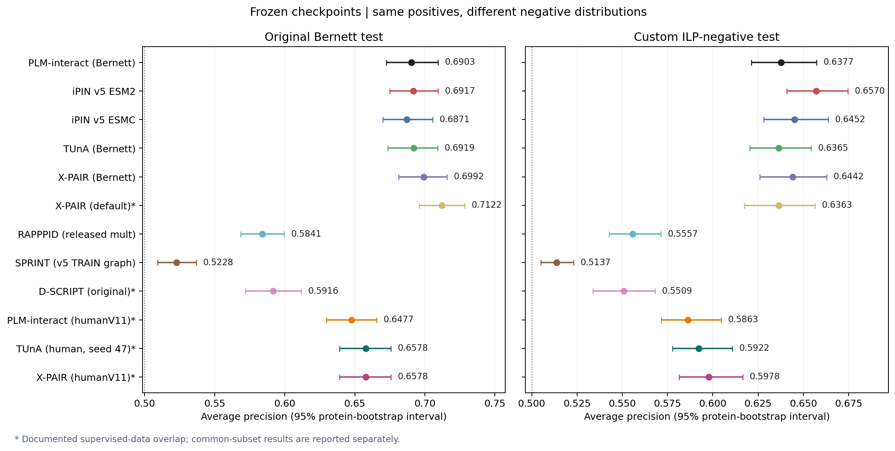
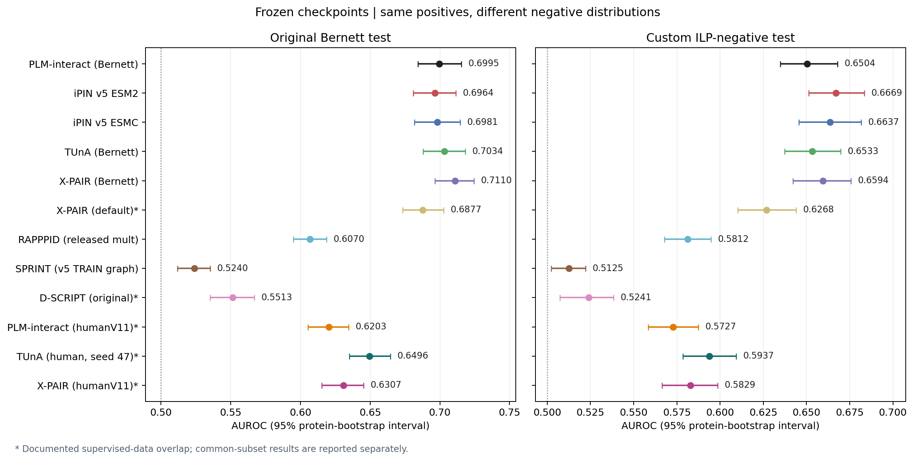
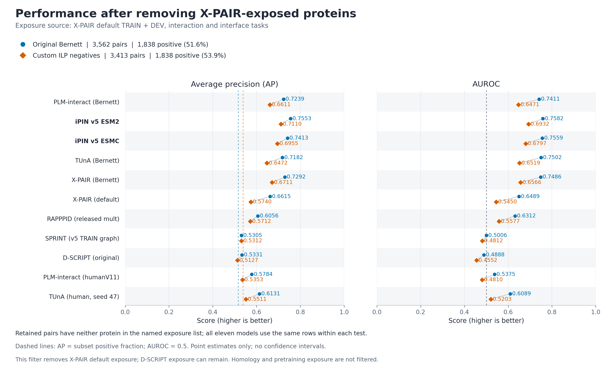
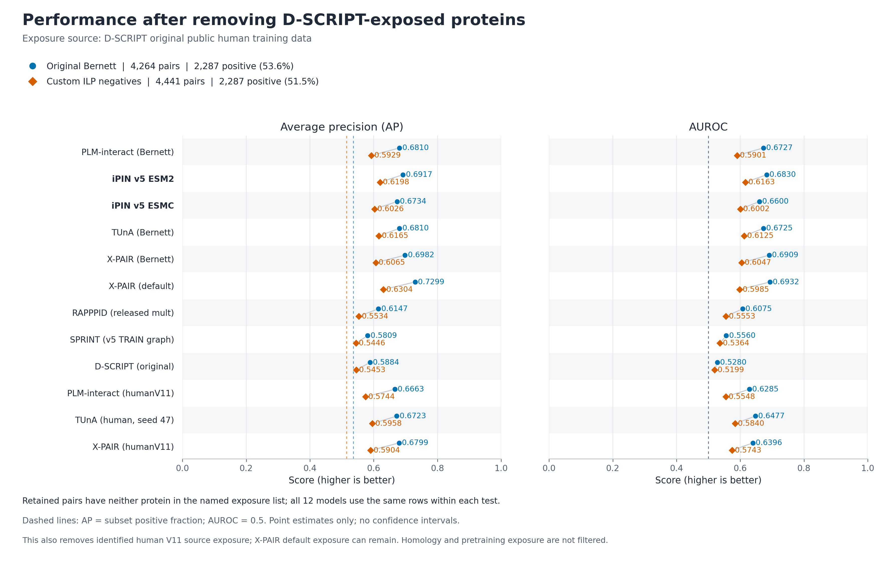
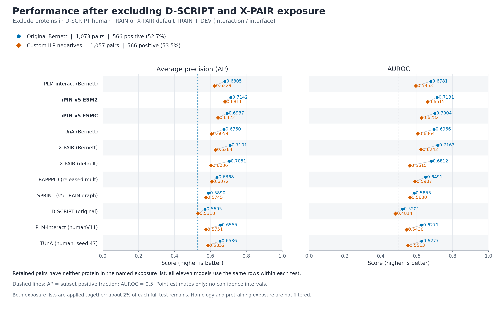

# v5 benchmark report

Completed: 2026-10-06T20:06:19.619395+00:00. Twelve frozen predictors, two 52,048-pair tests; all requested predictions are present.

V5 does not establish a meaningful improvement over native PLM-interact (Bernett) on the original Bernett test. V5 ESM2 improves on the custom ILP-negative test, meeting the descriptive +0.010 AP / positive paired interval target.

ESM2 was the preferred iPIN checkpoint based on DEV before testing. Its AP differences versus native Bernett are **+0.0014** on the original test (95% paired protein-bootstrap interval [-0.0095, +0.0120]) and **+0.0193** on the ILP test ([+0.0092, +0.0305]). These tests share all positives, so this is evidence about sensitivity to the negative distribution, not two independent replications.

## Main results

| Frozen predictor | Original AP | Original AUROC | ILP AP | ILP AUROC |
|---|---:|---:|---:|---:|
| PLM-interact (Bernett) | 0.6903 | 0.6995 | 0.6377 | 0.6504 |
| iPIN v5 ESM2 | 0.6917 | 0.6964 | 0.6570 | 0.6669 |
| iPIN v5 ESMC | 0.6871 | 0.6981 | 0.6452 | 0.6637 |
| TUnA (Bernett) | 0.6919 | 0.7034 | 0.6365 | 0.6533 |
| X-PAIR (Bernett) | 0.6992 | 0.7110 | 0.6442 | 0.6594 |
| X-PAIR (default)* | 0.7122 | 0.6877 | 0.6363 | 0.6268 |
| RAPPPID (released mult) | 0.5841 | 0.6070 | 0.5557 | 0.5812 |
| SPRINT (v5 TRAIN graph) | 0.5228 | 0.5240 | 0.5137 | 0.5125 |
| D-SCRIPT (original)* | 0.5916 | 0.5513 | 0.5509 | 0.5241 |
| PLM-interact (humanV11)* | 0.6477 | 0.6203 | 0.5863 | 0.5727 |
| TUnA (human, seed 47)* | 0.6578 | 0.6496 | 0.5922 | 0.5937 |
| X-PAIR (humanV11)* | 0.6578 | 0.6307 | 0.5978 | 0.5829 |

*X-PAIR default, X-PAIR humanV11, D-SCRIPT, PLM-interact humanV11 and TUnA human seed 47 have known supervised training/validation-data overlap with these tests; their full-test results are descriptive external baselines, without an unseen-protein guarantee. X-PAIR Bernett is separately reported and was not chosen by its test score. RAPPPID is the released multiplicative-head STRING-C3 model, with its native 1,500-residue cap. SPRINT uses the user-approved v5 TRAIN-positive graph.*

## iPIN versus native Bernett: uncertainty

| Test | iPIN backbone | AP difference | 95% interval | AUROC difference | 95% interval |
|---|---|---:|---|---:|---|
| original | ipin-esm2 | +0.0014 | [-0.0095, +0.0120] | -0.0031 | [-0.0139, +0.0075] |
| original | ipin-esmc | -0.0032 | [-0.0135, +0.0071] | -0.0013 | [-0.0127, +0.0092] |
| ilp | ipin-esm2 | +0.0193 | [+0.0092, +0.0305] | +0.0165 | [+0.0058, +0.0277] |
| ilp | ipin-esmc | +0.0075 | [-0.0030, +0.0186] | +0.0133 | [+0.0030, +0.0252] |

Intervals use 1,000 paired protein-endpoint bootstrap replicates (seed 20260929). A non-self pair receives the product of its endpoint multiplicities; a self-pair receives one multiplicity. Every model uses the same resampling weights within a test. Weighted AP/AUROC were independently checked against sklearn. These descriptive percentile intervals do not measure training-seed, protein-family or dataset-construction uncertainty; no multiplicity-adjusted significance claim is made.

## Frozen data and model choice

| Item | Original Bernett | Custom ILP negatives |
|---|---:|---:|
| Pairs | 52,048 | 52,048 |
| Positives | 26,024 | 26,024 |
| Negatives | 26,024 | 26,024 |
| Unique sequences | 3,022 | 2,948 |
| Pairs above 2,193 combined residues | 3,392 | 3,373 |
| Pairs affected by RAPPPID cap | 3,782 | 3,689 |

The tests share 26,024 positives and 1,154 negatives. Their union has 76,918 pairs over 3,022 unique sequences; each predictor scored that union once. Maximum test protein length is 5,183 residues and maximum paired length is 7,423 residues. No test rows were dropped, imputed or selected by outcome. The ILP test is this project’s custom negative reconstruction, not the published Bernett-2026 test.

| iPIN | Selected update | Selection DEV AP | DEV pairs | Training seed |
|---|---:|---:|---:|---:|
| iPIN v5 ESM2 | 27,374 | 0.615327 | 165,742 | 2 |
| iPIN v5 ESMC | 21,899 | 0.592462 | 165,742 | 2 |

Both iPIN models were selected independently using maximum full ILP DEV pooled AP; the selection audit rechecked all 16 saved full DEV evaluations for each model. Their training evidence contains 700,764 balanced pairs, including 350,382 positives. Neither model was fitted, recalibrated or selected using these benchmark scores. The folder was renamed from `retraining-v5` to `retrain-v5`; frozen checkpoint manifests and bytes were preserved.

## Exposure and fair interpretation

| Predictor / source | Exact test-sequence overlap | Original test pair overlap | ILP test pair overlap |
|---|---:|---:|---:|
| v5 iPIN TRAIN + DEV | 0 / 3,022 | 0 | 0 |
| TUnA documented TRAIN + DEV | 0 / 3,022 | 0 | 0 |
| D-SCRIPT documented human TRAIN | 2,233 / 3,022 | 1,167 | 1,292 |
| X-PAIR default published TRAIN + DEV | 1,873 / 3,022 | 2,127 | 2,310 |
| Native PLM-interact Bernett documented source | 0 / 3,022 | 0 | 0 |
| PLM-interact humanV11 TRAIN + validation | 2,233 / 3,022 | 1,320 | 1,456 |
| TUnA human seed 47 TRAIN + validation | 2,233 / 3,022 | 1,320 | 1,456 |
| X-PAIR humanV11 documented TRAIN + validation | 2,233 / 3,022 | 1,320 | 1,456 |
| SPRINT v5 TRAIN graph | 0 / 3,022 | 0 | 0 |
| X-PAIR Bernett | Expected 0 under documented split; not independently verified | Expected 0 under documented split; not independently verified | Expected 0 under documented split; not independently verified |
| RAPPPID released checkpoint | Not independently established | Not independently established | Not independently established |

D-SCRIPT has 2,233 exact test proteins and 1,167 / 1,292 original / ILP pairs in its documented public human training files. Its 1,091 shared positive pairs are common to both tests. X-PAIR default has 1,927 shared positive test pairs in its published interaction/interface training or validation data, plus 200 original-test negatives and 383 ILP-test negatives. Counts are unchanged by its checkpoint’s 50–2,000-residue training filters and by Ankh residue normalization. Removing only exact shared pairs leaves many familiar endpoints; the endpoint-unexposed sensitivity analysis is stricter but much smaller and has a different prevalence. Neither analysis proves absence of homologous or pretraining exposure.

The native Bernett audit concerns its documented historical source data; checkpoint membership cannot be proven from weights. X-PAIR Bernett names Bernett TRAIN/DEV in its checkpoint metadata. If the released checkpoint follows the original split, exact protein and pair exposure is zero on both tests, because the custom ILP test uses only original-test proteins. The exact processed author files were not available locally for independent verification. RAPPPID names STRING-C3 source files that are not bundled, so its overlap with these Bernett tests remains unknown.

### Common-subset sensitivity analyses

| Test / subset | Pairs | Positive fraction | Native Bernett AP | v5 ESM2 AP | v5 ESMC AP | X-PAIR default AP |
|---|---:|---:|---:|---:|---:|---:|
| original / xpair_default_pair_unexposed | 49,921 | 0.483 | 0.6685 | 0.6732 | 0.6664 | 0.6697 |
| original / xpair_default_endpoint_unexposed | 3,562 | 0.516 | 0.7239 | 0.7553 | 0.7413 | 0.6615 |
| original / combined_over_2193 | 3,392 | 0.497 | 0.6442 | 0.6582 | 0.6666 | 0.7280 |
| original / rapppid_uncapped | 48,266 | 0.501 | 0.6946 | 0.6947 | 0.6903 | 0.7126 |
| ilp / xpair_default_pair_unexposed | 49,738 | 0.484 | 0.6188 | 0.6413 | 0.6276 | 0.5965 |
| ilp / xpair_default_endpoint_unexposed | 3,413 | 0.539 | 0.6611 | 0.7110 | 0.6955 | 0.5740 |
| ilp / combined_over_2193 | 3,373 | 0.500 | 0.5748 | 0.5989 | 0.5918 | 0.6264 |
| ilp / rapppid_uncapped | 48,359 | 0.500 | 0.6416 | 0.6601 | 0.6485 | 0.6379 |

| Test / D-SCRIPT exposure subset | Pairs | Positive fraction | Native Bernett AP | v5 ESM2 AP | D-SCRIPT AP |
|---|---:|---:|---:|---:|---:|
| original / dscript_pair_unexposed | 50,881 | 0.490 | 0.6763 | 0.6816 | 0.5650 |
| original / dscript_endpoint_unexposed | 4,264 | 0.536 | 0.6810 | 0.6917 | 0.5884 |
| ilp / dscript_pair_unexposed | 50,756 | 0.491 | 0.6261 | 0.6488 | 0.5295 |
| ilp / dscript_endpoint_unexposed | 4,441 | 0.515 | 0.5929 | 0.6198 | 0.5453 |

All twelve predictors are evaluated on identical rows within each subset in [subsets.csv](results/subsets.csv). These are descriptive analyses. Do not compare their AP directly across different prevalences or use them to select a checkpoint.

### Performance after removing exposed proteins

Each figure removes every pair containing either protein from its named exposure list, then compares all twelve models on the same remaining rows within each test. The two figures apply separate exclusions. Both display AP and AUROC on identical axes, with the retained sample sizes, positive fractions and reference baselines. These are point estimates without subset-specific confidence intervals; the existing predictions were reused.

[X-PAIR exclusion: PDF](results/xpair-exposed-sequences-removed.pdf) · [SVG](results/xpair-exposed-sequences-removed.svg)

[D-SCRIPT exclusion: PDF](results/dscript-exposed-sequences-removed.pdf) · [SVG](results/dscript-exposed-sequences-removed.svg)

All 96 plotted metrics were recomputed from the frozen predictions and matched the existing subset CSV. [Figure data and verification](provenance/exposure-subset-figures.json).

### Removing exposure to either D-SCRIPT or X-PAIR default

This additional figure excludes a pair whenever either protein occurs in either documented exposure list. The retained sets contain 1,073 original-test pairs (566 positive, 507 negative) and 1,057 ILP-test pairs (566 positive, 491 negative). All twelve models use identical rows within each test. Only about 2% of each full test remains, so this is a descriptive subset comparison with no subset-specific confidence intervals.

[Combined exclusion: PDF](results/combined-exposed-sequences-removed.pdf) · [SVG](results/combined-exposed-sequences-removed.svg) · [Metrics CSV](results/combined-exposure-removed-metrics.csv) · [Data and verification](provenance/combined-exposure-subset-figure.json).

## Added human STRING-trained releases

The exact humanV11 and TUnA human seed-47 releases from the five-species benchmark were added at the user’s request after earlier results were known. Both remain frozen. Their original human TRAIN and validation files were compared as unordered sequence-pair/label multisets and match exactly. Their overlapping supervision means full-test scores are descriptive external-baseline results, not evidence of prediction on unseen proteins.

Both share 2,233 of the 3,022 union proteins with documented human TRAIN/validation. The original and ILP tests contain 1,320 and 1,456 previously seen pairs, respectively. This includes 1,230 test-positive pairs. Public TRAIN/validation also calls 33 original-test negatives and 161 ILP-test negatives positive. Conversely, 47 test positives occur as source negatives. All frozen test labels are preserved; these are source-label conflicts, not an experimental adjudication.

The following common subset excludes every pair containing either endpoint in either added release’s public TRAIN or validation. Every model uses the same rows. These endpoint masks happen to equal the existing D-SCRIPT TRAIN exposure mask, verified directly; its updated exclusion figure therefore also shows this comparison. Exact exclusions do not remove homologs or pretraining exposure.

| Predictor | Original AP | Original AUROC | ILP AP | ILP AUROC |
|---|---:|---:|---:|---:|
| PLM-interact (Bernett) | 0.6810 | 0.6727 | 0.5929 | 0.5901 |
| iPIN v5 ESM2 | 0.6917 | 0.6830 | 0.6198 | 0.6163 |
| iPIN v5 ESMC | 0.6734 | 0.6600 | 0.6026 | 0.6002 |
| TUnA (Bernett) | 0.6810 | 0.6725 | 0.6165 | 0.6125 |
| X-PAIR (Bernett) | 0.6982 | 0.6909 | 0.6065 | 0.6047 |
| X-PAIR (default)* | 0.7299 | 0.6932 | 0.6304 | 0.5985 |
| RAPPPID (released mult) | 0.6147 | 0.6075 | 0.5534 | 0.5553 |
| SPRINT (v5 TRAIN graph) | 0.5809 | 0.5560 | 0.5446 | 0.5364 |
| D-SCRIPT (original)* | 0.5884 | 0.5280 | 0.5453 | 0.5199 |
| PLM-interact (humanV11)* | 0.6663 | 0.6285 | 0.5744 | 0.5548 |
| TUnA (human, seed 47)* | 0.6723 | 0.6477 | 0.5958 | 0.5840 |
| X-PAIR (humanV11)* | 0.6799 | 0.6396 | 0.5904 | 0.5743 |

The common subset retains 4,264 original pairs (2,287 positive) and 4,441 ILP pairs (2,287 positive). These are point estimates without subset-specific intervals; changed prevalence and protein composition limit comparison with the full-test AP.

Both releases originally trained with proteins of 50–800 residues. Inference here preserves full sequences through 5,183 residues per protein and 7,423 residues per pair. The additional `human_training_length_range` rows in subsets.csv report all twelve models on identical rows within the training length range; this is a descriptive length-restricted sensitivity calculation, not model selection.

[Extension protocol](HUMAN-RELEASES-ADDENDUM.md) · [Frozen releases and runtimes](provenance/human-releases.json) · [Source exposure and label conflicts](provenance/human-releases-exposure.json) · [Archived nine-model report](archive/before-human-releases/REPORT.md).

## Added X-PAIR humanV11 release

The twelfth predictor is the released `interaction_dscript.ckpt`, an interaction-only X-PAIR model corresponding to Fig. 2C of the original paper. Its embedded configuration names human D-SCRIPT training and validation data, derived from STRING v11. It is distinct from the Bernett checkpoint and the STRING v12 multitask X-fair default. The user specified this checkpoint after earlier benchmark results were known; no checkpoint or threshold was selected by the new test scores.

The fixed release records epoch 3 (zero-based), global step 52,724, and seed 123. All 3,022 full-length Ankh-Large embeddings were reused after checksum and provenance verification. The new head alone scored the 76,918-pair union on one GPU, with atomic resumable chunks. Native singleton, projection-cache, swap, padded-batch and longest-pair checks passed in FP32. No weights changed and no test rows were dropped.

The documented source audit found 2,233 exposed union sequences and 1,320 / 1,456 exact original / ILP test pairs in public TRAIN/validation, including 1,230 common test-positive pairs. Ankh normalization and the checkpoint's 0–2,000-residue eligibility filter leave these counts unchanged; the source sequences span 50–800 residues. The exact processed author TSVs are unavailable locally, so this establishes documented source overlap rather than the complete checkpoint training history.

The existing D-SCRIPT endpoint mask also removes all identified X-PAIR V11 source exposure, verified for both exact and Ankh-normalized sequences. Its 4,264 / 4,441 retained-row comparison and the combined 1,073 / 1,057-row comparison therefore include this model without changing the earlier exclusion rules. These filters do not remove homologs or PLM pretraining exposure.

| Test | Reference | X-PAIR V11 AP difference | 95% paired interval | AUROC difference | 95% paired interval |
|---|---|---:|---|---:|---|
| original | PLM-interact (Bernett) | -0.0325 | [-0.0521, -0.0137] | -0.0687 | [-0.0898, -0.0481] |
| original | iPIN v5 ESM2 | -0.0339 | [-0.0549, -0.0118] | -0.0656 | [-0.0883, -0.0435] |
| original | iPIN v5 ESMC | -0.0293 | [-0.0506, -0.0089] | -0.0674 | [-0.0902, -0.0452] |
| original | X-PAIR (Bernett) | -0.0414 | [-0.0589, -0.0248] | -0.0802 | [-0.0985, -0.0629] |
| original | X-PAIR (default)* | -0.0543 | [-0.0649, -0.0445] | -0.0570 | [-0.0672, -0.0469] |
| original | PLM-interact (humanV11)* | +0.0102 | [+0.0026, +0.0171] | +0.0104 | [+0.0025, +0.0176] |
| original | TUnA (human, seed 47)* | +0.0001 | [-0.0076, +0.0077] | -0.0189 | [-0.0269, -0.0112] |
| ilp | PLM-interact (Bernett) | -0.0399 | [-0.0604, -0.0210] | -0.0675 | [-0.0877, -0.0481] |
| ilp | iPIN v5 ESM2 | -0.0592 | [-0.0810, -0.0392] | -0.0840 | [-0.1076, -0.0627] |
| ilp | iPIN v5 ESMC | -0.0474 | [-0.0690, -0.0279] | -0.0808 | [-0.1058, -0.0581] |
| ilp | X-PAIR (Bernett) | -0.0464 | [-0.0650, -0.0308] | -0.0765 | [-0.0960, -0.0591] |
| ilp | X-PAIR (default)* | -0.0385 | [-0.0491, -0.0282] | -0.0439 | [-0.0558, -0.0329] |
| ilp | PLM-interact (humanV11)* | +0.0115 | [+0.0033, +0.0186] | +0.0102 | [+0.0023, +0.0172] |
| ilp | TUnA (human, seed 47)* | +0.0056 | [-0.0023, +0.0126] | -0.0108 | [-0.0198, -0.0024] |

All eleven prior prediction arrays, full-test point estimates and bootstrap samples were preserved exactly. Only the new model required inference and new bootstrap samples. All five figure groups (13 image files) were regenerated for twelve predictors.

[Extension protocol](XPAIR-V11-ADDENDUM.md) · [Frozen checkpoint](provenance/xpair-v11.json) · [Numerical qualification](qualification/xpair-v11.json) · [Exposure audit](provenance/xpair-v11-exposure.json) · [Preservation receipt](provenance/xpair-v11-archive.json).

## Execution and checks

- All eleven neural predictors cover 76,918 unique pairs; SPRINT covers the same union. Both test mappings pass pair, sequence, label, duplication and shared-score checks.
- Native Bernett original-test predictions were reused after identity and hash verification; original AP/AUROC reproduce exactly. Only its 24,870 new ILP-negative scores were inferred.
- Fresh iPIN ESM2, iPIN ESMC and native model forwards reproduced saved DEV logits exactly across short, middle and long production batches. Weights were loaded strictly from frozen manifests.
- TUnA reused 2,784 exact sequence features and computed 238. X-PAIR reused 1,215 Ankh features and computed 1,807; the original two X-PAIR checkpoints shared those embeddings, and the added V11 checkpoint reuses all 3,022. Native singleton / full-forward comparisons passed before production scoring.
- D-SCRIPT original human_v1 was added at the user’s request after the first seven neural predictors had been analyzed. Its native Bepler–Berger encoder reused 2,784 projected sequence features and computed 238. The existing length-safe adapter extends only a nonlearned positional index and tiles contact computation while preserving full native pooling. Supported-length predictions and the long-sequence tiled/full-map check matched exactly. This adapter covers 2,301 original / 2,237 ILP pairs involving a protein over the upstream 2,000-residue limit; no rows were dropped or cropped.
- iPIN and native Bernett inference use full sequences, FP32 parameters, BF16 autocast, TF32 disabled and mean raw AB/BA logits. Added native humanV11 uses FP32 computation with TF32 disabled and the same mean AB/BA logit rule. The native comparator matches previous iPIN benchmarks, not every original-paper cap/precision convention. TUnA, X-PAIR and RAPPPID retain native FP32 semantics.
- SPRINT uses full TRAIN+TEST sequences for transductive sequence-only preprocessing, the exact 350,382 positive TRAIN edges, native PAM120/Thit=15/Tsim=35/Thc=40 settings, 64-thread HSP generation and native serial arithmetic with qualified filtering of unused destination entries. See `SPRINT-EXECUTION-ADDENDUM.md`; a 304-row full-corpus qualification matched the unmodified native binary byte-for-byte. It produced 2 zero scores and 73,072 unique scores on the union. Zeros/ties are retained; SPRINT scores are not probabilities, so no Brier score is reported.
- Native HSP output contains 54,813,119 records. One 12-residue TRAIN protein's native full self-HSP is preserved. The parser was adjusted to accept that legitimate record; the SPRINT algorithm and graph were unchanged.
- The four successful GPU jobs were 3367739 (ESM2), 3367740 (ESMC), 3367741 (native new pairs), and 3367742 (both X-PAIR models). All completed with exit code 0. D-SCRIPT job 3369152 also completed successfully. TUnA, RAPPPID and SPRINT ran within interactive allocation 3366323. Earlier container/launcher failures occurred before test inference and are retained in the logs and job ledger.
- HumanV11 passed fresh raw-tokenizer/original eager-attention and padding checks through the longest pair. TUnA human passed native singleton, encoder, longest-pair and padding checks; reused 57 exact-sequence features and computed 2,965. Frozen TUnA parameters and buffers were unchanged. See the two new qualification records and human-releases job ledger.

## What these results support

V5 does not establish a meaningful improvement over native PLM-interact (Bernett) on the original Bernett test. V5 ESM2 improves on the custom ILP-negative test, meeting the descriptive +0.010 AP / positive paired interval target.

Any improvement is specific to these frozen checkpoints and test distributions. The two iPIN models use new HIPPIE/ILP training evidence, whereas most competitors use their released training data. SPRINT alone shares the v5 positive graph. This is a comparison of usable predictors, not an isolated architecture ablation. The original test also informed earlier rounds of this research project, so it is not a fresh blind confirmation. The ILP test shares its positives, and sampled negatives are operational non-edges rather than experimentally verified non-interactions. No broad biological or proteome-wide superiority follows from these balanced tests.

## Artifacts

- [Protocol](PROTOCOL.md), [D-SCRIPT addendum](DSCRIPT-ADDENDUM.md), [SPRINT execution addendum](SPRINT-EXECUTION-ADDENDUM.md), [selected checkpoint identities](provenance/selection.json), [runtime/weight hashes](provenance/runtime-inputs.json), [native inference notes](provenance/inference-notes.md).
- [Main metrics](results/metrics.csv), [confidence intervals](results/confidence-intervals.csv), [paired differences](results/paired-differences.csv), [machine-readable summary](results/summary.json).
- [Original per-pair predictions](results/original-predictions.csv.gz), [ILP per-pair predictions](results/ilp-predictions.csv.gz), [source exposure audit](provenance/exposure.json).
- [Protein-macro AP](results/protein-macro.csv), [fixed/DEV operating points](results/operating-points.csv), [length and exposure subsets](results/subsets.csv).
- [PR/ROC curves](results/curves.pdf), [AP intervals](results/average-precision.pdf), [AUROC intervals](results/auroc.pdf), [resuming/re-running instructions](RUNNING.md).
