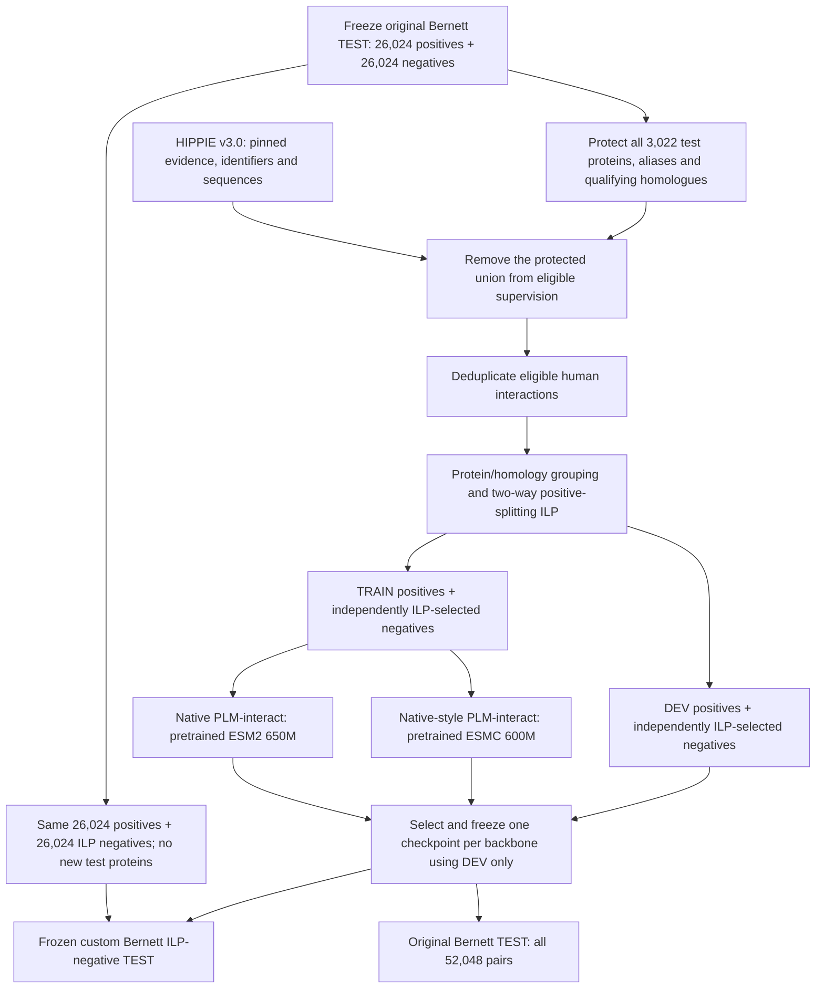

# Development proposal v5: native PLM-interact with two backbones and two frozen tests

**Updated:** 2026-10-02. **Status:** data preparation is authorized in `data-preparation-v5`; production model training has not started. This revision supersedes the separate published-ILP-test design. **Primary objective:** improve on native PLM-interact on the original, frozen Bernett test of **52,048 pairs**. The second test uses exactly its **26,024 positive pairs** with **26,024 newly ILP-selected negatives**, subject to a feasible, validated solution.

The user has specified **two retraining runs using the original PLM-interact architecture/design: ESM2 650M and ESMC 600M**. Both use the same new HIPPIE train/validation partition and ILP-selected negatives. The ESM2 arm preserves the native architecture; the ESMC arm ports its pair-encoding and classification design to a different backbone. Any gain over historical models would reflect the complete training system and additional eligible evidence. It would not isolate the effect of negative sampling alone.

**Agreed design and recommended defaults.**

| Item | Decision and status |
| --- | --- |
| Positive-data source | **User specified:** HIPPIE v3.0, with an immutable release snapshot. |
| Test exclusion | **Agreed:** protect all 3,022 proteins in the original Bernett test, including both labels, aliases, exact sequence matches and qualifying ≥40%-identity homologues. The ILP variant introduces no new test proteins. |
| Development data | **User specified:** construct new TRAIN and DEV sets from the remaining HIPPIE data. |
| Negative sampling | **User specified:** use Bernett-2026 ILP/bias-aware negative sampling for **both** TRAIN and DEV. Ordinary random negatives are not the proposed v5 recipe. |
| Evaluation endpoints | **Agreed:** original Bernett test is primary; a custom Bernett ILP-negative variant shares all positive cases and tests sensitivity to negative construction. It is not the published Bernett-2026 test or an independent confirmation. |
| Models | **User specified:** native PLM-interact with ESM2 650M; native-style PLM-interact with ESMC 600M. **Bounded implementation:** exactly two production runs, one seed each. |
| Architecture | Joint pair encoding, standard attention, CLS → ReLU → linear PPI head, full encoder fine-tuning and the backbone's MLM decoder. |
| Training objective | **Recommended native-style default:** masked language modelling plus classification on corrupted inputs. Concrete paper/code differences and proposed settings are documented below. |
| Selection | One checkpoint per backbone using frozen ILP validation only. If one overall model is required, choose between those checkpoints using validation AP before either test. |
| Additional specifications | Protein/homology-separated train/dev, separate sampling ILPs, frozen dev negatives, fresh pretrained initialization, and documented historical-baseline exposure to the ILP test. |

**What v1–v4 established.**

All models below were evaluated on the same full-length test pairs with mean AB/BA logits. The four v2 models, both v1 models and the stopped chain-aware experiments are documented in the linked reports.

| Selected model | Validation AP | Test AP | Test AUROC |
| --- | ---: | ---: | ---: |
| Native PLM-interact | 0.642142 | 0.690319 | 0.699467 |
| V2 clean BCE | 0.652156 | 0.690596 | 0.699727 |
| V3 residue-MLP | 0.657140 | 0.685553 | 0.697471 |
| V4 ESMC standard | 0.657630 | 0.681420 | 0.694261 |

V2 clean BCE essentially matched native: its AP difference was +0.000277, with a descriptive paired 95% interval of [-0.007765, +0.008157]. V3 and V4 achieved higher validation AP without improving the test result. This motivates examining supervision and data coverage; it does not establish that shortcuts caused the observed ranking reversal.

The existing training set contains **163,085 pairs, 81,550 positives and 4,285 distinct sequences**. The old validation set contains **59,258 pairs**. The test contains **26,024 positives and 26,024 negatives**, involving **3,022 distinct sequences**. There are no self-pairs in these three sets. Training positive/negative protein degrees already have Spearman correlation approximately **0.972**. Adding species balancing, removing existing self-pairs, or merely repeating degree matching would therefore offer little new information for the old dataset.

Evidence: [V2 benchmark](benchmark-v2/REPORT.md), [V3 benchmark](benchmark-v3/REPORT.md), [V4 benchmark and all nine models](benchmark-v4/REPORT.md), [machine-readable comparison](benchmark-v4/results/benchmark-summary.json), [existing data audit](literature/plm-interact/improvement-review-v2/existing-data-audit.json).

**What the Bernett-2026 paper contributes.**

The paper studies dataset construction using random forests over frozen ESM2/ProtT5 embeddings. It identifies residual shortcut risks after protein separation and uses integer programming for interaction retention and negative selection. High-confidence negative pools can introduce additional distribution shifts. In HIPPIE, Table A1 reports balanced AP of 0.59 for similarity-reduced splitting, 0.54 for ILP splitting and 0.56 after ILP negative sampling. Figure 3 shows training-positive retention increasing from 199,408 to 478,805 on its newer HIPPIE corpus. These are not results on our fixed partition or evidence of improved PLM-interact training. [Paper, including Appendices A–C](https://arxiv.org/html/2609.10193v1).

My interpretation is that broader eligible supervision and more deliberate negative construction are meaningful untested interventions. A weak baseline reaching chance does not establish absence of bias, and an above-chance pooled-embedding classifier need not be using exclusively spurious information. Mean-pooled representations can retain legitimate biological features. Likewise, removing functional associations indiscriminately can remove useful predictive information.

The released baseline implementation uses truncated, independently computed protein embeddings and refits its selected random forest on train plus validation. Our training and checkpoint-selection procedure will remain separately defined. Its current code is useful methodological evidence, not a directly interchangeable comparator. [Embedding code](https://github.com/bionetslab/ppi-splitting-pipeline/blob/8bf9adb183b702c88db62ff878de482e2f20e4b2/bin/embed_sequences.py), [classifier code](https://github.com/bionetslab/ppi-splitting-pipeline/blob/8bf9adb183b702c88db62ff878de482e2f20e4b2/bin/train_classifier.py).

**Freeze the original test and construct its ILP-negative variant before training.**

| Test | Definition | Role and current status |
| --- | --- | --- |
| Original Bernett test | Existing 52,048 pairs: 26,024 positives and 26,024 negatives; preserve sequences, labels, rows and scoring protocol. | Primary endpoint for comparison with native and v1–v4. Verified predictions already exist. |
| Bernett ILP-negative test | Exactly the original 26,024 positive rows and sequences, plus 26,024 ILP-selected non-self negatives among the 2,948 positive-endpoint proteins. Preserve original sequence versions for every endpoint. | Custom second endpoint. Target 52,048 pairs; the new negative set must be generated, checked and frozen. |

Use the Bernett-2026 **negative-sampling method**, not its published positive split. Its positive-splitting and negative-sampling ILPs are separate operations. Our two test variants share all positive cases and 1:1 class balance. The published random-forest scores are not scores on this custom test. [Bernett-2026 methods](https://arxiv.org/html/2609.10193v1).

This design measures two settings; it does not make their distributions identical. Matching the negative-construction method improves the alignment of ILP validation and ILP test, but the eligible proteins, evidence, annotations and sampler residuals can still differ. Original-test performance measures transfer to the historical construction. Keep the tests separate in analysis; do not pool their AP values.

1. Copy and hash the original test unchanged. Export its positives with original row identifiers, labels, orientation and sequence strings. The protection universe is all **3,022 original test proteins**, including the **74 found only in original negatives**.
2. Resolve HIPPIE accessions, retired identifiers, aliases and isoforms against a versioned sequence mapping. Exclude matching test proteins and exact duplicate sequences even when identifiers differ. Preserve all distinct frozen sequence versions when one accession has changed across releases.
3. Search prospective HIPPIE sequences against the complete frozen-test sequence union. Remove every eligible-pool protein satisfying the declared homology exclusion and all incident interactions. This applies to future **training and validation**, including their negative-candidate universes.
4. Save exclusion reasons and final train/test, dev/test and train/dev similarity checks. Test identities/sequences define the exclusion boundary; test label frequencies, GO targets, scores or model performance must not tune training or validation construction.
5. Generate ILP negatives only among the 2,948 original positive-endpoint proteins. Exclude all known positive pairs from the frozen evidence snapshot, mapped aliases/sequence duplicates, and self-pairs. Allow overlap with original negatives: forcing disjoint sets would add an unnecessary sampling restriction. Report the overlap and exact reusable prediction rows.
6. Fix sampler settings, annotation snapshot, seed and candidate pool before any model inference. Test-positive degree/GO statistics can define this test's sampling targets but must never tune TRAIN/DEV sampling. Freeze the final ILP test before training; preserve the original test even if newer evidence conflicts with an original negative label.

**Baseline exposure:** this design avoids introducing additional test proteins that native or v1–v4 may have used for supervision. Verify the original held-out boundary against the actual historical training/selection manifests, including aliases and sequence matches; report remaining historical homology/provenance limitations. It does not erase unsupervised PLM exposure or previous use of the original benchmark to guide research. All positives are shared, and some negatives may overlap, so the two results are explicitly dependent.

**The 40% identity rule is fixed operationally for preparation.** Use MMseqs2-detected identity ≥0.40 with coverage ≥0.80 of **both** sequences, continuing the existing project rule. Identity uses alignment length (`--alignment-mode 3`); sensitivity is 7.5, E-value cutoff 0.001 and `--max-seqs 100000`. Search in both directions and preserve the tool/module and binary hash. This is not identical to every CD-HIT interpretation of 40% identity, nor does it exclude every shared domain or remote homologue. Exact-identity/alias handling is independent of the coverage filter. Verify the remaining cross-boundary hits; do not silently relax the rule to obtain a larger training set. [Preparation configuration](data-preparation-v5/configuration.json), [existing rule](benchmark-v4/data/prepared-manifest.json), [CD-HIT identity and coverage documentation](https://github.com/weizhongli/cdhit/wiki/3.-User%27s-Guide).

The exclusion direction matters: remove proteins from the **new eligible pool**, preserving both frozen tests. A pipeline that removes test rows to accommodate training would change the endpoint.

**Construct a new development partition that tests unseen proteins.**

The old Bernett validation partition is retired for v5 selection. Former training and validation proteins can enter the eligible HIPPIE pool if they pass the original-test protein/homology exclusion, which protects both test variants. They are then assigned to the new train/dev partition. Reconstruct eligible supervision from the pinned HIPPIE release; do not reuse the published ILP train/validation files as the new splits.

Deduplicate unordered positive pairs using versioned identifiers and sequence identity while retaining their supporting evidence. Preserve the original HIPPIE evidence metadata and report additional filtering explicitly. Keep a blacklist of known positive pairs before optional quality filtering so that an excluded, low-confidence positive is not automatically turned into a negative.

**Self-pair scope:** both test variants are non-self interaction endpoints. Therefore exclude HIPPIE self-pairs from TRAIN/DEV positives, record those exclusions, and prohibit self-pairs in every new negative pool. This returns to the original non-self default; the intervening self-pair inclusion was motivated by the now-retired published HIPPIE ILP test. Also collapse exact sequence aliases so that apparent non-self identifier pairs with identical sequence are not silently introduced as self-pairs.

Group similar proteins before assigning groups to TRAIN or DEV. Retain a positive pair in a split only when both endpoints belong to that split; record crossing interactions as unused. The recommended initial target is approximately **80/20 of retained positive pairs**, subject to adequate dev protein diversity and feasible group assignment. This is a proposed implementation default, not a promise of final counts.

Use a two-way adaptation of the authors' positive-splitting ILP to reduce discarded interactions while assigning groups. This is separate from the **negative-sampling ILP** applied afterwards. Do not rerun a three-way split that replaces either protected test. Group assignment alone is not proof of homology separation: check the final train/dev boundary under the declared similarity rule and resolve qualifying overlaps before freezing the sets. Choose the partition without model-performance feedback.

The preparation implementation first contracts qualifying homology edges and UniProt entry/isoform families into indivisible components. KaHIP groups their normalized MMseqs2 bit-score graph into up to 100 groups before the two-way ILP. This explicitly replaces the paper's BLAST graph with MMseqs2 and prevents those hard components from being cut. The retained-pair fraction tolerance is 0.05, following the author's relative lower-bound formulation. Both this ILP and each negative ILP use HiGHS with eight threads, seed 2, a two-hour solver limit and a 1% relative-gap target. Record the actual achieved gap and feasibility; the configured target is not a result.

**Apply Bernett-2026 ILP negative sampling separately to TRAIN and DEV.**

Pin and inspect the author implementation rather than substituting a generic hard-negative miner. The inspected repository revision is `8bf9adb183b702c88db62ff878de482e2f20e4b2`. Preserve the normalized objective terms, hard degree constraints and degree-weighted/GO-priority candidate strategy, with the explicit adaptations below fixed before model training:

| Component | Proposed v5 setting |
| --- | --- |
| Protein universe | Only the proteins in the respective TRAIN or DEV split. |
| Negative ratio | One selected negative per retained positive, if feasible. |
| Candidate pool | Author-style stratified pool targeting four times the positive count, bounded by the number of admissible candidates. |
| Known interactions | Exclude known positive unordered pairs from the frozen evidence snapshot. |
| Degree objective | Active; weight 1 on the author's normalized per-protein degree term. |
| Functional objective | Active; weight 1 on the author's normalized mean GO-BP Jaccard term. |
| Taxonomy objective | Inactive: both endpoints are human. |
| Self-pair objective | Inactive because self-pairs are prohibited in both positives and new negative pools. |
| Degree cap | Retain the author's hard per-protein cap; do not confuse it with exact degree matching. |
| Annotations and randomness | Versioned GO mapping, fixed seeds and saved candidate/selected-pair manifests. |

These are explicit settings, not reliance on command-line defaults. The author HIPPIE samplesheet supplies active degree, self-loop and GO weights; our non-self adaptation disables the redundant self term and excludes self candidates explicitly. Apply the same declared sampling family separately to TRAIN, DEV and the original test positives, without transferring targets across splits. [Negative-sampler implementation](https://github.com/bionetslab/ppi-splitting-pipeline/blob/8bf9adb183b702c88db62ff878de482e2f20e4b2/bin/sample_negatives_ilp.py), [author samplesheet](https://github.com/bionetslab/ppi-splitting-pipeline/blob/8bf9adb183b702c88db62ff878de482e2f20e4b2/samplesheets/samplesheet.csv).

Two further implementation choices are explicit. First, the known-positive blacklist conservatively projects all HIPPIE evidence onto UniProt entry families, including aliases and isoforms, and includes all available historical train/validation/test positives; protected test families cannot enter development. The historical train/dev positives add 4,219 family pairs absent from the HIPPIE-only blacklist, preventing previously reported positives from becoming new negatives. Second, the upstream candidate helper truncates sorted pair keys after an overdraw, favoring low-index endpoints. Select excess candidates randomly with the fixed seed **within the same GO strata** instead. These are documented adaptations of the released implementation, not a claim of byte-for-byte reproduction. Both ILP objectives have been checked against exhaustive solutions on small instances. [Implementation and qualification](data-preparation-v5/README.md).

Sequences and GO-BP annotations are pinned to UniProt release `2026_03`. Preserve original test sequence versions, use explicitly recorded parent-entry GO annotations for isoforms, and exclude unresolved isoform sequences without substituting arbitrary canonical sequences. Missing GO remains an empty term set, with Jaccard zero as in the author code, and its frequency is reported. Initial normalization found 358 original test negatives supported as positives by the new HIPPIE snapshot. Preserve their historical labels and report conflicts separately; exclude known positives from every newly sampled negative set.

Construct each split's candidates and matching targets from that split's eligible positives. Dev statistics are used to define and freeze the dev dataset, not to adjust the training sampler. Neither optimization uses test label statistics. Save the selected dev negatives once; regenerating them during checkpoint selection would change the evaluation target.

Report annotation availability and the implementation's treatment of missing GO terms. Missing annotations are not evidence of biological dissimilarity. GO matching targets a mean, not the complete distribution; inspect residual degree differences, GO overlap distributions and annotation coverage as part of the same dataset-preparation check. Do not introduce an open-ended collection of alternative samplers.

Selected nonedges remain **unreported interactions**, not experimentally proven noninteractors. Functional matching can enrich unknown true interactions among candidate negatives. Do not automatically label high model scores as negatives or replace this pool with the paper's high-confidence-negative resource without a separate change in scope.

Record feasibility, actual achieved objective components, solver termination and available optimality information. A feasible solution reached at a time limit is not proven optimal. Even a proven optimum is conditional on the sampled candidate pool and chosen objectives. If constraints cannot be satisfied, report the blocker and address candidate coverage explicitly; do not silently fall back to ordinary random negatives.

**Train the original PLM-interact design with two backbones.**

| Run | Pretrained initialization | Native PPI head | Interpretation |
| --- | --- | --- | --- |
| `native-esm2-650m-seed2` | Fresh ESM2 650M sequence-pretrained weights; hidden width 1,280. | Final joint CLS embedding → ReLU → Linear(1280, 1). | Original PLM-interact architecture trained on the new v5 supervision. |
| `native-esmc-600m-seed2` | Fresh ESMC 600M sequence-pretrained weights; hidden width 1,152. | Final joint CLS embedding → ReLU → Linear(1152, 1). | Native-style PLM-interact with the ESMC backbone; an adaptation, not the original published ESM2 network. |

Encode each pair jointly as `CLS A EOS B EOS`, and its reverse orientation, using each backbone's correct token IDs. Standard bidirectional attention must connect both proteins, with padding masked correctly. Fine-tune the encoder and the native PPI head; retain the backbone's pretrained MLM decoder for the proposed multitask objective. The PPI head is exactly the single affine layer after ReLU. There is no added hidden-layer MLP, residue-pooling branch, chain-aware attention modification, amino-acid linker or positional gap. The native inference structure is verified in the [publication training source](plm-interact-reproducability/provenance/publication-code/PLMinteract/train_mlm.py) and [reproduced native model](plm-interact-reproducability/scripts/native_model.py).

**Architecture and objective are different choices.** V2 clean BCE already shared the native ESM2 CLS → ReLU → linear PPI head; its name did not denote a different classifier architecture. It removed the MLM objective and classification-input corruption. The present user instruction fixes the original architecture with two backbones. The recommended training default below also restores the native multitask approach, instead of silently carrying forward the V2 clean-BCE objective. [V2 configuration](retrain-v2/runs/clean-bce-official-seed2/contract.json).

Start both runs from their **sequence-pretrained** weights and a fresh PPI head. Neither the native PPI checkpoint nor a v1–v4 fine-tuned checkpoint is an initialization: new train/dev assignments could otherwise place previously supervised examples into validation. The two runs share the same physical pair manifests, negative pools, seed and selection procedure. Unsupervised pretraining exposure remains a separate limitation; the backbone comparison also includes differences in pretraining, parameterization and tokenizer.

**Use an explicit native-style training specification.**

The recommended loss is `L = 10 × BCE(PPI) + 1 × MLM`, with classification computed from corrupted pair inputs during training and clean inputs during validation/inference. Both the encoder and MLM decoder receive gradients. These are proposed v5 settings, not a reconstruction of an unavailable exact native Bernett training log.

| Training element | Recommended starting specification |
| --- | --- |
| Masking | Select 15% of eligible residue tokens; pin corruption and replacement rules, special-token exclusions and loss normalization in the implementation contract. |
| Positive-class weight | 1 for the balanced 1:1 ILP data, following the unweighted BCE form in the paper; record this explicitly as a v5 choice. |
| Loss scales | Classification 10; MLM 1. Class weight and classification-loss scale are separate parameters. |
| Orientations | Train on both AB and BA, as in the native design; use the mean of raw AB/BA logits for all validation/test scoring. |
| Optimization | Initial learning rate 2e-5; AdamW weight decay 0.01; warmup 2,000 updates; linear schedule; gradient clipping 1.0. |
| Batch and precision | 64 physical pairs / 128 oriented examples per update across four GPUs; FP32 parameters, BF16 compute and efficient standard attention. |
| Sequence handling | Full sequences; do not reinstate the historical 2,193-residue combined training cap. Qualify the longest eligible pairs and report any blocker before production. |
| Selection | Maximum pooled AP on the same frozen ILP validation set for each run; earlier checkpoint wins an exact tie. |

**Source discrepancy:** the paper favors 15% masking and writes the classification term without a positive-class multiplier, whereas the archived public trainer hardcodes **22% masking and positive weight 10**. Its default MLM/classification scales are 1/10. Therefore “original architecture” does not establish an exact historical training configuration. The proposed v5 defaults above follow the paper's masking recommendation and balanced-data BCE; they deliberately differ from those two released-code settings. Preserve this distinction in the final contracts rather than describing v5 as an exact native-recipe reproduction. This source reconciliation is a preparation step, not another hyperparameter screen. [Paper and Methods](https://www.nature.com/articles/s41467-025-64512-w), [archived trainer](plm-interact-reproducability/provenance/publication-code/PLMinteract/train_mlm.py), [native-log availability audit](retrain-v1/analysis/native-training-records/README.md).

The ESMC implementation needs a **new native-head adapter**. The v4 adapter requires the residue-MLP head, assumes no MLM loss and freezes the sequence decoder; reusing it unchanged would violate this proposal. Reuse the ESMC runtime and standard-attention infrastructure while implementing the CLS-only PPI head and active MLM decoding. Validate token mappings, label alignment, padding, cross-protein attention and finite encoder/head/decoder gradients in one bounded engineering qualification. Do not use ESMC chain IDs to block cross-protein attention. [Existing v4 adapter](retrain-v4/scripts/model_esmc.py), [ESMC runtime](images/plm-interact-esmc/README.md).

Freeze one common data-exposure budget and validation cadence after measuring retained pair counts and token-length cost. The same physical-pair exposure provides a controlled backbone comparison; report actual GPU-hours separately. If 12,745 updates at 64 pairs/update were reused, that would be 815,680 physical-pair presentations, not automatically five epochs of the new corpus. The final budget must also accommodate warmup and be fixed before production, without test-driven extensions.

**Keep the experiment bounded.**

V5 consists of **one dataset version and exactly two production runs**, one per requested backbone, with one seed each. Preparation produces two immutable model/runtime contracts and a shared data/selection contract, followed by a short execution/resume qualification for each implementation. No learning-rate grid, additional head variants, repeated resplitting campaign or six-run screen is planned.

Native and all existing v1–v4 models remain historical comparators. Reuse their verified predictions on the unchanged original test. The ILP test requires fresh inference wherever compatible predictions are unavailable, plus the exposure record described above; this adds evaluation, not baseline retraining. Freeze the comparison roster before inference. A new ordinary-negative training arm is outside this proposal. Consequently, v5 gains cannot isolate increased evidence, protein diversity, the dev partition or ILP sampling. Within v5, the common recipe compares the two pretrained backbones. V4 ESMC had a different residue-MLP head and training data, so it cannot stand in for the new ESMC run.

The bounded preparation report should give retained positive/negative counts, unique proteins and similarity groups, exclusion/crossing-pair losses, length distributions, self-pair exclusions, GO coverage, label conflicts and sampler residuals. Confirm that the ILP test adds no proteins to the protected original-test universe. Resulting train/dev sizes and genuinely new supervision are unknown until preparation; the paper's retention numbers are not forecasts.

**Select on ILP validation and evaluate the same checkpoints on both tests.**

Select and hash **one checkpoint per backbone before any test inference**. Each selected checkpoint is evaluated unchanged on both tests. Report both runs even if their ranking reverses. If a single preferred model is declared, choose it by ILP validation AP before opening either test result; use ESM2 on an exact cross-backbone tie. There is no separate ILP-test winner and original-test winner chosen retrospectively.

Preserve complete coverage, mean-AB/BA raw-logit scoring, precision settings and metric definitions. **Original-test AP is the primary native-comparison endpoint; custom ILP-negative-test AP is the prespecified second endpoint.** Also report AUROC, Brier, validation-derived operating points, length strata and protein-macro AP with eligibility counts. New-dev AP is not directly comparable with old validation AP. Neither AP nor its gain should be compared across the two tests as though they had identical difficulty.

Reuse original-test predictions from native and v1–v4 after checking hashes, rows and evaluation compatibility. Reuse all compatible positive scores and overlapping negative scores for the ILP variant. Each model needs inference only for unique, previously unscored pairs; export complete prediction tables for both tests. Reuse partial predictions only if exact sequences, unordered-pair identity, scoring and checkpoint provenance match; never substitute a score from a different pair or model. Keep the two test tables and paired comparisons separate.

Report paired AP differences against native and V2 clean BCE using the established protein-resampling convention within each test, retaining its limitations. For the ILP test, attach historical supervised/validation-exposure status to each comparator and qualify any unfair unseen-protein comparison. Any threshold or calibration is fixed from dev alone and carried unchanged to both tests; calibrated probabilities, if reported, are separate from the raw-score ranking analysis.

A positive AP point difference alone is not robust superiority. Retain the proposed original-test practical target of **at least +0.010 absolute AP over native with the paired 95% interval above zero** as a descriptive criterion. It is not a guarantee or a confirmatory significance claim. Report both candidates and their intervals without selecting a headline winner by test AP.

| Result pattern | Interpretation |
| --- | --- |
| Improvement on both tests | Broader support for the new recipe, subject to baseline exposure, shared test proteins and uncertainty. |
| Improvement on ILP test only | Success under the newer construction; the objective of beating native on the original benchmark remains unmet. |
| Improvement on original test only | Historical benchmark gain with limited transfer to the ILP construction. |
| No reliable gain on either | No demonstrated superiority; report the negative result without a further automatic training campaign. |

The second test changes negative construction while holding positive cases fixed. It is not an independent confirmation set or a fully isolated ablation of the ILP algorithm: the updated known-positive blacklist can also change negative eligibility. The original benchmark has informed several research rounds. One seed per backbone and conditional bootstrap intervals cannot establish training-seed robustness. Report both candidates and endpoints without picking the most favorable comparison as a confirmatory claim.

HIPPIE v3.0 may contain positive evidence conflicting with labels in either frozen test. Preserve official labels for each full-test result. Report conflicts separately without deleting/relabeling test rows or using them to tune v5.

**Arrhenius execution and resumability.**

Reuse the qualified ARM64 images: [ESM2/native SIF](images/plm-interact/plm-interact-native-arm64-v1.sif) and [ESMC 600M SIF](images/plm-interact-esmc/plm-interact-esmc-arm64-v1.sif). A new image is not currently justified; the ESMC PPI/MLM adapter is versioned outside the existing SIF. Rebuild only if implementation reveals an actual dependency requirement. The v4 runtime qualification does not by itself qualify the new ESMC multitask trainer.

Plan one four-GPU Arrhenius node per production run using the established distributed infrastructure. Running both simultaneously would request **two nodes / eight GPUs**; sequential scheduling is also valid. The interactive single GPU is sufficient for bounded implementation checks, not a promised full-corpus training schedule. Sequence processing, grouping and the ILPs primarily require CPU resources. Preparation now runs in allocation `3266861` on `n505`, using the existing ESMC SIF with an isolated CPU environment, CVXPY 1.9.2, HiGHS 1.15.1 and locally built ARM64 KaHIP 3.25; no commercial solver license is needed. Exact GPU-hours and walltimes for model training remain unknown until final retained counts, long-pair memory and multitask throughput are measured.

Versioned datasets, candidate pools, selected negatives, annotations, both-test exclusion records and independent backbone tokenizations must be materialized before training. Each run resumes independently with its encoder, PPI head, MLM decoder, optimizer, scheduler, scaler if used, RNG states, masking state or deterministic masking keys, sampler order/cursor, update counters, pending-validation state and best-checkpoint selection. Checkpoint commits remain atomic and hashed. Data, code, objective, pretrained weights and SIF identities are part of each immutable contract; a restart must not regenerate negatives or reset warmup. Qualify interrupted-versus-uninterrupted execution for both implementations before production.

Data preparation is authorized in `data-preparation-v5`. Future model-training artifacts belong in `retrain-v5`; test inference and comparisons belong in `benchmark-v5`. Training can use protected test identities/sequences for exclusion, but the trainer must not evaluate either test. Preparing these datasets does not authorize production model training.

**Preparation complete, 2026-10-02:** the HIPPIE snapshot contains 1,179,347 unique unordered interactions and matches the authors' released pairs and scores. Identifier/sequence/test-family exclusions left 808,015 eligible positive pairs; the declared bidirectional test-homology filter reduced this to **721,082 pairs across 20,812 distinct sequences**. The positive partition retained 433,253 pairs and excluded 287,829 crossing pairs. Final TRAIN contains **350,382 positives + 350,382 negatives = 700,764 pairs**, with 13,110 distinct sequences. DEV contains **82,871 positives + 82,871 negatives = 165,742 pairs**, with 6,023 distinct sequences. Both tests contain 52,048 pairs; the ILP test shares all 26,024 positives and 1,154 negatives with the original test, leaving 24,870 new pairs per historical model for future inference. The historical source and actual v1–v4 official training/validation arrays were checked: no shared test accessions, exact sequences or resolved entry families were found; unresolved alias coverage and native provenance limitations remain recorded. The final audit and all 23 completion-manifest file hashes passed verification. See [final preparation report](data-preparation-v5/REPORT.md), [completion manifest](data-preparation-v5/completed.json), and [historical exposure](data-preparation-v5/reports/historical-exposure.json). Model training and test inference remain separate future tasks.

**Parameters to settle during preparation, before production.**

| Item | Current position |
| --- | --- |
| Data/annotation versions | Frozen: author-matched HIPPIE v3.0 snapshot, UniProt release 2026_03 sequences/aliases/GO-BP, candidate pools, mappings and output hashes. |
| ILP-test identity | Frozen custom variant: exact original 26,024 positives plus 26,024 ILP negatives among their 2,948 proteins. Original sequences are preserved. |
| Test relationships and baseline exposure | Identical positives and 1,154 shared negatives; no added test proteins. Exposure audit completed with recorded provenance/alias limitations. Reuse compatible predictions later. |
| Homology definition | Fixed: ≥40% alignment identity and ≥80% coverage of both sequences, bidirectional MMseqs2 with settings in the preparation configuration. |
| Train/dev allocation | Frozen: 350,382 / 82,871 positives (80.87% / 19.13%); matching counts of negatives. Positive partition reached its original time limit at a 49.41% solver gap; optimal retention is not established. |
| Negative-sampler configuration | Frozen separate TRAIN, DEV and test-negative ILPs; 1:1 ratio; degree/GO terms; human-only and non-self positives/negatives. Actual gaps: 0.3362%, 0.0438% and 2.9808%, respectively. |
| Native training configuration | Two requested architectures are fixed. Proposed objective: MLM + classification, 15% masking, BCE positive weight 1, MLM scale 1 and classification scale 10; record paper/code differences explicitly. |
| ESMC implementation | Native CLS head and active pretrained MLM decoder need implementation/qualification; the v4 residue-MLP adapter is insufficient. |
| Training horizon | Fix common physical-pair exposure, validation cadence, schedule and per-run resource estimates before production; no test-driven extension. |
| Feasibility record | Preparation and final counts are complete. Both backbones have verified full-sequence exports; 585 TRAIN and 446 DEV pairs exceed 8,192 combined residues. Long-pair memory, multitask throughput and two-run training cost still require bounded qualification before production. |

Primary references: [Bernett et al., arXiv:2609.10193v1](https://arxiv.org/html/2609.10193v1); [released pipeline at the inspected revision](https://github.com/bionetslab/ppi-splitting-pipeline/tree/8bf9adb183b702c88db62ff878de482e2f20e4b2); [associated data and results](https://doi.org/10.6084/m9.figshare.33407437). The data-release metadata and selected code were inspected; the full multi-gigabyte result archives were not rerun or reproduced during this review.

**Sampler recovery, 2026-10-02:** the first validation negative ILP reached its two-hour limit without an integer incumbent, causing training sampling to be cancelled. Completed positive splitting, ILP-test sampling and homology checks are retained. The approved recovery supplies verified feasible starts through the direct HiGHS interface, uses an algebraically equivalent scaled degree/GO formulation, and checkpoints every improving solution. Candidate pools and the scientific objectives remain frozen. Runtime is bounded to 30 minutes per unfinished split and five minutes without improvement; an unoptimized diagnostic selection is not silently published as the final dataset. See [recovery methods and qualification](data-preparation-v5/recovery-v1/README.md).

The recovery succeeded: TRAIN solved in **95.85 seconds** at **0.3362% gap**, and DEV in **17.45 seconds** at **0.0438% gap**. Both meet the 1% tolerance; their objective values improved by approximately 98.2% and 99.7% over the feasible diagnostic starts. This statement concerns the two recovered negative samplers only. The completed positive partition (49.41% gap) and ILP test (2.98% gap) were reused unchanged. Independent final checks confirmed balanced unique pairs, known-positive exclusion for new negatives, test protection, train/dev separation, and consistent ESM2/ESMC physical-pair exports. No production retraining has started.
