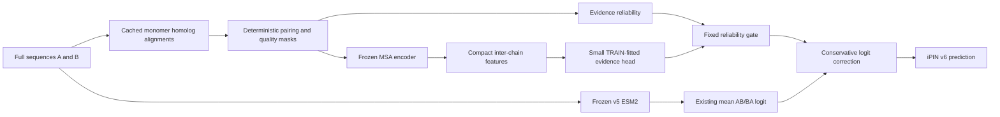

# iPIN v6 proposal: an explicit paired-MSA coevolution channel

**Research and feasibility review — 5 October 2026**

**Status:** proposal only. This review did not start MSA generation, download sequence databases or model weights, build containers, submit jobs, or change the v5 datasets/checkpoints. Literature, public code/metadata, local results, installed software, and scheduler accounting were inspected.

## 1. Recommendation

**Yes: paired-MSA coevolution is a scientifically credible next direction for iPIN. It supplies information that our existing sequence-pair models do not explicitly observe. I recommend one bounded experiment combining frozen v5 ESM2 with a cached, reliability-aware MSA channel. I do not recommend immediately retraining both large backbones.**

Two findings make this worth considering now:

- A human-proteome study released deeper human homolog alignments that we may reuse. The relevant whole-protein archive is **17.24 GB compressed**, according to its public data record. We do not need to recreate the authors' enormous upstream data-mining effort. Exact coverage of our sequences remains unmeasured. [Human omicMSA dataset](https://datadryad.org/dataset/doi%3A10.5061/dryad.15dv41p84).
- **MSA Pairformer**, published in *Cell* in August 2026, is a small pretrained model specifically relevant to extracting interaction information from aligned homologs. Its reported interface-contact results make it a stronger first candidate than inventing another iPIN attention mechanism. Those results do **not** establish an improvement on our human binary-classification benchmark. [Published paper](https://doi.org/10.1016/j.cell.2026.06.029).

The decisive uncertainties are whether enough of our human pairs have correctly paired, diverse homologs; whether their evolutionary information adds to v5 after controlling for alignment depth and protein-family effects; and whether pairwise inference is affordable. These are measurable questions. Another broad learning-rate or architecture screen would not answer them.

My recommendation is **one pretrained MSA encoder, one small fusion candidate, and two inexpensive diagnostic controls**, followed by a fixed decision. A successful v6 would be a retrieval-augmented predictor: its external sequence resources and preprocessing costs must accompany its accuracy claim.

## 2. What the existing project establishes

The relevant local evidence is the [v5 benchmark report](benchmark-v5/REPORT.md), [training protocol](retrain-v5/PROTOCOL.md), [data report](data-preparation-v5/REPORT.md), and [v5 proposal](improvment-proposal-v5.md).

| Frozen predictor | Original test AP | Original AUROC | Custom ILP test AP | Custom ILP AUROC |
|---|---:|---:|---:|---:|
| Native PLM-interact | 0.6903 | 0.6995 | 0.6377 | 0.6504 |
| iPIN v5 ESM2 | 0.6917 | 0.6964 | 0.6570 | 0.6669 |
| iPIN v5 ESMC | 0.6871 | 0.6981 | 0.6452 | 0.6637 |

ESM2 was the preferred v5 backbone by DEV performance before benchmarking. Relative to native, its original-test AP difference is only +0.0014, with a paired protein-bootstrap 95% interval of approximately [-0.0095, +0.0120]. Its custom ILP-test difference is +0.0193, with interval [+0.0092, +0.0305]. Thus v5 provides a useful baseline and a distribution-specific improvement, not an established general victory over native.

V1–v4 explored longer sequences, symmetry, alternative readouts/backbones, and chain-aware modifications without establishing the desired broad improvement. That history supports seeking complementary evidence rather than assuming another architectural adjustment will work.

V5 uses the native **CLS → ReLU → linear logit** head on joint sequence representations. Both orientations are evaluated, and raw AB/BA logits are averaged. Its standard attention already permits cross-chain communication. It has **no explicit paired homolog alignment, cross-family covariance matrix, or paired-MSA encoder**. PLM pretraining can encode evolutionary regularities implicitly; that is different from presenting the model with the particular homolog families of its current two inputs.

The proposed MSA branch therefore changes the available evidence. It does not require reviving the failed chain-attention modification or inserting a linker into ESM2/ESMC.

Paired-MSA-based PPI prediction is already established research, so adding it is not by itself a novelty claim. The useful contribution would be demonstrating complementary value under our difficult human splits and bias-aware negatives, while accounting for coverage, external supervision and cost.

### Scale of the actual task

| Dataset | Pairs | Positives | Negatives | Unique sequences |
|---|---:|---:|---:|---:|
| V5 TRAIN | 700,764 | 350,382 | 350,382 | 13,110 |
| V5 DEV | 165,742 | 82,871 | 82,871 | 6,023 |
| Original Bernett test | 52,048 | 26,024 | 26,024 | 3,022 |
| Custom ILP test | 52,048 | 26,024 | 26,024 | 2,948 |

The tests share all positives and 1,154 negatives; their union has **76,918 unique pairs**. Processing all TRAIN, DEV and unique test pairs would involve **943,424 pairs**, but only **22,155 unique sequences**. These counts favor caching homolog searches once per protein.

A read-only recount of the frozen sequence files found 13,461,085 residues, median protein length 449, maximum length **34,350**, 2,929 proteins longer than 1,024 residues, and 576 longer than 2,048. A dense residue-pair branch cannot simply inherit v5's full-length execution strategy.

## 3. What paired coevolution would contribute

For candidate human proteins A and B, an informative paired MSA has rows resembling:

```text
human query:       A_human          | B_human
ortholog context: A_species_1      | B_species_1
ortholog context: A_species_2      | B_species_2
                  ...              | ...
```

Positions are aligned within each family. Each non-query row should pair plausible corresponding homologs from the same organism or matched genomic dataset. Interface compatibility can constrain substitutions across the boundary: a change in A can be associated with compensating changes in B.

The desired evidence is **cross-chain dependence beyond the marginal conservation of A and B**. Simply concatenating two independently ordered MSAs does not supply valid paired coevolution. Neither do two mean MSA embeddings, which mainly retain separate-family information.

Three questions must remain distinct:

1. **Partner assignment:** which paralog of family A goes with which paralog of family B in another species?
2. **Contact inference:** which residues could form an interface, given an alignment?
3. **Our task:** does this particular human pair receive the positive interaction label used in the benchmark?

Success on the first two questions does not guarantee success on the third. A family can retain some interacting members while the queried human paralogs do not interact. Conversely, a real recent, transient, or motif-mediated interaction may carry little detectable family-wide covariance.

## 4. Literature: support, limits, and consequences for v6

The following are primary papers or author resources. Findings are separated from my proposed use of them.

| Source | What it contributes | Consequence for iPIN |
|---|---|---|
| Hopf et al., *eLife* 2014, [EVcomplex](https://doi.org/10.7554/eLife.03430) | Inter-protein evolutionary couplings can identify interface residues and help assemble complexes. Alignment construction and evolutionary diversity matter. | A classical coupling score is a useful mechanistic reference, but small conserved-complex successes are not a human interactome guarantee. |
| Green et al., *Nature Communications* 2021, [EVcomplex2](https://www.nature.com/articles/s41467-021-21636-z) | Extends coevolution to interaction classification at scale, with reciprocal-identity pairing and calibrated residue/interaction scores; much evidence is bacterial. | Supports a score-level coevolution branch. Do not transfer its coverage or performance numbers directly to HIPPIE. |
| Rao et al., ICML 2021, [MSA Transformer](https://proceedings.mlr.press/v139/rao21a.html) | A pretrained row/column-attention model extracts information from an alignment rather than a single sequence. | A possible technical fallback, although its interface behavior and length constraints make it less attractive than the newer candidate. |
| Lupo et al., *Nature Communications* 2022, [phylogeny in MSA language models](https://www.nature.com/articles/s41467-022-34032-y) | MSA representations encode evolutionary relatedness; controlled experiments distinguish phylogenetic correlations from contact information. | A raw correlation is not necessarily a physical interface. Include phylogeny-aware controls. |
| Lupo et al., PNAS 2024, [DiffPALM](https://doi.org/10.1073/pnas.2311887121) | Uses an MSA language-model objective to optimize within-species paralog assignments, with promising difficult-pairing examples. | Potential rescue for ambiguous families, but its repeated optimization is unsuitable as the default for nearly one million candidates. |
| Lupo et al., 2024, [DiffPaSS paper and detailed methods](https://arxiv.org/html/2409.16142v1) | Differentiable matching with mutual-information or graph scores offers cheaper pairing optimization. Its standard formulation assumes one-to-one partners. | More plausible than DiffPALM for a restricted future rescue step. Human many-to-many interactions and negative pairs remain problematic. |
| Zhang et al., *Science* 2025, [human-proteome PPI prediction](https://doi.org/10.1126/science.adt1630) | Combines substantially deeper human/eukaryotic MSAs with RF2-PPI, a model designed for PPI identification. | The most directly relevant evidence that this information can help human PPI prediction. Reuse its sequence resources rather than regenerate them. |
| Akiyama et al., *Cell* 2026, [MSA Pairformer](https://doi.org/10.1016/j.cell.2026.06.029) | A 111M-parameter MSA/pair-representation model reports strong interface-contact and interface-variant results despite individual-chain language-model training. | Preferred frozen feature extractor, conditional on exposure and runtime qualification. It has not established an AP gain on our two tests. |
| Luo et al., April 2026 preprint, [depth-over-pairing study](https://www.biorxiv.org/content/10.64898/2026.04.14.718427v1) | On 439 heterodimers, AFM/AF3 experiments attribute much of the alignment benefit to added depth; shuffled pairings can preserve improvements. | Essential counterevidence: test paired information against depth-matched controls. This structure-prediction result neither proves nor disproves our classifier hypothesis. |
| Mirdita et al., *Nature Methods* 2022, [ColabFold](https://doi.org/10.1038/s41592-022-01488-1), and Kallenborn et al., *Nature Methods* 2025, [MMseqs2-GPU](https://doi.org/10.1038/s41592-025-02819-8) | Practical, accelerated sequence search and MSA workflows. | Local batched search is a fallback; published speedups are not timing estimates for our database, lengths, or GH200 installation. |

### The human-proteome paper is encouraging, with important scope differences

Zhang and colleagues report sevenfold deeper MSAs generated from a very large collection of unassembled sequence data. Their system combines alignment improvements, model design, and additional training evidence; its overall gain cannot be attributed solely to “adding paired MSA.” Their accuracy estimation also differs from our balanced Bernett/ILP evaluation. Their RF2-PPI training uses structural and domain-interaction information, so its checkpoint requires a separate exposure assessment. [Paper and methods](https://pmc.ncbi.nlm.nih.gov/articles/PMC13281779/).

For v6, the most valuable immediate asset is the **unlabeled homolog alignment collection**. Importing the authors' published human PPI probabilities would create a different experiment, with additional training/exposure and candidate-selection concerns.

### Why prefer MSA Pairformer, cautiously

The accessible 2025 preprint describes masked-language-model training on OpenProteinSet MSAs and a contact readout fitted using 20 structural examples. That readout is supervised even though the representation learning is self-supervised. Its interface experiment uses conserved complexes; a contact precision result is not a general human PPI AP result. [Preprint and methods](https://www.biorxiv.org/content/10.1101/2025.08.02.668173v1).

The currently released implementation exposes pair representations and contact heads, with explicit complex boundaries. This makes it practical to extract an inter-chain feature channel without retraining an MSA foundation model. The released weights and training provenance must be treated as distinct artifacts; the final publication's details should not be assumed identical to the earlier preprint. [Author implementation](https://github.com/yoakiyama/MSA_Pairformer).

The recommendation is a choice of an existing feature extractor, not a prediction that it will outperform native PLM-interact. Its pretrained contact probabilities must not be presented as calibrated human interaction probabilities.

### Reasons the idea could fail

- **Wrong partners:** human gene duplication, isoforms, lineage-specific loss and functional divergence complicate ortholog pairing.
- **Wrong biological target:** a physical-interface channel is most naturally aligned with direct binding; database interaction labels can reflect broader experimental associations.
- **Insufficient diversity:** hundreds of close mammalian sequences can contain much less independent information than their raw row count suggests.
- **False confidence from shared ancestry:** correlated substitutions can arise without the particular physical interaction we seek.
- **Generic family compatibility:** a family-level interface can exist without the queried human proteins interacting in the relevant context.
- **Coverage shortcuts:** positives may have deeper, more complete, or better-curated alignments than negatives. A model may exploit that instead of coupling.
- **New architecture, old supervision exposure:** structural contact heads or pretrained PPI models can have seen relevant proteins or complexes.
- **Cost:** a smaller parameter count does not make dense residue-pair computation cheap.

These are reasons to test the information carefully, not reasons to dismiss it. The depth-over-pairing paper especially changes the experimental design: an improvement without a pairing-sensitive control would support useful MSA context, but not the stronger claim of useful explicit coevolution.

## 5. Recommended data strategy

### 5.1 Start with public human omicMSAs

The [Dryad deposit](https://datadryad.org/dataset/doi%3A10.5061/dryad.15dv41p84) lists `protein_omicMSAs.tar.gz` at 17.24 GB and an optional segment archive at 12.79 GB. These are compressed sizes, not expanded-storage estimates. The A3M-like files contain a special alignment-quality mask, query sequence, dataset-accession headers, and taxonomic information. Some gaps represent assembly/alignment failure rather than biological deletion. Parsing these as ordinary A3M without recognizing that format would be incorrect.

Proposed processing:

1. Pin the dataset version, archive checksum, retrieval date and usage terms. Retrieve only the needed alignment resource, not predicted PPI tables or structures.
2. Map each iPIN protein by **exact query sequence**, preserving accession aliases separately. An accession match alone does not establish an isoform match.
3. Record exact matches, unresolved isoforms, partial matches and missing entries separately. A partial match must never silently replace the full iPIN query.
4. Preserve original residue coordinates and quality masks. Masked or omitted regions cannot become imaginary adjacent residues in a contact map.
5. Construct paired rows from shared genomic-dataset accessions, then apply deterministic taxonomic balancing and redundancy filtering.
6. Cache each monomer MSA and its metadata once. Assemble paired inputs on demand, then cache compact pair features.

The [authors' pairing script](https://github.com/CongLabCode/RoseTTAFold2-PPI/blob/main/generate_protein_pair_MSA.py) joins on shared dataset-accession keys and applies `hhfilter` after pairing. Its preprocessing also removes low-quality query positions. We should preserve its biological pairing information while explicitly mapping all retained columns back to our original sequence coordinates. Its set iteration and external-tool behavior need deterministic handling in our wrapper.

Do not concatenate arbitrary row numbers, pair by genus alone, or count multiple assemblies of one species as independent evolutionary evidence. The proper pairing key and the taxonomic redundancy key serve different purposes.

Homologous A/B families require an additional check: duplicating the same monomer hit into both slots can manufacture impressive-looking cross-chain dependence. Detect reused biological sequence instances and collapsed paralog assignments; retain genuine fusion evidence only with an explicit coordinate-aware rule. This is not a reason to remove real interactions between related proteins. All four current supervised splits contain no self-pairs, as verified during this review.

For the neural branch, preserve poorly aligned internal query columns under a mask or use mapped contiguous segments. Merely deleting internal columns and declaring the remaining residues adjacent would change the sequence geometry seen by the encoder.

### 5.2 Fill genuine gaps only after measuring their importance

For unmatched queries, use a pinned local search pipeline with taxonomically annotated homologs. Search each unique sequence once; infer plausible orthologs and then intersect species/dataset identities for candidate pairs. Reciprocal-best-hit or comparable orthology evidence is preferable to blindly taking the highest-scoring paralog. Ambiguous assignments should lower reliability or yield missing paired evidence.

Arrhenius already has sizeable protein FASTA databases, but a taxonomy-aware, GPU-ready search index is not automatically available merely because a FASTA exists. Metagenomic sequences without reliable organism/dataset correspondence may improve a monomer MSA without adding pairable rows.

Use local batched search if fallback volume justifies it. The [ColabFold project](https://github.com/sokrypton/ColabFold) documents restrictions on public-server querying; a project-wide bulk workflow should not depend on repeatedly calling the public service.

### 5.3 Do not optimize all negative pairs into plausible partners

DiffPALM and DiffPaSS address partner matching, often starting from two families believed to interact. Our input contains many candidate noninteractions. Maximizing a coevolution score for every candidate can select accidental high-scoring assignments even for negatives.

The first implementation should use deterministic orthology/dataset pairing independent of PPI labels. If optimized matching is investigated later, apply the same procedure and optimization budget to positives, negatives, and null controls. Measure the improvement relative to that optimized null; a high optimized score alone is insufficient evidence.

### 5.4 Preserve the v5 data contract

Keep every v5 supervised pair, label, split and test manifest unchanged. Do not create easier negatives, discard low-MSA examples, add structure-derived positive labels, or rerun the ILP to favor the new modality. Missing MSA evidence is an input condition, not a negative label.

The supervised TRAIN/DEV/test protein and homology protections remain in force. External sequence retrieval introduces another exposure category: a fixed unlabeled database can contain evaluation sequences or homologs. That is not automatically supervised PPI leakage, but it means we cannot claim that the entire feature pipeline has never encountered those sequences.

Before fitting the new branch, record that policy explicitly. Remove exact held-out human query sequences from training-context rows where identifiable, distinguish generic external homolog context from supervised labels, and report remaining cross-split context overlap. Do not quietly extend the 40%-identity rule to eliminating all external homologs: that would change the scientific question and potentially remove the very information under study.

Audit the MSA encoder's structural/contact supervision separately. If released-head training membership cannot be established, label that limitation; use trunk-only features with an iPIN-TRAIN-fitted readout for the strict variant. Do not assert an exposure-free comparison from the fact that a model is called self-supervised.

## 6. Proposed model

### 6.1 Preserve the existing predictor and add a separate branch



Let `s5(A,B)` be the frozen v5 mean AB/BA logit. A suitable starting form is:

```text
s6(A,B) = s5(A,B) + alpha × m(A,B) × g(q(A,B)) × r(c(A,B))
```

- `c`: compact cross-chain evidence, constructed symmetrically from the two orientations.
- `q`: alignment/pairing quality; it controls trust rather than being an unrestricted interaction predictor.
- `m`: explicit availability/validity mask.
- `g`: fixed, bounded reliability function established during the development experiment.
- `r`: small regularized evidence head, fitted only to designated TRAIN examples.
- `alpha`: one nonnegative fusion coefficient, including zero as an allowed outcome.

When evidence is missing, invalid or disallowed, **`s6 = s5` exactly**. No missingness-specific intercept should move the fallback score. Positive and negative corrections are possible when informative evidence is present, but a shallow alignment alone must not be treated as evidence against interaction.

This preserves the original PLM-interact branch. The combined predictor is a new architecture and must be described as such.

### 6.2 What to extract

Use a small fixed feature specification, approximately 32–128 scalar summaries rather than a learned giant residue-pair network. Candidate summaries include:

- Several fixed top-k and upper-quantile cross-chain scores, not just the single maximum.
- Size and coherence of high-scoring residue patches; fractions of both chains supported by those patches.
- Scores normalized for evaluated residue-pair count and assessed window count.
- Stability under deterministic taxonomically balanced MSA subsampling, measured on a diagnostic sample.
- A classical APC-corrected coupling summary on a small subset as a mechanistic reference.

Quality metadata should include raw paired depth, a defined effective sequence count, species/clade counts, query coverage, gaps, retained-column fraction and assignment ambiguity. Record the exact sequence-reweighting identity threshold and coverage convention; “Neff” is not reproducible without a definition. Provisional depth bins such as 0, 1–7, 8–31, 32–127 and ≥128 are descriptive bins, not universal biological sufficiency thresholds.

Classical MI/APC or DCA are useful checks, but MI is not a direct-coupling model and APC does not remove every phylogenetic confounder. Conversely, do not apply APC automatically to neural contact probabilities; the score transformation has to match the feature method.

Preferred extractor: pinned MSA Pairformer, frozen. Use a qualified released contact head only with an explicit supervision audit; otherwise summarize frozen pair representations with a small TRAIN-only readout. Do not pretrain a new MSA model. Do not import RF2-PPI's published human prediction scores as features.

### 6.3 Length and depth must have explicit limits

Start with **128 paired rows and at most 1,536 combined residues per MSA forward** as proposed engineering limits, subject to a real GH200 memory check. These are not demonstrated throughput or biological-optimality claims.

For longer queries, the conservative initial behavior is full-sequence v5 fallback. If the same fixed implementation supports windows, allow at most two predetermined contiguous windows per chain and four combinations, with at most 768 residues per window. Choose windows using only monomer alignment coverage/quality, never known interaction labels or a test-selected interface. Preserve coordinates and record the evaluated fraction.

A window policy can miss the true interface. It must not make absence of a detected contact equivalent to absence of interaction. Variable numbers of windows also inflate maximum scores; include their multiplicity in normalization and controls. The unchanged full-sequence branch continues to score **every** pair.

### 6.4 Avoid an in-sample stacking trap

The v5 model was trained on all TRAIN pairs. Fitting a fusion model to its confident in-sample TRAIN logits can teach the new branch the wrong residual distribution.

A bounded design avoids needing expensive PLM cross-fitting:

1. Fit the small MSA evidence head on a fixed TRAIN subset **without using v5's in-sample score as a learned input**.
2. Before inspecting v6 outcomes, create a deterministic internal calibration/assessment division of DEV by protein/homology groups. Cross-boundary pairs are excluded only from these internal selection masks; the official DEV set remains unchanged.
3. Choose the single fusion coefficient on the calibration part from a tiny declared grid, for example `{0, 0.1, 0.25, 0.5, 1}`. Require enough retained pairs and both labels in each mask.
4. Assess the selected recipe on the other part, then report full-DEV metrics for that already fixed recipe. Do not choose a new recipe from the full-DEV report.

The original v5 checkpoint was already selected using DEV, so these internal masks do not make the entire project newly independent. They do prevent directly fitting the v6 combiner and assessing it on the identical rows. If this partition leaves inadequate evidence, report an inconclusive development experiment rather than inventing a favorable split.

### 6.5 Other ideas considered, ranked

| Idea | Judgment for this round |
|---|---|
| Frozen v5 + frozen MSA features + small gated correction | **Recommended.** Directly tests whether new evidence adds value, with the least disruption. |
| Sparse coevolution-derived attention bias or residue-pair adapter inside ESM2 | Potential follow-up only after the external channel works. Zero-initialize the new contribution; avoid another unproven global attention rewrite. |
| RF2-PPI as a separate expert | Relevant alternative, but carries additional supervised-data and ARM-porting questions. Not a second production candidate by default. |
| Distill a successful MSA expert into a sequence-only student | Attractive for deployment cost, but would discard some per-query evolutionary context. Only useful after the teacher demonstrates value; distill on TRAIN only. |
| DiffPaSS/DiffPALM refinement | Reserve for a small, predefined ambiguous-family subset if ordinary pairing is the demonstrated bottleneck. |
| Full AFM/AF3 cofolding for all pairs | Too costly and changes the experimental question. A few structure visualizations could aid interpretation later. |
| End-to-end retraining of both PLMs and an MSA network immediately | **Not recommended.** Expensive, confounded, and unnecessary to establish complementarity. |

These are brainstormed options, not a queue of promised experiments.

## 7. The essential controls

The existing v5 predictor is the baseline. The development experiment adds just two diagnostic controls to the proposed MSA branch:

**Control A — quality/profile information without paired dependence.** Use the same small-head capacity and training subset, but supply alignment quality and separate-chain conservation/profile summaries. This asks whether coverage, family properties, or better marginal sequence information explain the benefit. The quality-only component should also be inspected separately because the ILP negatives were not constructed to match MSA depth or conservation.

**Control B — disrupted pairing with preserved marginal alignments.** Keep the query A/B row, each monomer's homolog sequences, depth, gaps and window policy; permute the homolog rows of one chain. Use a fixed seed and, where feasible, permute within suitable taxonomic neighborhoods. A global shuffle can destroy phylogeny as well as physical pairing, so report that limitation. Tiny clades with no meaningful permutation provide no informative null.

The true paired branch must improve over these controls, not merely over a weaker sequence model. If paired and shuffled inputs perform alike, we may have a useful alignment-context method, but should not claim that paired coevolution caused the gain. A few repeat shuffles on a small diagnostic subset can check sensitivity; there is no need to multiply all production inference by a large permutation count.

Further checks are observations on the same experiment: coverage by class/length/family, score-versus-depth plots, paired/unpaired orientation consistency, and behavior when the branch is masked out. They do not require additional large retraining runs.

## 8. Arrhenius feasibility: what was actually checked

### Hardware and scheduling

The [official Arrhenius description](https://www.naiss.se/resources/arrhenius-technical-description/) lists four GH200 modules per GPU node, ARM Grace CPUs, and separate AMD Turin CPU nodes. Local inspection confirms `aarch64`; `nvidia-smi` labels the GPU “GH200 120GB” but reports **97,871 MiB device memory**. Size GPU workloads using that reported memory, not the name. Host memory is a different resource and is limited by the job allocation.

CPU nodes expose 256 cores with roughly 768 GB RAM; the fat CPU partition offers roughly 3 TB RAM. The live partition limits were 72 hours. MSA feature extraction should use independent restartable shards: one worker per GPU is preferable to distributed training for independent pair forwards. CPU-only jobs can handle indexing, joins and feature packing. Request fat nodes only when measured index memory needs them.

The mounted project filesystem reported about 143 TB free. That is shared filesystem capacity, **not a verified user/project quota**. No allocation balance, permitted storage quota, queue delay or monetary price was established in this review.

### Existing assets

| Asset | Observed state | Implication |
|---|---|---|
| `images/plm-interact-esmc/plm-interact-esmc-arm64-v1.sif` | Python 3.12.3; PyTorch `2.8.0a0+34c6371d24.nv25.08`; CUDA 13.0; GPU import works | A possible base for a separate feature-extraction image, not proof that MSA dependencies work. |
| `/software/sse2/el9_gh200/easybuild/prefix/software/mmseqs2-gpu/18-8cc5c/bin/mmseqs` | Existing executable; help command works; SHA256 `bbe29a5b59b268d13f1237a8a8dd47c7d2a0d74103aab474c6d532e885ea58ac` | Local GPU-search route exists. Its version output is `GITDIR-NOTFOUND`; record its checksum and installed path. No search throughput was measured. |
| `AlphaFold3-data/3.0` module | Points to `/dataset/easybuild/data/AlphaFold3-data/3.0` | Shared sequence resources can reduce downloads. |
| Shared protein FASTAs | UniProt April 2021 ~102 GB; UniRef90 May 2022 ~67 GB; MGnify clusters May 2022 ~120 GB; BFD first representatives ~17 GB | These are FASTAs, not verified taxonomy-complete expandable MSAs or ready GPU search indices. Pin actual snapshots. |

For a future MSA Pairformer SIF, preserve the existing v5 images. The inspected package requests Python ≥3.10 and PyTorch ≥2.5. Its Linux dependencies include CUDA-12 cuEquivariance packages, whereas the current ESMC image uses CUDA 13. This mismatch needs a deliberate compatible environment or the implementation's PyTorch fallback, not a blind `pip install` into production. ARM64 wheels exist for current cuEquivariance operations, but the exact pinned combination remains untested. [Package specification](https://github.com/yoakiyama/MSA_Pairformer/blob/main/pyproject.toml), [model implementation](https://github.com/yoakiyama/MSA_Pairformer/blob/main/MSA_Pairformer/model.py), [wheel metadata](https://pypi.org/pypi/cuequivariance-ops-torch-cu12/json).

The README's suggested HH-suite download is an SSE2/x86 binary. GPU-node preprocessing needs an ARM-compatible build; CPU-node preprocessing can use a separately pinned x86 environment. The inspected automatic weight loader also names `yakiyama/MSA-Pairformer`, while the verified public repository is `yoakiyama/MSA-Pairformer`. Resolve weights explicitly and load offline from a pinned snapshot. Neither issue proves the model is unusable; both belong in qualification before allocating a long job.

### Memory is about sequence length, not only parameters

For a dense pair representation with width 256 in BF16, one tensor alone needs approximately:

```text
bytes = (L_A + L_B)^2 × 256 × 2
```

At combined length 1,536 that is about **1.21 GB**; at 2,048, **2.15 GB**; near the longest v5 DEV pair, **0.94 TB**. Layers, temporary activations, MSA representations and outputs add substantially. This explains the explicit MSA-window limit despite the frozen model's modest parameter count.

Pair-update operations also make compute grow steeply with length. Throughput estimates must therefore be weighted over the actual length, depth and window-count distribution; extrapolating from a few short examples would underestimate the long tail.

A naïve dense Potts/covariance representation is not automatically cheap either: `(21L)^2` FP32 entries occupy about 1.76 GB at L=1,000 and 7.06 GB at L=2,000, before factorization/optimization workspace. Implementations can avoid storing all of that, but their actual runtime still needs measurement.

## 9. Cost model and a lower-cost production design

### Compute

The right unit is **measured effective seconds per physical pair**, including every required orientation, window and MSA subsample. Let `t_i` denote that total and `I_i` indicate that a pair requires the MSA branch:

```text
GPU-hours for feature inference = sum(I_i × t_i) / 3600
```

Include separate time for controls, sequence search, v5 scores that cannot be reused, and feature-head fitting. A reported single-window forward time is not an end-to-end cost estimate.

The following table is arithmetic, **not a measured speed prediction**. It assumes every pair is processed and perfect four-GPU parallelization for the walltime column.

| Effective seconds per pair | All 943,424 pairs: GPU-hours | Ideal walltime on 4 GPUs | Reduced 292,660-pair design: GPU-hours |
|---:|---:|---:|---:|
| 0.1 | 26.2 | 6.6 hours | 8.1 |
| 1 | 262.1 | 65.5 hours | 81.3 |
| 5 | 1,310.3 | 13.6 days | 406.5 |
| 10 | 2,620.6 | 27.3 days | 812.9 |
| 30 | 7,861.9 | 81.9 days | 2,438.8 |

**Recommended reduction:** fit the small MSA evidence head on a fixed, balanced **50,000-pair TRAIN subset**, selected before MSA outcomes are seen. The frozen base still embodies training on all 700,764 TRAIN pairs. Then process full DEV (165,742) and, only after freezing the recipe, the unique test union (76,918). Total: **292,660 candidate pairs**. This does not alter the official TRAIN partition; it limits supervised fitting of the added low-capacity branch and must be reported.

Quality-based fallback can reduce neural calls further, but its frequency must be measured separately for each class and split. Coverage should never be chosen using test labels. Control features need only cover the declared development experiment unless a broader claim demands them.

For perspective, SLURM accounting including both requeue segments gives approximately **231.7 allocated GPU-hours for v5 ESM2** and **229.6 for v5 ESMC**. These sum parent-job elapsed time across allocations and multiply by four GPUs; batch/step records are not added again. A full pairwise MSA pass can therefore cost more than either original retraining run.

CPU accounting should use elapsed time multiplied by reserved cores. Index construction and archive parsing may dominate search startup, while searches can be batched over unique proteins. No defensible CPU-hour forecast is available until archive coverage and fallback-query volume are measured. Likewise, there is no basis here for a monetary estimate.

### Storage and caching

| Item | Planning implication |
|---|---|
| Whole-protein omicMSA download | 17.24 GB compressed, published archive size; expanded footprint unmeasured. |
| Optional segment archive | Additional 12.79 GB compressed; not needed automatically. |
| Compact pair features | 943,424 × 256 FP32 values is ~0.97 GB before IDs/metadata; the reduced design is ~0.30 GB. |
| Materialized paired alignments | At depth 256 and mean paired length 1,000, one million one-byte alignments already approach 256 GB before headers/insertions. Avoid duplicating these on disk. |
| Full residue maps/hidden states | Potentially many terabytes; retain compact summaries and a small declared interpretation subset. |
| Search indices | Additional footprint depends on database and indexing scheme; shared FASTA size is not a sufficient estimate. |

Use sequence-hash keys for monomer MSAs and unordered pair-hash keys for final symmetric features. Include database, pairing, mask, encoder and window-policy hashes in cache identities. Put temporary pair tensors on node-local scratch. Persistent artifacts should be compact, chunked, checksummed and resumable.

## 10. A finite experimental plan

### Step 1 — one bounded development experiment

**Proposed ceiling: 24 allocated GPU-hours, 2,000 CPU-core-hours, and 150 GB additional working storage.** These are suggested limits for a future authorized experiment, not measured requirements or jobs launched by this review. Partial archive extraction can keep the working footprint bounded; do not silently expand storage if it does not fit.

Within that ceiling:

1. Qualify exact query mapping, mask/coordinate parsing, deterministic pairing, encoder loading, memory behavior and interrupted-shard resume on the interactive GPU.
2. Examine approximately 1,000–2,000 TRAIN/DEV proteins spanning lengths and families. Measure archive match rate and paired depth before choosing any rescue strategy.
3. Extract candidate and control features for up to **4,000 fixed TRAIN pairs and 4,000 fixed DEV pairs**, with class balance and representative length strata. Include unavailable/long pairs through baseline fallback; do not restrict evaluation to successful MSAs.
4. Fit small heads with one fixed regularization recipe. Assess added value, pairing sensitivity, quality-only effects, failure rates, memory and throughput. Reuse matching v5 scores wherever available.

The pair counts are upper bounds. If the compute ceiling is reached first, record the result as incomplete or inconclusive; do not turn it into repeated extended pilots. For 8,000 pairs and three feature views, 24 GPU-hours allows only about 3.6 GPU-seconds per view on average before other work. The ceiling itself is a useful feasibility test.

**Proceed only if** the paired channel shows a credible benefit beyond the quality/profile and disrupted-pairing controls on development examples; that benefit is not confined to a handful of deeply aligned families; full-population fallback behavior is sound; and the measured production extrapolation fits the next budget. There is no universal minimum MSA-coverage percentage: a rare but strong signal and a broad weak signal have different utility. Report the achievable full-population gain rather than declaring a literature-derived coverage cutoff.

### Step 2 — one fixed v6 candidate, conditional on Step 1

Use frozen v5 ESM2, the pinned MSA encoder, the declared 50,000-pair TRAIN subset and the calibration/assessment policy above. No PLM retraining, no encoder fine-tuning, no LR grid, and no simultaneous ESMC production run are needed to establish the new channel.

**Suggested total v6 development/feature-generation ceiling: 300 allocated GPU-hours**, including the initial experiment and remaining baseline-score inference. A measured estimate above that ceiling is a reason to stop or explicitly revise the project scope, not to submit hidden extra work. Storage and CPU limits must be updated from measurements before this stage.

A proposed practical continuation target is **at least +0.010 AP over frozen v5 ESM2 on the internal DEV assessment set**, with a positive paired protein-bootstrap interval and no material AUROC deterioration. This is an engineering decision threshold, not a predicted gain. A smaller uncertain effect can be scientifically interesting without justifying more production compute.

If the paired branch fails the information test, stop v6. If it passes, freeze its feature pipeline and fusion coefficient, then benchmark once. A later ESMC transfer or end-to-end adaptation would be a separate proposal justified by the result, not an automatic additional phase.

### Step 3 — benchmark the frozen result and close the round

Use a future `benchmark-v6/` folder. Score both complete frozen tests; reuse v5 and competitor predictions only when pair and checkpoint hashes agree. Generate MSA features for their 76,918-pair union once. Report:

- AP and AUROC for v6, v5 ESM2, native PLM-interact and existing comparators on identical rows.
- Paired protein-bootstrap differences versus both v5 and native, with the same resamples for all methods.
- Coverage, missingness, length/depth strata, runtime and storage; covered-only performance is secondary.
- Precision at declared operating points and calibration where appropriate. Balanced-test AP does not establish proteome-wide positive predictive value.
- Supervised structural/PPI exposure and unlabeled homolog-context exposure as separate categories.

The original test has informed several project rounds already; both historical tests are **exploratory confirmation for v6**, not newly blind data. They share all positives, so two positive results are not independent replication. A broad generalization claim would need an additional independent evaluation later. That limitation should be stated without making an open-ended new benchmark project a prerequisite for finishing this round.

The strong outcome would be a meaningful original-test gain while preserving the ILP improvement. An ILP-only gain should be described as such. The small combined D-SCRIPT/X-PAIR-unexposed subsets remain descriptive sensitivity analyses, not model-selection targets.

## 11. Implementation contract if the proposal is accepted

Keep preparation, model fitting and benchmarking separate. Suggested future locations are `data-preparation-v6/`, `retrain-v6/` and `benchmark-v6/`; none was created for this review.

Each feature shard should record protein/pair hashes, original coordinates, source archive/database identity, row-pairing provenance, RNG seed, feature version, encoder hash, precision, masks and explicit failure reason. Write to a temporary file, validate dimensions/coverage/finiteness, then commit atomically. Resume only missing or invalid shards.

For the small trained branch, preserve parameters, optimizer state, RNG, sample order/cursor, normalization statistics, selection state and immutable configuration. Unit qualification should cover query/column mapping, AB/BA handling, train-only fitting of transforms, exact v5 fallback, and interruption/resume equivalence. An execution failure is distinct from a biologically shallow MSA and must not silently become a reassuring low interaction score.

No template structures, GO annotations, benchmark labels, known-PPI databases or public human interaction predictions belong in MSA construction or window selection. Provenance should make that distinction inspectable.

## 12. Source and review record

The literature search covered classical direct coupling, human/eukaryotic ortholog pairing, neural MSA encoders, differentiable paralog matching, recent counterevidence, public human MSA availability and practical HPC tooling. Detailed accessible material included the MSA Pairformer 2025 preprint, the depth-over-pairing preprint, DiffPaSS methods, author repositories and dataset documentation. The *Cell* 2026 publication summary was checked; its full publisher text was inaccessible in this session. Accordingly, the preprint's training details above are identified as preprint details, not assumed final-publication facts.

Additional reproducibility references:

- [Human omicMSA / RF2-PPI author repository](https://github.com/CongLabCode/RoseTTAFold2-PPI). Its original download host had certificate/access problems in this environment; the independent Dryad metadata was accessible. The large archive was not downloaded or content-validated.
- [MSA Pairformer code snapshot](https://github.com/yoakiyama/MSA_Pairformer/tree/875363570df1ae484cf725aba382790444223005). Repository HEAD observed during this review; any executable release needs its own pinned manifest.
- [MSA Pairformer weight snapshot metadata](https://huggingface.co/yoakiyama/MSA-Pairformer/tree/7563e77a87536b5572f91683c39073ef348639a4). Contains trunk and separate contact-head files; weight bytes were not downloaded. The weight license is a modified MIT “Pizza edition”; preserve the actual license rather than relying on a package label.
- [DiffPaSS author code](https://github.com/Bitbol-Lab/DiffPaSS).
- [MMseqs2 official software](https://github.com/soedinglab/MMseqs2) and [ColabFold official workflow](https://github.com/sokrypton/ColabFold).
- [Local frozen selection and runtime provenance](benchmark-v5/provenance/selection.json), [benchmark metrics](benchmark-v5/results/metrics.csv), [final data audit](data-preparation-v5/reports/final-audit.json).

**Decision:** paired-MSA context merits one carefully bounded v6 experiment because it adds a distinct source of information. The preferred first model is a frozen v5 ESM2 predictor augmented by cached MSA-derived evidence with explicit fallback. Coverage, pairing-specific added value and measured cost should determine whether it proceeds; outperforming native remains a hypothesis to test.
