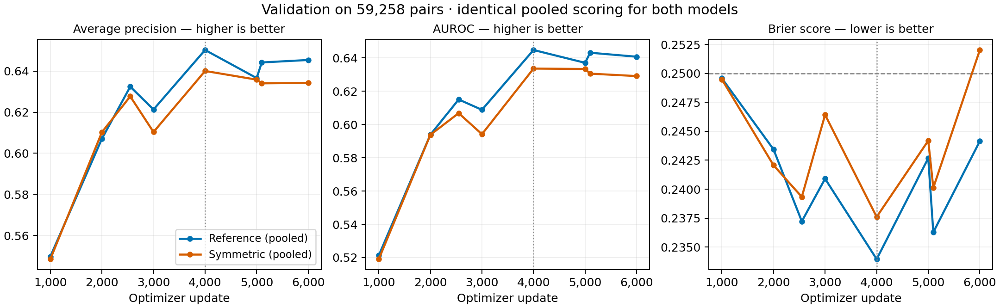

**Validation review through update 6,000 — 29 September 2026**

This report compares exactly two trained models. Both use the same scoring rule: average the A–B and B–A logits; apply sigmoid for probability metrics. AP and AUROC are computed from raw pooled logits. All eight completed validation checkpoints were checked for complete unique row coverage, matching labels, finite logits, and agreement with logged AP. Each includes all 59,258 frozen validation pairs.

| Model | Latest AP | Latest AUROC | Latest Brier, lower is better |
| --- | ---: | ---: | ---: |
| Reference (pooled) | 0.645417 | 0.640721 | 0.244150 |
| Symmetric (pooled) | 0.634255 | 0.629097 | 0.252017 |

The reference currently leads by 0.011161 AP and 0.011624 AUROC. Its Brier score is lower by 0.007866. These are descriptive single-seed differences, not a statistical significance claim. There is no demonstrated validation-ranking advantage from the symmetric training objective so far.

Both models improved from AP around 0.55 at update 1,000. Both reached their highest observed AP at update 4,000: reference 0.650275 (AUROC 0.644770, Brier 0.233961); symmetric 0.640064 (AUROC 0.633595, Brier 0.237610). Neither has exceeded that AP at subsequent validations. Their update-4,000 checkpoints remain retained as best models. The reference's prespecified ordinary-order AP also selected update 4,000; this pooled analysis has not changed its selection rule.

The symmetric model's latest Brier score, 0.252017, is worse than the constant-prevalence baseline of approximately 0.25, despite ranking above chance. Probability estimates have therefore not improved consistently with ranking. A Brier score combines calibration and discrimination; this observation alone does not identify the cause. The curves are consistent with a validation plateau and fluctuating probability quality. Overfitting or optimization effects remain hypotheses, not diagnosed causes.

At the status check both jobs were running around updates 6,300–6,320 of 12,745, in the third epoch, with committed checkpoints at update 6,300 and no training errors found. The current validation comparison is at update 6,000. No training settings were changed, no test predictions were generated, and the remaining planned training is still running. These validation metrics are not directly comparable with the paper's reported test metrics.

The dotted vertical line marks update 4,000, the best AP checkpoint so far for both models. The dashed Brier line is the constant-prevalence baseline. The unequally spaced points include epoch-end validations at updates 2,549 and 5,098.

[Exact results and checks](validation-review-update-6000.json) · [CSV history](validation-pooled-history-through-6000.csv) · [SVG figure](validation-curves-through-6000.svg)
