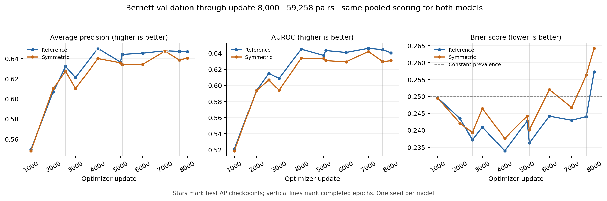

**Validation review through update 8,000 — 29 September 2026**

The latest completed validation for both models is update 8,000, approximately 3.14 epochs into the planned five-epoch training. Reference validation finished at 08:39 UTC and symmetric validation at 08:34 UTC. Each evaluation covers all 59,258 frozen validation pairs.

Exactly two models are compared below. Both use the same scoring rule: average the A–B and B–A logits; apply sigmoid for probability metrics. AP and AUROC use raw pooled logits. The figures are independently recomputed from saved predictions rather than mixing the reference model's ordinary-order metrics with the symmetric model's pooled metrics.

| Model | AP at update 8,000 | AUROC at update 8,000 | Brier at update 8,000, lower is better | Best pooled AP so far | Best update |
| --- | ---: | ---: | ---: | ---: | ---: |
| Reference | 0.647030 | 0.640269 | 0.257343 | 0.650275 | 4,000 |
| Symmetric | 0.640548 | 0.630456 | 0.264225 | 0.647411 | 7,000 |

The reference leads at the latest validation by 0.006482 AP and 0.009813 AUROC. These are descriptive differences from one seed per model; no significance claim is made.

The symmetric run improved to a new best AP of 0.647411 at update 7,000, approximately 2.75 epochs, compared with its previous best of 0.640064 at update 4,000. At update 7,000 its AP was close to the reference's 0.647818 at that same update. It subsequently fell to 0.638533 at the end of epoch three (update 7,647), then partially recovered to 0.640548 at update 8,000. Its best checkpoint at update 7,000 remains retained.

The reference's best pooled AP remains 0.650275 at update 4,000, approximately 1.57 epochs. Its prespecified ordinary-order AP also selects this checkpoint; the pooled analysis has not changed that selection rule. Reference AUROC reached 0.645901 at update 7,000, so the best AUROC update differs from the best AP update. AP governs checkpoint selection.

Probability quality has worsened at the latest evaluation. Both Brier scores exceed the constant-prevalence baseline of approximately 0.25. They have risen from 0.242950 to 0.257343 for reference and from 0.246709 to 0.264225 for symmetric since update 7,000. Ranking remains above chance, but the probability estimates currently have greater mean squared error than a constant prediction near 0.5. Brier score reflects both calibration and discrimination; these results alone do not diagnose overfitting or its cause.

All 11 completed validations per model passed checks for complete unique row coverage, labels matching the frozen validation array, finite predictions, and agreement with logged metrics. The validation array's SHA-256 matches the prepared manifest. All logged training loss, gradient-norm and learning-rate values were finite. Both Slurm jobs were running and advancing around update 8,100, in epoch four, with current resumable checkpoints and no traceback, out-of-memory, or CUDA-error messages found in their logs.

The latest results still provide no demonstrated AP advantage for the symmetric objective over the matched reference. The reference is our newly trained control; this comparison is not a comparison against the authors' released native checkpoint. Training settings and selection rules were left unchanged, and no test evaluation was performed.

Stars mark each model's best observed AP; vertical lines mark completed epochs at updates 2,549, 5,098 and 7,647. The dashed Brier line is the constant-prevalence baseline.

[Exact results and validation checks](validation-review-update-8000.json) · [CSV history](validation-pooled-history-through-8000.csv) · [SVG figure](validation-curves-through-8000.svg)
