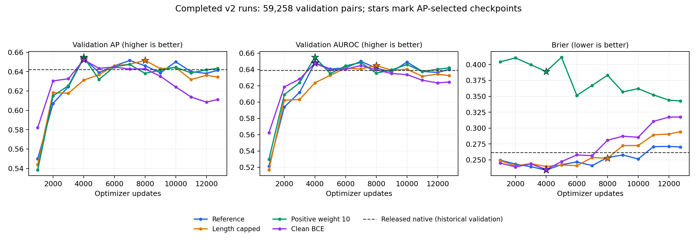

**Completed PLM-interact v2 retraining results**

Audit started 30 September 2026 at 10:26 CEST. All four production jobs completed their prescribed 12,745 updates and 815,680 physical-pair exposures with SLURM exit code `0:0`. Their selected validation AP values are close, between 0.6516 and 0.6548. This screen does not establish a robust AP improvement over the v2 reference or improved generalization over released native PLM-interact.

**Validation selected checkpoints**

Every row uses the same 59,258 uncapped validation pairs, clean sequences, BF16 inference, and the mean of the A–B and B–A logits. Each run selected its maximum pooled validation AP among the same 13 scheduled evaluations. AUROC and Brier below belong to that AP-selected checkpoint; they were not selected separately. Brier measures squared probability error and is better when lower.

| Model | Selected update | Selected AP | AUROC | Brier ↓ | Final AP at 12,745 |
| --- | ---: | ---: | ---: | ---: | ---: |
| Reference | 4,000 | 0.653895 | 0.648293 | 0.234051 | 0.641393 |
| Length capped at 2,193 combined residues | 8,000 | 0.651579 | 0.644744 | 0.252541 | 0.634317 |
| Positive class weight 10 | 4,000 | **0.654795** | **0.654988** | 0.388923 | 0.643277 |
| Clean BCE without MLM | 4,000 | 0.652156 | 0.647778 | 0.234906 | 0.611196 |

All four completed the same update/exposure budget before this comparison. The capped run repeatedly samples its smaller training subset: 130,461 distinct pairs and 6.252 equivalent passes, versus 163,085 pairs and 5.002 passes in each other arm. It is appropriate to compare their prespecified best selections after this common horizon. The [matched update comparisons](matched-update-comparisons.csv) also retain every comparison at identical update counts.

**What the interventions achieved**

Positive weighting has the highest selected AP, but improves on reference by only **0.000900 AP**, or 0.090 percentage points. Its AUROC gain is 0.006695. Its raw probability error is substantially worse: selected Brier is 0.388923 versus 0.234051. Mean predicted probability is 0.8880 on a validation set with approximately 50% positives, and all pairs exceed the default 0.5 decision threshold. Positive weighting changes the classification objective and shifts scores; the AP/AUROC ranking observations should be distinguished from the usefulness of uncalibrated probabilities or a default threshold.

Clean BCE's early advantage did not persist. At update 3,000 it led reference by 0.008222 AP; both selected update 4,000, where clean BCE was lower by 0.001739. Its final AP fell 0.040960 below its own selected maximum, the largest decline in the screen. This is consistent with overfitting or weaker regularization, but the cause is not identified: this arm removes both corruption and MLM together. It cannot determine their individual effects.

The capped model is an efficiency result: 11h 10m 50s versus reference's 20h 15m 44s, or **44.8% less allocated GPU time** at the same number of updates and pair exposures. Its selected AP is lower by 0.002316. That small difference does not establish equivalence. The comparison also does not support a blanket conclusion that including longer sequences has no value: on the 4,934 validation pairs exceeding 2,193 combined residues, selected reference AP is 0.582741 versus capped AP 0.566739, a descriptive gain of 0.016003. These subset observations are exploratory and need replication.

| Validation length stratum | Pairs | Reference AP | Capped AP | Positive10 AP | Clean BCE AP |
| --- | ---: | ---: | ---: | ---: | ---: |
| Combined residues ≤2,193 | 54,324 | 0.659167 | 0.657450 | 0.659969 | 0.657059 |
| Combined residues >2,193 | 4,934 | 0.582741 | 0.566739 | 0.587536 | 0.591514 |

Each stratum uses the checkpoint selected on the complete validation set, without selecting a different checkpoint for the subset. Full AP, AUROC, Brier and prevalence values are in [the stratum table](selected-length-strata.csv).

**Uncertainty and native comparison**

Paired protein resampling gives the following conditional 95% percentile intervals for selected-checkpoint AP differences. Every interval spans zero.

| Candidate versus reference | AP difference | Protein bootstrap interval |
| --- | ---: | --- |
| Length capped | −0.002316 | [−0.010315, +0.004936] |
| Positive weight 10 | +0.000900 | [−0.004973, +0.007141] |
| Clean BCE | −0.001739 | [−0.009707, +0.006269] |

The analysis uses 1,000 paired Poisson protein resamples, weighting a pair by the product of its distinct endpoint multiplicities; self-pairs receive one multiplicity. It conditions on this validation graph and the already selected predictions. It excludes training-seed and model/checkpoint-selection uncertainty, so these intervals are descriptive evidence rather than a confirmatory test. Only seed 2 has been run, and the three planned homology-group fold comparisons are not complete.

The [previous evaluation of released native PLM-interact](../../../benchmark-v1/results/validation-metrics.csv) on this validation set reported pooled AP **0.642142**, AUROC **0.638945**, and Brier **0.261642**. All four v2 selections have higher validation AP. This is a historical evaluation of the released checkpoint, not the native training log. Our [v1 benchmark](../../../benchmark-v1/REPORT.md) already showed that a validation advantage can reverse on the historical test set. V2 test performance remains unmeasured. As the [prespecified protocol](../../PROTOCOL.md) explains, that historical test has influenced research decisions; any reuse is exploratory, and a generalization claim requires independently reserved data and replication.

The reference at update 4,000 remains the appropriate control for further work. Positive10 is a close ranking alternative, rather than an established improvement. Preserve all four selections for transparent subsequent comparisons. Later objective, learning-rate and architecture templates have not been trained by this four-run screen; no candidate has yet met the protocol's fold/seed confirmation requirements.

**Job completion and checkpoint integrity**

| Model | Array task | Node | Elapsed | Allocated GPU hours |
| --- | --- | --- | --- | ---: |
| Reference | 3130215_0 | n537 | 20:15:44 | 81.05 |
| Length capped | 3130215_1 | n584 | 11:10:50 | 44.72 |
| Positive weight 10 | 3130215_2 | n472 | 20:07:42 | 80.51 |
| Clean BCE | 3130215_3 | n524 | 20:04:49 | 80.32 |

Total allocated cost was **286.61 GPU-hours**, including validation and checkpoint overhead, rather than a measured utilization integral. [SLURM accounting](../../provenance/final-accounting-3130215.txt) records all four jobs as COMPLETED. The final training state has no pending validation, and each run's four ranks report identical final model hashes.

The audit independently recomputed AP, AUROC and Brier from all **52** validation payloads after checking SHA-256, exact row/label alignment, and finite scores; every metric agreed with its metadata and event log within 1e-12. It verified the full payload SHA-256 and size of all **eight selected/final checkpoints**, the maximum-AP selection rule, frozen training code/configuration, and train/validation row hashes. All logged losses and gradient norms were finite, and production logs contained none of the checked fatal traceback, GPU-memory, NCCL, segmentation-fault or scheduler-error patterns. Reference, Positive10 and Clean BCE had identical logged batch digests.

Selected pointers: [reference](../../runs/reference-official-seed2/best.json), [capped](../../runs/capped-official-seed2/best.json), [positive10](../../runs/positive10-official-seed2/best.json), [clean BCE](../../runs/clean-bce-official-seed2/best.json). Their corresponding `latest.json` files identify the final resumable states. Use the selected checkpoints for model comparisons; all final checkpoints have lower validation AP.

This inspection used stored validation predictions and CPU calculations inside the existing SIF. It did not load test predictions, rerun GPU inference, alter selection, or submit jobs.

[Machine-readable audit](snapshot.json) · [Selected and final metrics](selected-and-final.csv) · [Full validation history](validation-history.csv) · [Selected comparisons](selected-comparisons.csv) · [Bootstrap samples](protein-bootstrap.npz) · [SVG figure](validation-curves.svg) · [Audit script](../audit_completed.py)
