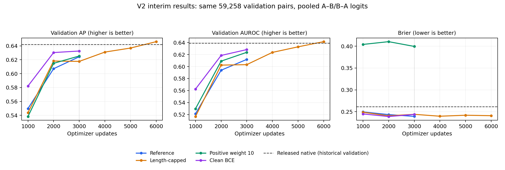

**V2 interim retraining results**

Snapshot: 29 September 2026, 19:32:02 CEST (17:32:02 UTC).

All figures below are validation results on the same 59,258 pairs, using clean sequences, BF16 inference and mean A–B/B–A logits. These are interim point estimates; no test inference or model-selection changes were performed.

| Model | Logged training update / 12,745 | Latest validation update | Validation AP | AUROC | Brier ↓ |
| --- | ---: | ---: | ---: | ---: | ---: |
| Reference | 3,770 | 3,000 | 0.624334 | 0.611930 | 0.239357 |
| Length-capped | 6,670 | 6,000 | 0.646045 | 0.641522 | 0.240931 |
| Positive weight 10 | 3,790 | 3,000 | 0.625387 | 0.623749 | 0.399468 |
| Clean BCE | 3,780 | 3,000 | 0.632557 | 0.628293 | 0.243772 |

For all four runs, the latest completed validation is also their best AP so far. The capped model is farther through the schedule because shorter inputs train faster.

**Matched comparison at update 3,000**

| Model | AP | AP difference from reference | AUROC | Brier ↓ |
| --- | ---: | ---: | ---: | ---: |
| Reference | 0.624334 | +0.000000 | 0.611930 | 0.239357 |
| Length-capped | 0.617619 | -0.006715 | 0.603192 | 0.244051 |
| Positive weight 10 | 0.625387 | +0.001053 | 0.623749 | 0.399468 |
| Clean BCE | 0.632557 | +0.008222 | 0.628293 | 0.243772 |

**Interpretation**

- Clean BCE has the strongest AP and AUROC at the common 3,000-update checkpoint: AP gain +0.008222 and AUROC gain +0.016363 over reference. This tests the combined removal of masking and MLM and does not separate their effects. No significance or seed-robustness claim is made.
- The capped model's latest AP is 0.646045, but it has reached update 6,000. At update 3,000, its AP difference from reference was -0.006715. Its current lead in wall-clock progress is not evidence of superior performance at matched exposure.
- Positive weight 10 adds only +0.001053 AP at the common checkpoint and has Brier 0.399468. Its mean predicted probability is 0.8968 on a split with prevalence 0.5000; the strong positive weighting produces upward-shifted probabilities and large probability errors. At this checkpoint, all 59,258 validation pairs have scores above 0.5. Ranking remains informative, but these raw probabilities are strongly biased toward positives. Total training losses across different objectives should not be compared directly.
- The historical native pooled validation AP/AUROC are 0.642142/0.638945. The capped snapshot exceeds native validation AP by +0.003903, while remaining below the prior v1 reference validation AP 0.650275. Earlier v1 validation/test rankings reversed; none of these validation observations establishes a native test-performance improvement.
- Retain the prespecified training horizon and validation selection rule. The next useful comparisons are common optimizer updates, followed by the planned development-fold checks. Do not select new checkpoints using historical test outcomes.

**Verification**

Recomputed AP, AUROC and Brier for all 15 completed validation files after SHA-256 checks, exact row/label alignment, and finite-score checks. Logged metrics matched to 1e-12. Best-checkpoint pointers agree with the maximum observed pooled AP. Every logged training loss and gradient norm is finite; latest/best checkpoint payload sizes match their manifests. No GPU inference or retraining was launched for this inspection.

[Machine-readable snapshot](snapshot.json) · [Validation history](validation-history.csv) · [Matched-update comparison](matched-update.csv) · [SVG plot](validation-progress.svg)
