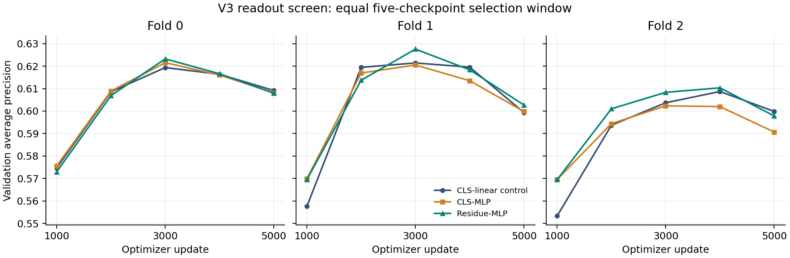

# V3 readout results — 2026-10-01

**All six jobs completed their planned screening window successfully. The residue head produced a small, consistent development improvement, but neither candidate met the complete advancement rule.**

Residue-MLP mean selected-checkpoint AP was **0.620374**, compared with **0.616488** for the preserved v3 CLS-linear controls: **+0.003886**, or +0.389 percentage points. The rule fixed before this stage required at least +0.005 mean AP. CLS-MLP changed mean AP by -0.001699.

## Best checkpoints from the same five-validation window

Each model is selected by maximum pooled validation AP at updates 1,000–5,000, with the earliest exact tie retained. AUROC, protein macro-AP and Brier below use that same AP-selected checkpoint. Means give each fold equal weight; AP is average precision, not classification accuracy.

| Design | Fold 0 AP | Fold 1 AP | Fold 2 AP | Mean AP | Mean AUROC | Mean protein macro-AP | Mean Brier ↓ |
| --- | ---: | ---: | ---: | ---: | ---: | ---: | ---: |
| CLS-linear control | 0.619353 | 0.621409 | 0.608703 | 0.616488 | 0.609621 | 0.658064 | 0.257559 |
| CLS-MLP | 0.621549 | 0.620481 | 0.602337 | 0.614789 | 0.609366 | 0.658863 | 0.251249 |
| Residue-MLP | 0.623224 | 0.627560 | 0.610338 | 0.620374 | 0.613253 | 0.661924 | 0.258550 |

The reference is our v3 ESM2-initialized, clean-BCE CLS-linear model on each development fold. It is **not the authors’ released native checkpoint**. These results cannot be directly compared with native scores on a different test population.

| Array task | Design | Fold | Best update | AP | AUROC | AP change vs CLS-linear | Runtime |
| --- | --- | ---: | ---: | ---: | ---: | ---: | --- |
| 3196827_0 | CLS-MLP | 0 | 3,000 | 0.621549 | 0.613318 | +0.002197 | 7h 31m 11s |
| 3196827_1 | CLS-MLP | 1 | 3,000 | 0.620481 | 0.621349 | -0.000928 | 7h 23m 50s |
| 3196827_2 | CLS-MLP | 2 | 3,000 | 0.602337 | 0.593430 | -0.006366 | 7h 23m 27s |
| 3196827_3 | Residue-MLP | 0 | 3,000 | 0.623224 | 0.611812 | +0.003871 | 7h 32m 2s |
| 3196827_4 | Residue-MLP | 1 | 3,000 | 0.627560 | 0.625084 | +0.006151 | 7h 18m 45s |
| 3196827_5 | Residue-MLP | 2 | 4,000 | 0.610338 | 0.602862 | +0.001635 | 7h 23m 13s |

CLS-linear control checkpoint updates are 3,000 / 3,000 / 4,000. Each new run retains its selected checkpoint plus update-5,000 fallback and update-5,001 resume state under `runs/<configuration>/checkpoints/`; `best.json` and `latest.json` identify the roles.

## Prespecified decision

| Comparison | Mean AP change | Positive folds | Failed rules | Decision |
| --- | ---: | ---: | --- | --- |
| CLS-MLP vs CLS-linear | -0.001699 | 1/3 | mean_ap_gain, positive_folds | Do not advance |
| Residue-MLP vs CLS-linear | +0.003886 | 3/3 | mean_ap_gain | Do not advance |
| Residue-MLP vs CLS-MLP | +0.005585 | 3/3 | None | Pass |

Residue-MLP improved AP, AUROC and protein macro-AP on every fold against CLS-linear, and met the comparison rule against the equally sized CLS-MLP head. It missed only the minimum mean-AP improvement against CLS-linear. Because the residue candidate must pass against **both** controls, the frozen decision selects no candidate for confirmation. Its mean Brier score is slightly worse than CLS-linear, so the ranking gain is not a uniform improvement in all metrics.

## Uncertainty and training trajectory

The descriptive paired endpoint bootstrap uses 1,000 replicates per fold and comparison. Every individual-fold interval below includes zero. The intervals are conditional on the observed graph and selected checkpoints; they exclude training-seed and model-selection uncertainty. Folds also share training data. Passing a development rule is not a significance test.

| Residue-MLP vs CLS-linear | AP change | Conditional 95% bootstrap interval |
| --- | ---: | --- |
| fold-0 | +0.003871 | [-0.005202, +0.012767] |
| fold-1 | +0.006151 | [-0.003360, +0.015758] |
| fold-2 | +0.001635 | [-0.008458, +0.011442] |

Five of the six new runs peaked at update 3,000; residue fold 2 peaked at 4,000. All six had lower AP and higher Brier at 5,000 than at their selected checkpoint, consistent with late overfitting. Completing more updates under this schedule cannot be assumed to improve validation performance.

## Length-stratified observation

These are descriptive results at the already selected checkpoints; they do not select a new model or threshold.

| Validation pair length | Fold 0 residue AP gain | Fold 1 gain | Fold 2 gain | Mean gain |
| --- | ---: | ---: | ---: | ---: |
| At most 2,193 combined residues | +0.002108 | +0.003327 | +0.001249 | +0.002228 |
| Over 2,193 combined residues | +0.014600 | +0.017109 | +0.002614 | +0.011441 |

The larger gains against CLS-linear occur among long pairs. CLS-MLP also improves AP in the long-pair stratum on all three folds, so this does not by itself isolate a residue-specific mechanism. These strata have no separate confirmation gate or uncertainty analysis here.

## Execution and integrity

All six SLURM tasks exited `COMPLETED`, `0:0`, without restarts, OOM reports or nonfinite-metric failures. Total allocation was **178.16 GPU-hours**, within the planned 125–225. Maximum logged allocated GPU memory ranged from 23.23 to 23.78 GiB.

Every run has exactly the five planned validations. The window watcher stopped each at update **5,001**, one safe-boundary update after validation 5,000; that extra update is excluded from selection. This completed the amended screening window, not the full declared 6,000-update optimizer schedule. All stopped states are committed with no pending validation, and retain the original optimizer/RNG/sampling resume state.

The audit SHA-256 verified all **18 retained checkpoint payloads**, totaling 140.64 GB, including best, fallback and latest state. Frozen release/input/qualification integrity was verified before executing its comparison script. Validation rows, labels, prediction hashes and strict maximum-AP selection were recomputed from saved predictions. No new inference, retraining or historical-test evaluation was needed.

The new heads share the independently stored-gradient trainer amendment qualified before submission; original linear controls keep their original bucket-view trainer. That DDP amendment changed only gradient storage, leaving model computation, objective, data and optimizer settings intact. Bitwise equality of numerical trajectories across the two trainer implementations is not asserted. The common window was chosen after the LR screen and before readout production. These are development results; superiority over the native released model remains unestablished.

Evidence: [frozen readout protocol](releases/20260930-readout/protocol/READOUT_PROTOCOL.md), [machine-readable decision](decisions/readout-window5000.json), [completion and checkpoint audit](provenance/readout-completion-3196827.json), [SLURM accounting](provenance/readout-accounting-3196827.txt), [comparison log](logs/readout-window5000-comparison.log), [checkpoint audit log](logs/readout-completion-audit-3196827.log). No further production jobs were submitted during this review.
