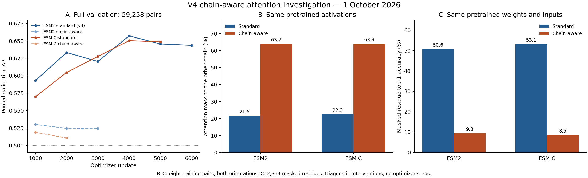

# Investigation of the v4 chain-aware models

**1 October 2026. Finding: the hard switch to unrotated cross-chain scores severely disrupts pretrained sequence modeling in both backbones.** The numerical implementation agrees with the intended formula in the tested cases. Gradients, optimizer updates and activation recomputation work. The strongest explanation for poor PPI learning is a mismatch between the new attention rule and the pretrained representation, rather than an observed failure to execute optimization.

This is supported by controlled interventions with **identical weights and inputs**, not just by comparing different training runs. No production model, configuration, checkpoint, job or test dataset was changed. All diagnostic forwards/backwards ran in separate processes on the interactive GPU, with **zero optimizer steps**. Only analysis files were written.

The [machine-readable summary](analysis/chain-attention-investigation-20261001/summary.json), [PDF figure](analysis/chain-attention-investigation-20261001/diagnosis.pdf) and [evidence hashes](analysis/chain-attention-investigation-20261001/evidence-manifest.json) accompany this report.

The production failure is measurable on the same complete validation set. At **update 2,000**, every model evaluated the same 59,258 pairs:

| Backbone | Attention | AP | AUROC | Prediction probability SD |
| --- | --- | ---: | ---: | ---: |
| ESM2 | Standard, v3 | 0.633263 | 0.625944 | 0.116672 |
| ESM2 | Chain-aware, v4 | 0.524611 | 0.533786 | 0.021624 |
| ESM C | Standard, v4 | 0.604631 | 0.585975 | 0.065049 |
| ESM C | Chain-aware, v4 | 0.510789 | 0.505579 | 0.001504 |

ESM C chain-aware predictions are nearly constant: the mean positive-pair probability is **0.492200**, versus **0.492130** for negatives. Its training BCE over the last 50 logged batches ending at update 2,000 is **0.693281**, close to the 0.693147 loss of predicting 0.5. ESM2 chain-aware has similarly weak training progress, with BCE **0.692390**. This is poor learning already on training batches, not simply good fitting followed by poor validation generalization.

The deficit persists for pairs of at most 512 tokens, so long-context extrapolation cannot be the sole explanation. Within that short group, ESM2 standard/chain-aware AUROCs are **0.6613/0.5283**, and ESM C standard/chain-aware AUROCs are **0.6428/0.5316**. Longer groups also underperform. Existing prediction files were hash-verified; row labels and recalculated AP/AUROC match the saved metrics. [Prediction audit](analysis/chain-attention-investigation-20261001/prediction-audit.json)

At the validation snapshot taken at **18:54 UTC**, ESM2 chain-aware had also completed update 3,000: AP **0.524645**, AUROC **0.533250**, with no meaningful recovery. ESM C chain-aware's latest completed validation in that snapshot was update 2,000. These remain interim results; later recovery is not logically excluded.

The intervention changes the meaning of pretrained scores. Standard rotary attention has scores proportional to

\[
q_i^\top R(p_j-p_i)k_j.
\]

The current chain-aware branch replaces this expression across chains with

\[
q_i^\top k_j=q_i^\top R(0)k_j.
\]

Thus every cross-chain residue comparison receives the **zero-relative-position rotary phase**. Removing position dependence does not preserve the score distribution that the pretrained model learned. Within-chain scores are unchanged, but their softmax weights change because all valid keys share the same denominator.

To isolate that effect, I captured pretrained activations and calculated both score rules on exactly the same queries/keys. The probe used eight official **training** pairs spanning 367–1,883 tokens, both orientations, all attention heads/layers, and up to six evenly spaced residue query positions per chain. Each sampled query still attended to every valid key. Values below are diagnostic averages, not measurements over the full validation set:

| Backbone | Other-chain attention, standard scores | Other-chain attention, chain-aware scores | CLS other-chain attention, standard → chain-aware |
| --- | ---: | ---: | ---: |
| ESM2 | 21.50% | 63.72% | 24.52% → 76.52% |
| ESM C | 22.33% | 63.88% | 23.25% → 66.94% |

With the same pretrained activations, mean cross-chain scores rise from **−0.0325 to 3.8046** for ESM2 and **−0.0563 to 3.8927** for ESM C; within-chain scores stay identical. Applying the changed rule through the full stack also substantially changes final residue representations: mean cosine similarity against standard-attention embeddings is **0.6049** for ESM2 and **0.2394** for ESM C. The representations are altered; the diagnostics do not show that they are already constant at initialization. [ESM2 diagnostics](analysis/chain-attention-investigation-20261001/esm2-pretrained-diagnosis.json), [ESM C diagnostics](analysis/chain-attention-investigation-20261001/esmc-pretrained-diagnosis.json)

The most direct functional evidence comes from reconstructing masked residues using the original language-model decoder. I masked 15% of real residue positions with a fixed seed on those same eight training pairs: **2,354 masked positions across both orientations**. No weights were updated, and the identical mask/targets were used for both attention modes. This is a diagnostic of retained sequence-modeling ability, not a held-out PPI benchmark or a reproduction of a published perplexity result.

| Weights held fixed | Standard attention accuracy | Chain-aware attention accuracy | Standard → chain-aware cross-entropy |
| --- | ---: | ---: | ---: |
| Pretrained ESM2 | **50.59%** | **9.35%** | 1.5611 → 2.8841 |
| Pretrained ESM C | **53.06%** | **8.54%** | 1.4784 → 3.1078 |
| ESM2 chain-aware checkpoint, update 1,000 | **50.81%** | **8.92%** | 1.5625 → 3.0353 |
| ESM C chain-aware checkpoint, update 1,000 | **52.46%** | **5.31%** | 1.4971 → 4.0935 |

The last two rows are particularly informative: restoring standard attention **in a diagnostic copy of the already-trained chain-aware weights** restores much of the masked-residue performance. The underlying pretrained capability remains accessible; the changed attention rule prevents its effective use in these tests. This does not show that switching production attention midway would produce a valid or successful PPI model. [ESM2 functional and gradient probes](analysis/chain-attention-investigation-20261001/esm2-training-probes.json), [ESM C functional and gradient probes](analysis/chain-attention-investigation-20261001/esmc-training-probes.json)

I also tested competing implementation explanations:

| Check | Evidence and scope |
| --- | --- |
| Wrong score expansion, scaling or softmax | Production efficient SDPA was compared with an independently assembled dense score matrix and softmax at the first, middle and last attention layers. FP32 forward relative L2 errors were below 1e-6; parameter-gradient errors were below 4.2e-6 across both backbones/modes. |
| BF16-specific attention failure | Forward relative differences were at most 0.233%; input-gradient differences at most 0.689%; the largest individual parameter-gradient difference was 2.53%. These are numerical discrepancies against FP32-accumulating dense reference calculations, not bitwise equivalence. Both modes show small discrepancies; no large chain-specific failure was observed. |
| Expanded Q/K dimension alone changes the model | Assigning every valid token to one chain makes the hybrid formula reduce to standard attention. Full-encoder FP32 relative errors were 1.91e-6 for ESM2 and 2.23e-6 for ESM C. |
| RoPE overwrites the supposedly unrotated Q/K tensors | Explicit tensor comparisons show no such mutation in the pinned runtime. |
| Broken activation recomputation or lost chain metadata | On both full-size update-1,000 checkpoints, all trainable gradients were bitwise identical with checkpointing enabled versus disabled, for both attention modes, accumulating two distinct training pairs. |
| Frozen encoder, missing parameters or optimizer not stepping | No trainable parameter lacked a gradient; gradients were finite. All optimizer parameter-state steps were exactly 1,000. Almost all trainable encoder elements changed from initialization; relative encoder weight changes were 0.182% for ESM2 and 0.284% for ESM C. |
| Wrong deployed configuration or modified code | Every frozen release file hash and every v4 live contract matches the submitted release. Official partitions, initialization, learning rate, schedule and full-size four-GPU setting are as configured. |

These checks narrow the diagnosis; they are not a proof that every possible input or hardware path is correct. Existing qualification additionally covered padding exclusion, cross-chain gradient flow and four-GPU exact resumption. The present evidence supports a **pretrained-function compatibility problem in the proposed architecture**. It does not establish a general failure of chain-aware models or identify a single software line that can be patched to guarantee improved AP. [Live contract audit](analysis/chain-attention-investigation-20261001/live-contract-audit.json)

The literature precedent does not validate our particular transfer shortcut. PPLM combines a related rotary/non-positional score design with learned per-head inter-protein coefficients and training on more than 3.3 million paired sequences. Its released attention implementation includes a learned cross-chain score multiplier. Our v4 intervention omitted that learned calibration and the paired language-model training stage. Those differences matter when interpreting the precedent; the present tests do not isolate their individual contributions. [PPLM paper](https://www.nature.com/articles/s41467-026-70457-5), [pinned author attention source](https://github.com/junliu621/PPLM/blob/1267db4592703095b889cc22da6cf1796ce038b5/pplm/multihead_attention.py)

My earlier qualification checked mathematical correctness, execution and resumability, but did not check preservation of useful pretrained behavior before accepting the hard switch. **That was a gap in my preparation.** Passing those checks established that the specified experiment could run; it did not establish that its starting representation was suitable for fine-tuning.

My recommendation was to **stop the two current chain-aware runs, retaining their checkpoints and results**, and continue the standard ESM2 and ESM C runs. The investigation itself left all jobs unchanged. **The user subsequently authorized stopping both chain-aware jobs:** at 19:01 UTC on 1 October, **3210885 stopped at update 3,070** and **3210887 at update 3,015**, each with a committed checkpoint and a clean scheduler exit. The two standard-attention jobs remained running. The [verified stop record](provenance/chain-aware-stop-20261001T190127.json) documents this deviation from the original full-horizon protocol. C1 remains the originally declared primary arm; C0 is not silently promoted into its place.

If a replacement chain-aware experiment is pursued, its initial forward function should equal standard pretrained attention. A concrete design principle is a learnable cross-chain score correction initialized at zero:

\[
s_{ij}=s^{\mathrm{standard}}_{ij}
 + \mathbf{1}_{c_i\ne c_j}\,\alpha_{\ell,h}
   \left(s^{\mathrm{unrotated}}_{ij}-s^{\mathrm{standard}}_{ij}\right),
\qquad \alpha_{\ell,h}(0)=0.
\]

This avoids the measured abrupt shift at initialization while allowing a learned departure from standard attention. It is a proposed remedy, not a demonstrated PPI improvement. A changed architecture requires a separately versioned run; existing optimizer checkpoints should not be resumed under silently changed semantics. No replacement model, LR sweep or additional production job was launched here.

The reproducible diagnostic scripts are [diagnose.py](analysis/chain-attention-investigation-20261001/diagnose.py), [probe_training.py](analysis/chain-attention-investigation-20261001/probe_training.py), [audit_predictions.py](analysis/chain-attention-investigation-20261001/audit_predictions.py) and [summarize.py](analysis/chain-attention-investigation-20261001/summarize.py). The first two ran through the existing pinned container wrapper, once for each backbone; the latter two only read saved predictions and produce analysis artifacts. Checkpoint identities, sampled training-row indices, software/code hashes, numerical results and logs are retained in [the investigation directory](analysis/chain-attention-investigation-20261001/).
